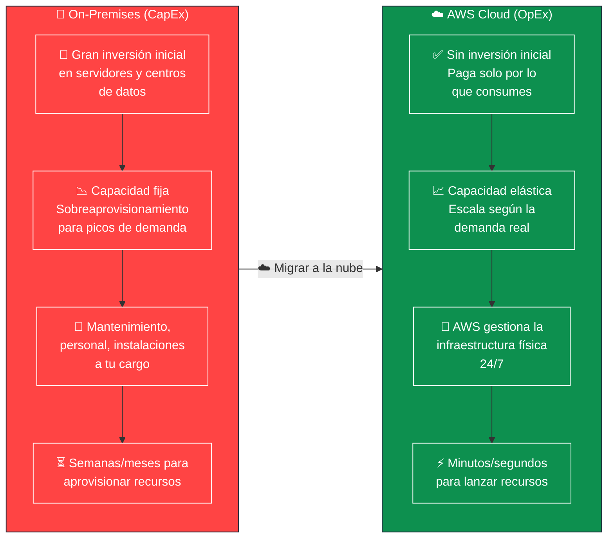
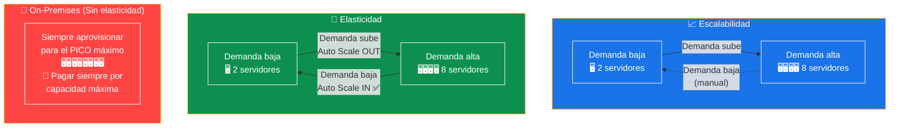
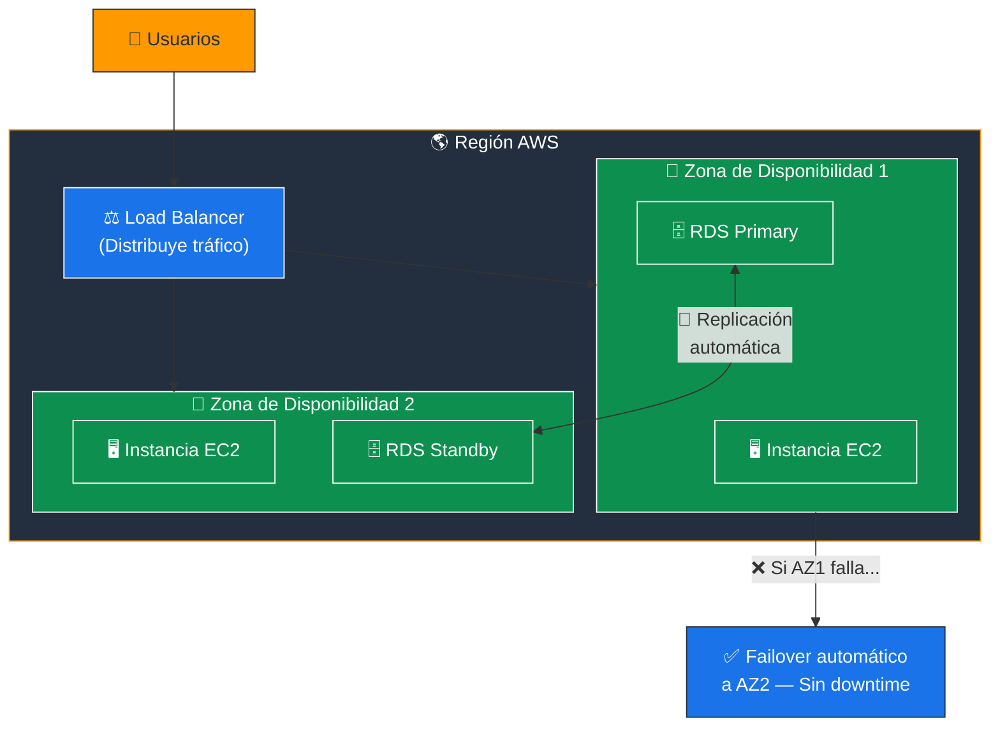
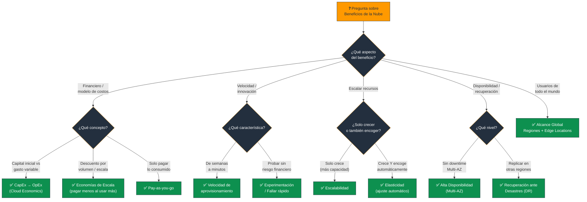

# Beneficios de la Computación en la Nube - Examen CLF-C02

Basado en las tres fuentes proporcionadas (Sequeira, Piper/Clinton y Kankaria), he analizado los Beneficios de la Computación en la Nube.

En el contexto del examen **AWS Certified Cloud Practitioner (CLF-C02)**, este tema establece la base teórica del **Dominio 1: Conceptos de la Nube**, específicamente la **Declaración de Tarea 1.1: Definir los beneficios de AWS Cloud**.

A continuación, presento un análisis detallado de los beneficios fundamentales que debe dominar para el examen.

---

## 1. Beneficios Económicos (Cloud Economics)

Las tres fuentes coinciden en que el **cambio del modelo financiero** es el argumento más fuerte para la adopción de la nube.

### De CapEx a OpEx

La nube permite a las organizaciones cambiar:
- **CapEx (gastos de capital):** Grandes inversiones iniciales en centros de datos y servidores físicos.
- **OpEx (gastos operativos):** Costos variables y medidos según el uso real.

Piper y Clinton explican que la infraestructura local es **pesada en CapEx**, mientras que la nube implica costos operativos continuos y medidos.

### Modelo de Pago por Uso (Pay-as-you-go)

- Se elimina la necesidad de **adivinar la capacidad**.
- En lugar de pagar por servidores inactivos, se paga **solo por los recursos** cuando se consumen.
- Similar a una factura de servicios públicos como la electricidad.

### Economías de Escala

- AWS, debido a su **tamaño masivo**, logra costos por unidad mucho más bajos de lo que una empresa individual podría conseguir.
- Estos ahorros se trasladan al cliente: **"pague menos al usar más"**.

> **Tip de examen:** "CapEx → OpEx", "pagar solo por lo que usas" y "economías de escala" son las tres ideas económicas fundamentales. Si ves cualquiera de estas frases, el concepto es **Cloud Economics**.

### 📊 Diagrama: CapEx vs OpEx - El Modelo Financiero de la Nube

---

## 2. Agilidad y Velocidad

El examen vincula la agilidad con la capacidad de **innovar** y la **velocidad de implementación**.

### Velocidad de Aprovisionamiento

- En un entorno local, obtener un servidor puede llevar **semanas o meses**.
- En AWS, los recursos (como instancias EC2) se pueden lanzar en **minutos o segundos**.
- Esto permite a los desarrolladores pasar de la **idea a la implementación** casi instantáneamente.

### Experimentación y "Fallar Rápido"

- Gracias al bajo costo y la velocidad, las empresas pueden **experimentar** con nuevas ideas sin grandes riesgos financieros.
- Si un experimento falla, simplemente se **apagan los recursos** y se deja de pagar.
- Piper y Clinton destacan que este modelo permite "**sandboxear**" y reevaluar aplicaciones regularmente.

### Cultura de Innovación

- Sequeira señala que estos factores fomentan una **cultura de innovación**, permitiendo a las empresas centrarse en nuevas soluciones de negocio en lugar de preocuparse por la infraestructura.

> **Tip de examen:** "Pasar de la idea al mercado rápidamente", "experimentar sin riesgo financiero" y "reducir el tiempo de aprovisionamiento" son indicadores de **Agilidad**.

### 📊 Diagrama: Agilidad - Del Experimento al Mercado

```mermaid
flowchart TD
    subgraph TRAD["🏢 Proceso Tradicional (Lento)"]
        direction LR
        T1["💡 Idea"] --> T2["📋 Aprobación<br/>presupuesto"] --> T3["🛒 Compra<br/>hardware"] --> T4["⏳ Esperar<br/>entrega<br/>(semanas)"] --> T5["🔧 Instalar<br/>y configurar"] --> T6["🚀 Lanzar"]
    end

    subgraph AWS["☁️ Proceso AWS (Ágil)"]
        direction LR
        A1["💡 Idea"] --> A2["⚡ Lanzar en<br/>AWS (minutos)"] --> A3["🧪 Experimentar<br/>y probar"] --> A4{"¿Funciona?"}
        A4 -->|"✅ Sí"| A5["🚀 Escalar<br/>rápidamente"]
        A4 -->|"❌ No"| A6["🛑 Apagar recursos<br/>Dejar de pagar"]
    end

    style TRAD fill:#FF4444,stroke:#232F3E,color:#FFFFFF
    style AWS fill:#0d904f,stroke:#232F3E,color:#FFFFFF
    style T1 fill:#FF4444,stroke:#FFFFFF,color:#FFFFFF
    style T2 fill:#FF4444,stroke:#FFFFFF,color:#FFFFFF
    style T3 fill:#FF4444,stroke:#FFFFFF,color:#FFFFFF
    style T4 fill:#FF4444,stroke:#FFFFFF,color:#FFFFFF
    style T5 fill:#FF4444,stroke:#FFFFFF,color:#FFFFFF
    style T6 fill:#FF4444,stroke:#FFFFFF,color:#FFFFFF
    style A1 fill:#0d904f,stroke:#FFFFFF,color:#FFFFFF
    style A2 fill:#0d904f,stroke:#FFFFFF,color:#FFFFFF
    style A3 fill:#0d904f,stroke:#FFFFFF,color:#FFFFFF
    style A4 fill:#FF9900,stroke:#232F3E,color:#232F3E
    style A5 fill:#0d904f,stroke:#FFFFFF,color:#FFFFFF
    style A6 fill:#1a73e8,stroke:#FFFFFF,color:#FFFFFF
```

---

## 3. Elasticidad y Escalabilidad

Las fuentes enfatizan la **distinción técnica** entre estos dos términos, vital para las preguntas de escenario del examen.

### Escalabilidad (Scalability)

- Es la capacidad de **aumentar** los recursos para satisfacer una demanda creciente.
- Kankaria usa el ejemplo de una empresa de streaming que añade servidores durante las horas pico.
- Un servicio escalable **crece en capacidad** para satisfacer la demanda.

### Elasticidad (Elasticity)

- Es la capacidad de escalar **hacia afuera** (agregar recursos) **y hacia adentro** (eliminar recursos) automáticamente para coincidir con la demanda real.
- Piper y Clinton comparan esto con una **banda elástica**: se estira cuando se necesita y vuelve a su tamaño original cuando se suelta.
- Es crucial para **no pagar por recursos inactivos**.

### Dejar de Adivinar la Capacidad

- En el modelo local, se debe aprovisionar para el **pico máximo** de tráfico, desperdiciando recursos el resto del tiempo.
- En la nube, la capacidad se **ajusta dinámicamente**.

> **Tip de examen:** **Escalabilidad** = solo crece. **Elasticidad** = crece Y encoge automáticamente. Si la pregunta menciona "ajuste automático" o "no pagar por inactividad", es **Elasticidad**.

### 📊 Diagrama: Escalabilidad vs Elasticidad

---

## 4. Alta Disponibilidad y Fiabilidad

La infraestructura física de AWS permite niveles de fiabilidad **difíciles de replicar** localmente.

### Fiabilidad y Recuperación ante Desastres

- Kankaria destaca que la nube ofrece capacidades integradas de **recuperación ante desastres** y copias de seguridad.
- Permite replicar datos en **múltiples regiones geográficas** para mayor resiliencia.

### Alta Disponibilidad (HA)

- Se logra diseñando sistemas **sin puntos únicos de fallo**.
- Utilizando múltiples **Zonas de Disponibilidad (AZ)**: si un centro de datos falla, la carga de trabajo se mueve automáticamente a otro.

### Infraestructura Asegurada Profesionalmente

- Piper y Clinton señalan que, al usar AWS, se **subcontrata la seguridad física** y de red a expertos que vigilan la infraestructura 24/7.
- Algo que muchas empresas **no pueden costear** por sí mismas.

> **Tip de examen:** "Sin punto único de fallo", "Multi-AZ", "recuperación automática" = **Alta Disponibilidad**. "Replicar en múltiples regiones" = **Recuperación ante Desastres (DR)**.

### 📊 Diagrama: Alta Disponibilidad Multi-AZ

---

## 5. Alcance Global en Minutos

- AWS permite desplegar aplicaciones en **múltiples regiones geográficas** alrededor del mundo en cuestión de **minutos**.
- Esto acerca los recursos a los usuarios finales, reduciendo la **latencia** y mejorando la **experiencia del usuario**.
- Sin la nube, llegar a usuarios globales requeriría construir o arrendar centros de datos en cada región.

> **Tip de examen:** "Reducir latencia para usuarios globales", "desplegar en múltiples regiones" = **Alcance global**. Se habilita mediante **Regiones**, **AZs** y **Edge Locations** de AWS.

---

## Resumen para el Candidato

Al prepararse para el CLF-C02, recuerde que estos beneficios **no son aislados**: la elasticidad impulsa la eficiencia de costos (pagar solo por lo que se usa), la infraestructura global habilita la alta disponibilidad, y la agilidad reduce el costo de la innovación.

| Beneficio | Concepto clave | Palabras disparador |
|---|---|---|
| **Cloud Economics** | CapEx → OpEx, pagar por uso | "inversión inicial", "gasto variable", "factura de electricidad" |
| **Agilidad** | De semanas a minutos, fallar rápido | "lanzar rápido", "experimentar", "innovar" |
| **Elasticidad** | Escalar y encoger automáticamente | "ajuste automático", "no pagar inactividad" |
| **Escalabilidad** | Solo crecer | "manejar más carga", "crecimiento" |
| **Alta Disponibilidad** | Multi-AZ, sin punto único de fallo | "sin downtime", "failover", "Multi-AZ" |
| **Alcance Global** | Regiones, Edge Locations | "latencia baja", "usuarios globales", "minutos" |

---

### 📊 Diagrama: Árbol de Decisión para Preguntas del Examen

