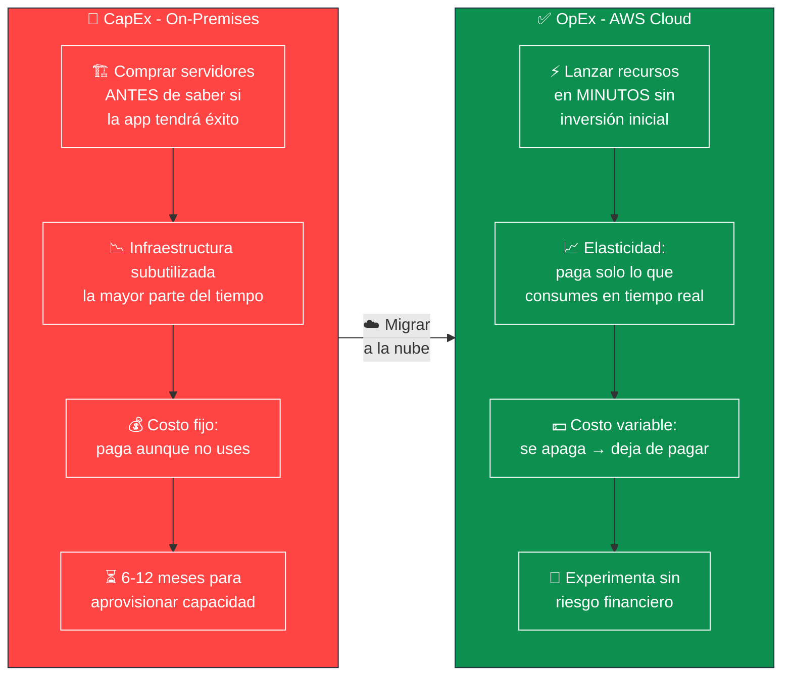
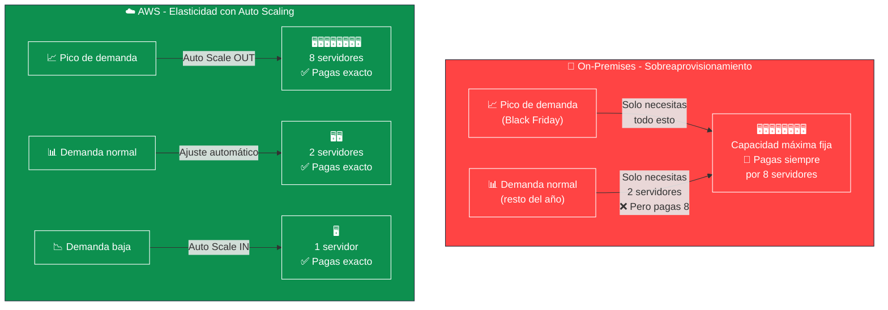
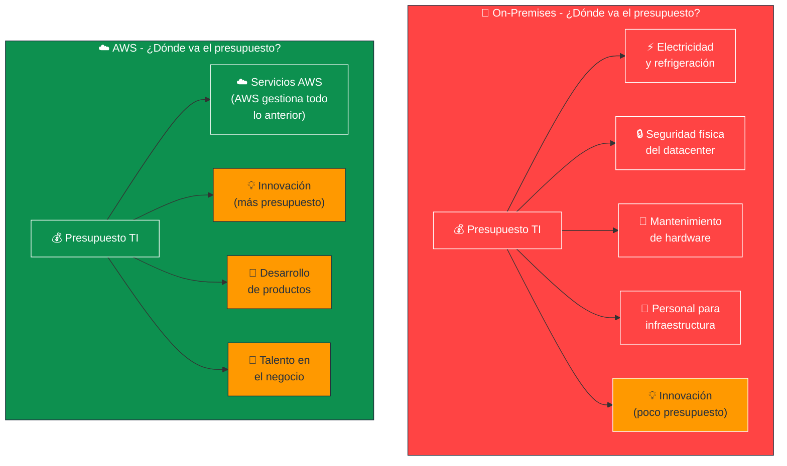
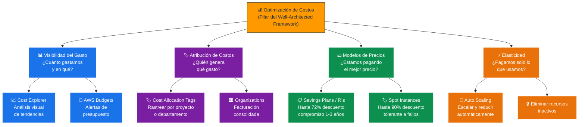
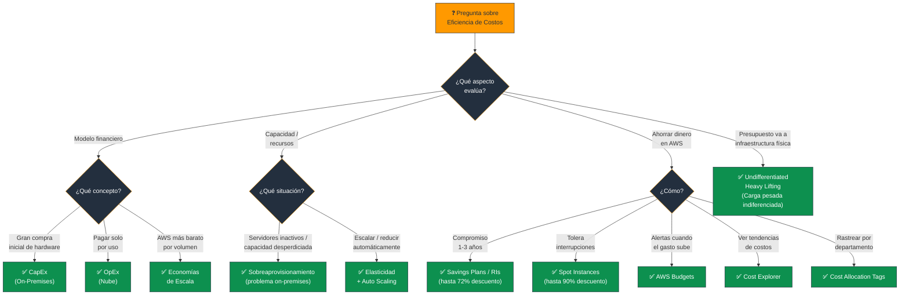

# Eficiencia de Costos en la Nube - Examen CLF-C02

La eficiencia de costos es posiblemente el beneficio **más transformador** de la computación en la nube y actúa como el catalizador de muchas otras ventajas, como la agilidad y la innovación. En el contexto de los objetivos del examen, comprender la **economía de la nube** es fundamental para el **Dominio 1: Conceptos de la Nube**.

---

## 1. El Cambio de Paradigma Financiero: De CapEx a OpEx

En la infraestructura de TI tradicional (on-premises), las empresas se enfrentan a enormes **Gastos de Capital (CapEx)**; es decir, deben realizar grandes inversiones iniciales para comprar servidores, almacenamiento y espacio físico **antes de saber si la aplicación tendrá éxito**.

La nube transforma este modelo hacia los **Gastos Operativos (OpEx)**:

| Modelo | Característica | Impacto |
|---|---|---|
| **CapEx (On-Premises)** | Gran inversión inicial fija | Riesgo financiero alto antes de validar |
| **OpEx (Nube)** | Costos variables por consumo | Flexibilidad financiera, pago solo por uso |

Las organizaciones cambian los **costos fijos** por **costos variables**, pagando únicamente por los recursos que consumen. Esto es especialmente crítico para startups y nuevos proyectos.

> **Tip de examen:** Si la pregunta menciona "inversión inicial", "comprar hardware", "costos fijos" → **CapEx**. Si menciona "pagar por uso", "costos variables", "sin inversión inicial" → **OpEx**.

### 📊 Diagrama: CapEx vs OpEx - El Paradigma Financiero

---

## 2. Modelo de Pago por Uso y Eliminación del Sobreaprovisionamiento

Muy relacionado con el paso a OpEx, el modelo **pay-as-you-go** funciona como una **factura de servicios públicos** (como la electricidad).

### Dejar de Adivinar la Capacidad

- Históricamente, las empresas compraban hardware suficiente para soportar los **picos máximos** de tráfico previstos.
- La mayor parte del tiempo esos servidores estaban **inactivos y desperdiciando dinero**.
- En la nube, gracias a la **elasticidad** y herramientas como **Auto Scaling**, la infraestructura:
  - **Crece automáticamente** cuando hay demanda.
  - **Se reduce** cuando la demanda baja.
- Se deja de pagar en el instante en que los **recursos se apagan**.

> **Tip de examen:** "Sobreaprovisionamiento", "capacidad ociosa", "adivinar la demanda" → problemas del modelo **on-premises**. La solución en la nube es la **Elasticidad + Auto Scaling**.

### 📊 Diagrama: El Problema del Sobreaprovisionamiento vs Elasticidad

---

## 3. Economías de Escala Masivas

Las empresas que utilizan AWS se benefician de las **economías de escala**:

- AWS agrupa los recursos de **cientos de miles de clientes**.
- Alcanza una eficiencia y un poder de compra de hardware **masivos**.
- Ofrece servicios a un **costo por unidad mucho menor** del que una empresa individual podría lograr por sí sola.
- Estos ahorros se trasladan al cliente: **"pague menos al usar más"**.

> **Tip de examen:** "Economías de escala" = AWS compra hardware en volumen masivo → precios más bajos para todos los clientes.

---

## 4. Reducción de la "Carga Pesada Indiferenciada"

Una de las formas más significativas de lograr eficiencia de costos es lo que AWS llama **"dejar de gastar en la carga pesada indiferenciada"** (*undifferentiated heavy lifting*).

### ¿Qué es la Carga Pesada Indiferenciada?

En un entorno local, el presupuesto de TI se consume en:

- Facturas de **electricidad**
- Sistemas de **refrigeración**
- **Seguridad física** de los centros de datos
- Personal dedicado al **mantenimiento de hardware**

Al trasladar estas tareas operativas a AWS, la empresa puede **reasignar ese presupuesto y talento humano** al desarrollo de software y a la innovación de su núcleo de negocio.

### 📊 Diagrama: Presupuesto de TI - On-Premises vs AWS

---

## 5. Optimización de Costos como Pilar Arquitectónico

La eficiencia de costos **no ocurre mágicamente** por el simple hecho de moverse a la nube; **debe ser diseñada**. Por ello, la **Optimización de Costos** es uno de los seis pilares del **AWS Well-Architected Framework**.

### Prácticas que exige este pilar

| Práctica | Herramienta / Concepto |
|---|---|
| **Gestión Financiera en la Nube (CFM)** | Dedicar tiempo para entender y controlar el gasto |
| **Analizar y atribuir gastos** | **Cost Allocation Tags** → saber qué departamento gasta qué |
| **Modelos de precios con descuento** | Savings Plans, Reserved Instances, Spot |
| **Alertas de presupuesto** | **AWS Budgets** → alertas antes de sobrepasar límites |
| **Análisis de tendencias** | **Cost Explorer** → visualizar y analizar gastos históricos |

### Modelos de Precios para Optimizar Costos

| Modelo | Descuento | Condición |
|---|---|---|
| **On-Demand** | Sin descuento | Sin compromiso (más flexible) |
| **Savings Plans / Reserved** | Hasta **72%** | Compromiso 1-3 años |
| **Spot Instances** | Hasta **90%** | Tolerante a interrupciones |

### 📊 Diagrama: Estrategias de Optimización de Costos en AWS

---

## Resumen para el Candidato

En el panorama general, la eficiencia de costos no solo significa **pagar menos**; significa utilizar el presupuesto de TI de manera **más inteligente**:

- El bajo costo para aprovisionar recursos experimentales **reduce el riesgo financiero del fracaso**, fomentando una cultura de experimentación y agilidad.
- Herramientas de gobernanza como **AWS Budgets** y **Cost Explorer** garantizan que esta agilidad técnica no se traduzca en sorpresas en la facturación mensual.

| Concepto | Idea clave |
|---|---|
| **CapEx → OpEx** | De inversión fija a pago por uso variable |
| **Pay-as-you-go** | Pagas solo lo que consumes, como la electricidad |
| **Economías de escala** | AWS compra en volumen → precios más bajos para ti |
| **Undifferentiated heavy lifting** | AWS gestiona lo operativo → tú te enfocas en innovar |
| **Optimización de costos** | Pilar del WAF: debe diseñarse, no ocurre sola |
| **Savings Plans / RIs** | Hasta 72% de descuento con compromiso 1-3 años |
| **Spot Instances** | Hasta 90% de descuento si toleras interrupciones |

### Palabras clave que debes asociar

- **"Inversión inicial / hardware previo"** → CapEx (problema on-premises)
- **"Pago por consumo / factura variable"** → OpEx (ventaja de la nube)
- **"Cientos de miles de clientes / poder de compra"** → Economías de escala
- **"Electricidad / refrigeración / mantenimiento"** → Carga pesada indiferenciada
- **"Reasignar presupuesto a innovación"** → Undifferentiated heavy lifting
- **"Alertas de gasto / presupuesto"** → AWS Budgets
- **"Análisis de tendencias de costos"** → Cost Explorer
- **"Rastrear costos por departamento"** → Cost Allocation Tags

---

### 📊 Diagrama: Árbol de Decisión para Preguntas del Examen

