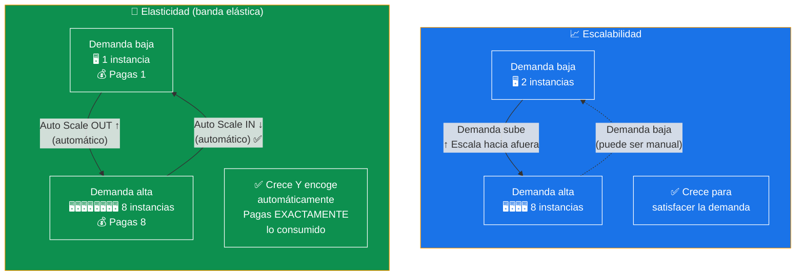
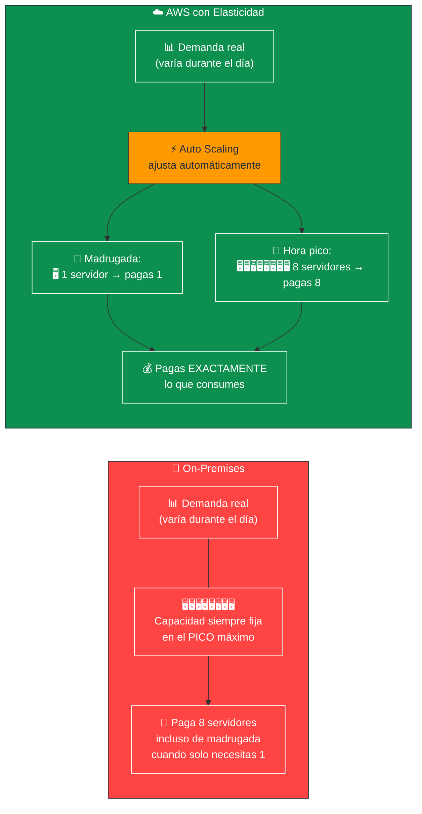
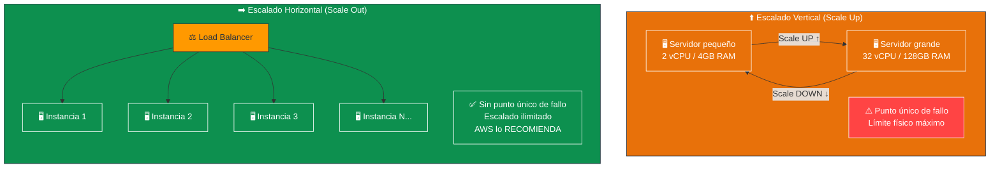
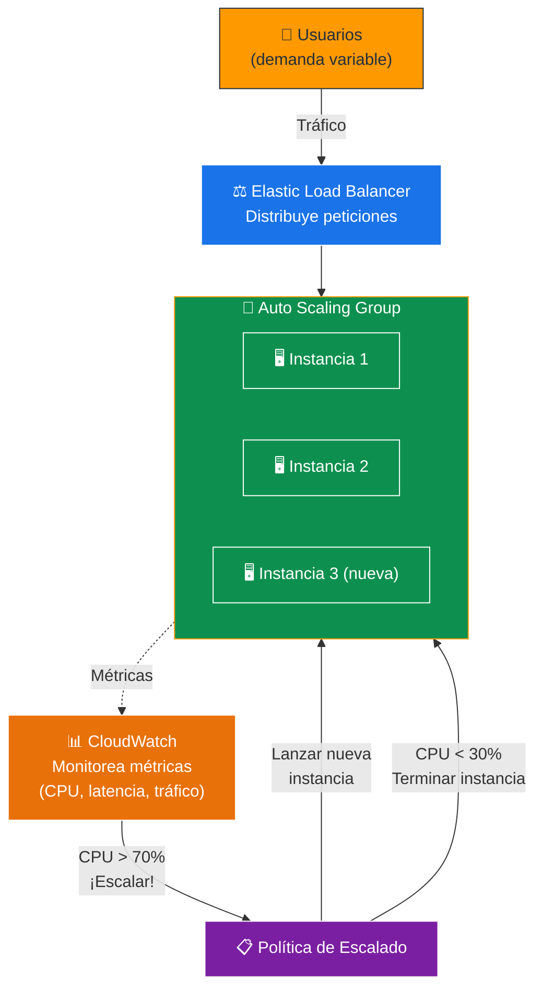
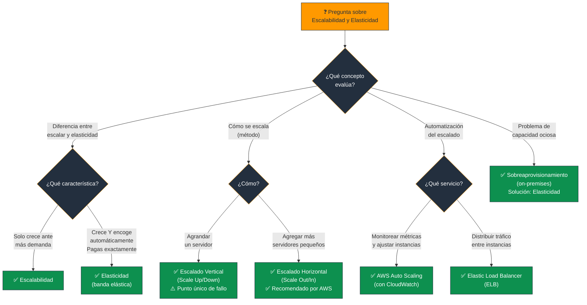

# Escalabilidad y Elasticidad en la Nube - Examen CLF-C02

Dentro del modelo de computación en la nube, la escalabilidad y la elasticidad son **principios arquitectónicos gemelos** que habilitan algunos de los beneficios más transformadores de AWS, especialmente en términos de **rendimiento** y **eficiencia de costos**.

---

## 1. Diferencia entre Escalabilidad y Elasticidad

Aunque a menudo se usan de manera intercambiable, el examen y los marcos de diseño de AWS hacen una **distinción importante**:

### Escalabilidad (Scalability)

- Es la capacidad de un servicio para **crecer y aumentar automáticamente** su capacidad para satisfacer un aumento de la demanda de los usuarios de manera fluida.
- Dado el inmenso tamaño de la infraestructura global de la nube, la escalabilidad es **prácticamente ilimitada**.
- Permite a las empresas expandirse de manera transparente a medida que sus necesidades evolucionan, ya sea abordando nuevos mercados o enfrentando fluctuaciones de gran volumen.
- **Dirección:** Solo crece (escala hacia afuera / hacia arriba).

### Elasticidad (Elasticity)

- Se compara frecuentemente con una **banda elástica**: es la capacidad del sistema no solo para **expandirse** (escalar hacia afuera o hacia arriba) cuando la demanda crece, sino también para **contraerse** (escalar hacia adentro o hacia abajo) de forma rápida y **automática** cuando la demanda disminuye.
- El sistema regresa a su tamaño original cuando la demanda baja.
- **Dirección:** Crece Y encoge automáticamente.

| Concepto | Dirección | Automatismo | Propósito |
|---|---|---|---|
| **Escalabilidad** | Solo crece ↑ | Manual o automático | Manejar más carga |
| **Elasticidad** | Crece ↑ y encoge ↓ | Siempre automático | Pagar solo lo consumido |

> **Tip de examen:** Si la pregunta menciona "ajuste automático hacia arriba Y hacia abajo" o "no pagar por recursos inactivos" → **Elasticidad**. Si solo menciona "crecer para manejar más demanda" → **Escalabilidad**.

### 📊 Diagrama: Escalabilidad vs Elasticidad - La Diferencia Clave

---

## 2. Impacto en los Beneficios Económicos y Eficiencia de Costos

La elasticidad es el **motor técnico** que hace que el modelo económico de **pago por uso (pay-as-you-go)** sea verdaderamente rentable.

### El Fin de las Conjeturas de Capacidad

- En la infraestructura de TI **tradicional (on-premises)**, las empresas tenían que **sobreaprovisionar hardware** para soportar los picos máximos previstos de demanda.
- Esto resultaba en un **desperdicio enorme de recursos de capital (CapEx)** cuando los servidores estaban inactivos durante horas de menor actividad.

### Con la Nube

- Se establecen **niveles de rendimiento máximos y mínimos**, y el sistema ajusta los recursos según sea necesario.
- Un servicio de streaming de video puede **agregar servidores automáticamente** para lidiar con el tráfico pesado de la noche y **eliminarlos durante la madrugada**.
- Al reducir los recursos de forma elástica, solo se paga por el **tiempo y la capacidad exacta consumida**, optimizando el gasto operativo (OpEx).

> **Tip de examen:** "Sobreaprovisionar / desperdicio de capacidad" = problema **on-premises**. "Pagar solo lo consumido / sin capacidad ociosa" = ventaja de la **elasticidad en la nube**.

### 📊 Diagrama: El Problema del Sobreaprovisionamiento resuelto por Elasticidad

---

## 3. Escalado Horizontal vs. Vertical

La nube proporciona **dos métodos** para realizar este escalado elástico:

### Escalado Vertical (Scale Up / Scale Down)

- **¿Qué es?** Cambiar el tamaño de una **sola instancia** de servidor (hacerla más grande o más pequeña añadiendo vCPU o memoria).
- **Ejemplo:** Cambiar una instancia EC2 t3.small a una t3.2xlarge.
- **Limitación:** Tiene un límite físico (el servidor más grande disponible). Puede generar un **punto único de fallo**.

### Escalado Horizontal (Scale Out / Scale In)

- **¿Qué es?** Añadir **más instancias** de servidores adicionales para que trabajen en conjunto.
- **Ejemplo:** Pasar de 2 instancias EC2 a 10 instancias EC2 idénticas detrás de un Load Balancer.
- **Recomendado por AWS:** Elimina los **puntos únicos de fallo**, distribuye las peticiones del cliente en múltiples recursos pequeños y eficientes, incrementando la **confiabilidad**.

| Tipo | Acción | Límite | Disponibilidad |
|---|---|---|---|
| **Vertical** | Agrandar/achicar 1 instancia | Limitado por el hardware máximo | Punto único de fallo |
| **Horizontal** | Agregar/quitar instancias | Prácticamente ilimitado | Alta disponibilidad ✅ |

> **Tip de examen:** AWS **recomienda el escalado horizontal** porque elimina puntos únicos de fallo. "Agregar más instancias pequeñas" = horizontal. "Hacer el servidor más grande" = vertical.

### 📊 Diagrama: Escalado Vertical vs Horizontal

---

## 4. Automatización y Agilidad

La verdadera escalabilidad y elasticidad **no requieren que un administrador humano** encienda o apague servidores manualmente.

- **AWS Auto Scaling** monitorea de manera continua el uso de las aplicaciones (por ejemplo, mediante **métricas de CPU** en CloudWatch) y activa **acciones automáticas** para provisionar o terminar servidores.
- Esto otorga a las empresas una **agilidad extrema**, permitiéndoles:
  - Responder en **minutos** a aumentos bruscos e inesperados de carga de trabajo.
  - Lanzar nuevos recursos **instantáneamente**.
  - Mantenerse un paso adelante de la competencia **sin tiempos de inactividad**.

### Flujo de AWS Auto Scaling

- **CloudWatch** monitorea métricas (CPU, tráfico, latencia).
- Cuando se supera un **umbral**, se activa una **política de escalado**.
- **Auto Scaling Group** lanza o termina instancias automáticamente.
- El **Load Balancer** distribuye el tráfico entre todas las instancias activas.

> **Tip de examen:** "Respuesta automática a cambios de demanda sin intervención humana" = **AWS Auto Scaling**. "Distribuir tráfico entre instancias" = **Elastic Load Balancer (ELB)**.

### 📊 Diagrama: Flujo Completo de Auto Scaling

---

## Resumen para el Candidato

| Concepto | Definición | Ejemplo |
|---|---|---|
| **Escalabilidad** | Capacidad de crecer ante mayor demanda | Una app maneja 1M de usuarios en lugar de 100K |
| **Elasticidad** | Crecer Y encoger automáticamente | Auto Scaling sube/baja instancias según CPU |
| **Escalado Vertical** | Agrandar 1 servidor (más CPU/RAM) | EC2 t3.small → t3.2xlarge |
| **Escalado Horizontal** | Agregar más servidores (recomendado) | 2 instancias → 10 instancias + Load Balancer |
| **Auto Scaling** | Automatiza el escalado según métricas | CloudWatch detecta CPU alto → lanza instancias |
| **Fin del sobreaprovisionamiento** | Pagas solo lo que consumes | Costo se ajusta al tráfico real |

### Palabras clave que debes asociar

- **"Crece automáticamente"** → Escalabilidad
- **"Crece Y encoge / banda elástica / pago exacto"** → Elasticidad
- **"Hacer el servidor más grande"** → Escalado Vertical
- **"Agregar más servidores / distribuir carga"** → Escalado Horizontal (recomendado)
- **"Sin intervención humana / métricas de CPU"** → Auto Scaling
- **"Distribuir tráfico entre instancias"** → Elastic Load Balancer
- **"Sobreaprovisionar / capacidad ociosa"** → Problema on-premises

---

### 📊 Diagrama: Árbol de Decisión para Preguntas del Examen

