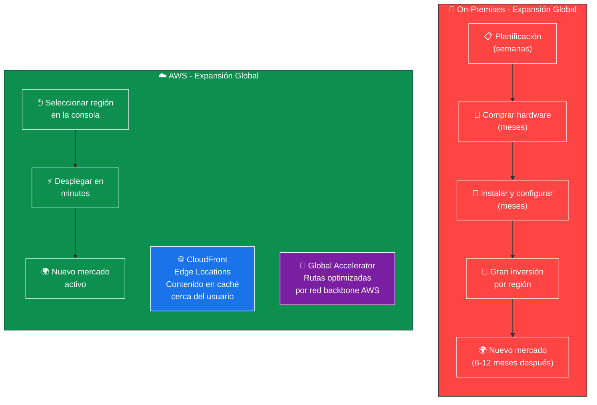
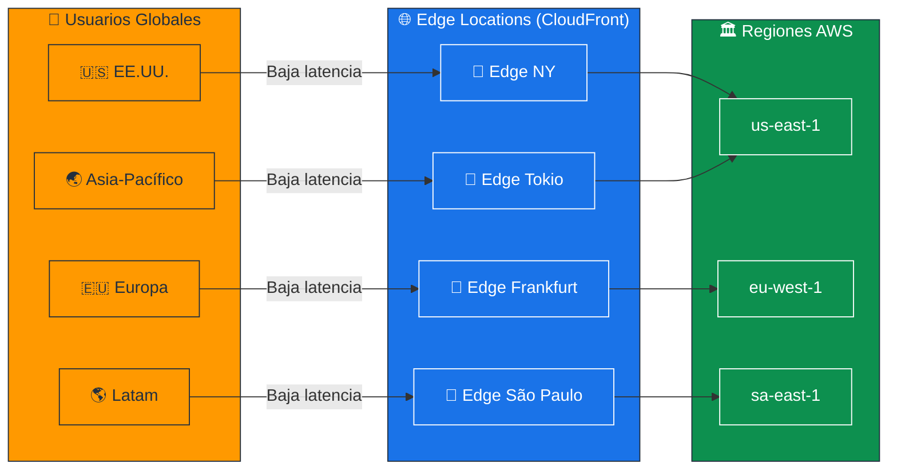
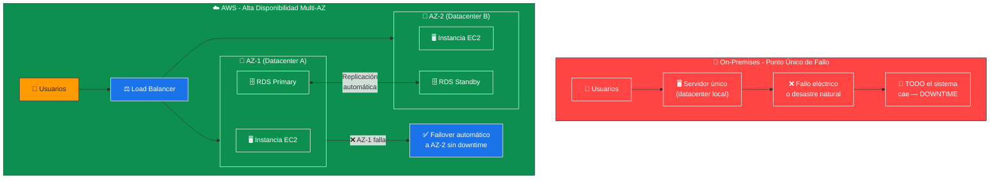
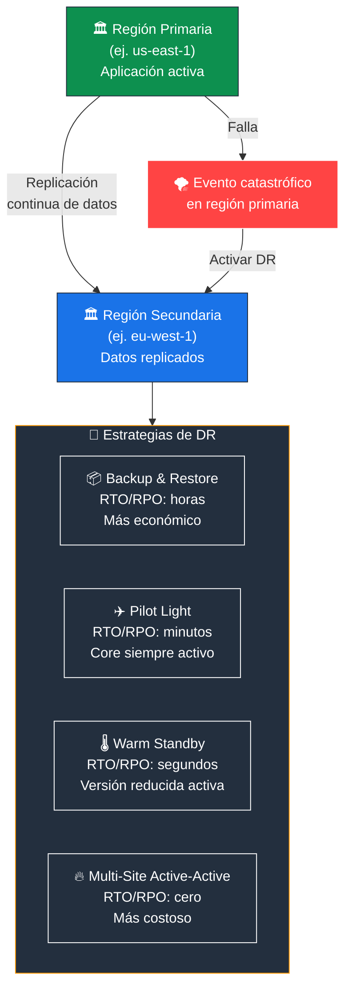
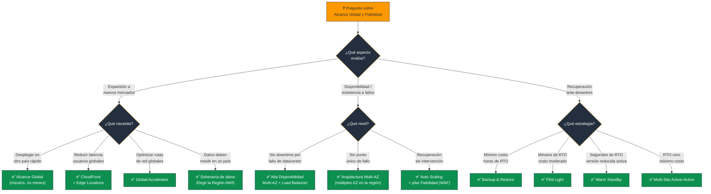

# Alcance Global y Fiabilidad en la Nube - Examen CLF-C02

Dentro del paradigma de la computación en la nube, el **Alcance Global** y la **Fiabilidad** representan dos de las ventajas más disruptivas frente a la infraestructura local tradicional (on-premises). Ambos conceptos **eliminan las barreras físicas y financieras** que históricamente limitaban el crecimiento y la estabilidad de las empresas.

---

## 1. Alcance Global (Global Reach): "Volverse global en minutos"

En un entorno tradicional, expandir los servicios de TI a otro país requería **meses de planificación**, negociación de contratos, compra de hardware y viajes de personal. En la nube, este proceso se reduce a **unos pocos clics**, impulsando la agilidad empresarial.

### Reducción Drástica de la Latencia

- Gracias a la **infraestructura global** (Regiones, Zonas de Disponibilidad y Ubicaciones de Borde), las empresas pueden desplegar cargas de trabajo y datos en ubicaciones **geográficamente cercanas** a sus usuarios finales.
- Una empresa emergente puede ofrecer a sus clientes en otro continente la **misma velocidad y rendimiento** que a sus clientes locales.

### Servicios Habilitadores

- **Amazon CloudFront** (CDN): Almacena contenido en caché en el borde de la red, reduciendo latencia.
- **AWS Global Accelerator:** Optimiza las rutas de tráfico usando la red backbone de AWS para maximizar rendimiento.
- Ambos servicios garantizan una **experiencia de usuario de alto rendimiento a escala mundial**.

### Cumplimiento y Soberanía de Datos

- El alcance global no solo se trata de velocidad, sino de **control**.
- Permite elegir en qué **región geográfica específica** residirán los datos.
- Fundamental para cumplir con **regulaciones locales**, leyes de privacidad (GDPR, LGPD) y requisitos de soberanía de datos bancarios o gubernamentales.

> **Tip de examen:** "Desplegar en múltiples regiones", "reducir latencia para usuarios globales" = **Alcance Global**. "Datos deben residir en un país específico" = **Soberanía de datos / Cumplimiento**.

### 📊 Diagrama: Alcance Global - On-Premises vs AWS

### 📊 Diagrama: Infraestructura Global de AWS - Reducción de Latencia

---

## 2. Fiabilidad (Reliability) y Alta Disponibilidad

La nube **democratiza el acceso** a niveles de resiliencia empresarial que antes solo estaban al alcance de corporaciones con presupuestos masivos.

### Eliminación de Puntos Únicos de Fallo

- En un centro de datos local, un fallo eléctrico o un desastre natural puede **tumbar todo el sistema**.
- En AWS, la arquitectura de **Zonas de Disponibilidad (AZ)** —centros de datos físicos separados, con energía y redes redundantes— permite que una aplicación se ejecute **simultáneamente en múltiples instalaciones**.
- Si un centro de datos falla, el tráfico se **redirige automáticamente** al respaldo sin que el usuario lo note.

### Recuperación Automatizada

- El pilar de **Fiabilidad del Well-Architected Framework** enfatiza la capacidad de **recuperarse automáticamente** de los fallos.
- En lugar de que un equipo de TI intente reparar frenéticamente un servidor caído en medio de la noche, herramientas como **Auto Scaling**:
  - Detectan la anomalía.
  - Terminan la instancia defectuosa.
  - Lanzan una nueva instancia **al instante**.

### Recuperación ante Desastres (DR) y Copias de Seguridad

- La nube ofrece capacidades integradas para **replicar datos y aplicaciones** a través de múltiples regiones geográficas.
- Garantiza que, incluso ante eventos catastróficos, los sistemas puedan **restaurarse rápidamente** minimizando el tiempo de inactividad.
- Sin necesidad de mantener un **costoso centro de datos secundario inactivo**.

> **Tip de examen:** "Sin punto único de fallo / Multi-AZ" = **Alta Disponibilidad**. "Recuperación automática sin intervención humana" = **Auto Scaling + pilar Fiabilidad del WAF**. "Replicar en múltiples regiones ante desastres" = **Disaster Recovery (DR)**.

### 📊 Diagrama: Alta Disponibilidad Multi-AZ vs On-Premises

### 📊 Diagrama: Recuperación ante Desastres - Estrategias Multi-Región

---

## 3. El Contexto Más Amplio: Agilidad e Innovación

Tanto el alcance global como la fiabilidad se **retroalimentan** con los otros beneficios de la nube:

- Al subcontratar la **seguridad física**, el mantenimiento del hardware y la redundancia a AWS (bajo el **Modelo de Responsabilidad Compartida**), las empresas dejan de gastar tiempo y dinero en el "trabajo pesado indiferenciado".
- Saber que la infraestructura subyacente es **inherentemente fiable** y puede **escalar globalmente bajo demanda**, permite a los desarrolladores enfocar sus recursos en experimentar, innovar y lanzar nuevos productos al mercado a una **velocidad sin precedentes**.

| Beneficio | Impacto en el Negocio |
|---|---|
| **Alcance Global** | Llegar a nuevos mercados en minutos, no en meses |
| **Baja Latencia** | Misma experiencia para usuarios locales y globales |
| **Soberanía de Datos** | Cumplir regulaciones locales eligiendo la región |
| **Alta Disponibilidad** | Sin downtime por fallos de hardware o datacenter |
| **DR Multi-Región** | Recuperación rápida ante desastres sin datacenter secundario propio |
| **Responsabilidad Compartida** | AWS gestiona la infraestructura → tú te enfocas en innovar |

---

### Palabras clave que debes asociar

- **"Volverse global en minutos"** → Alcance Global de AWS
- **"Reducir latencia para usuarios de otro continente"** → CloudFront / Edge Locations
- **"Datos deben permanecer en un país"** → Soberanía de datos / Cumplimiento
- **"Sin punto único de fallo"** → Multi-AZ / Alta Disponibilidad
- **"Failover automático sin downtime"** → Multi-AZ con Load Balancer
- **"Recuperación automática sin humanos"** → Auto Scaling + pilar Fiabilidad (WAF)
- **"Replicar ante catástrofes en otra región"** → Disaster Recovery (DR)
- **"Sin datacenter secundario costoso"** → DR en la nube

---

### 📊 Diagrama: Árbol de Decisión para Preguntas del Examen

