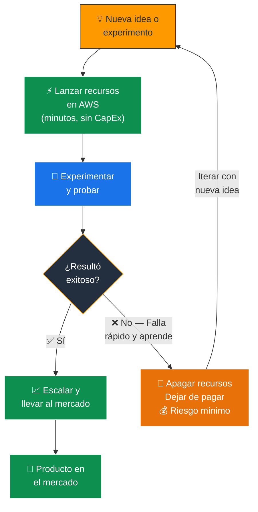
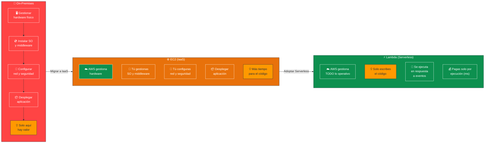
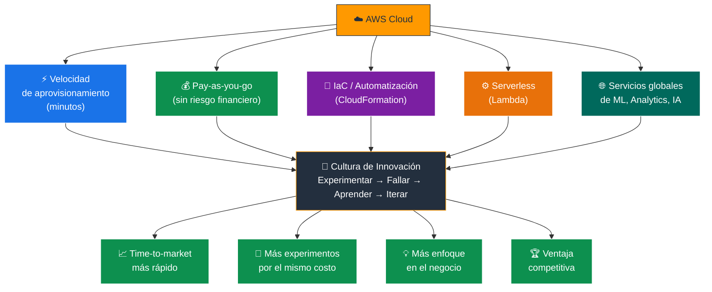
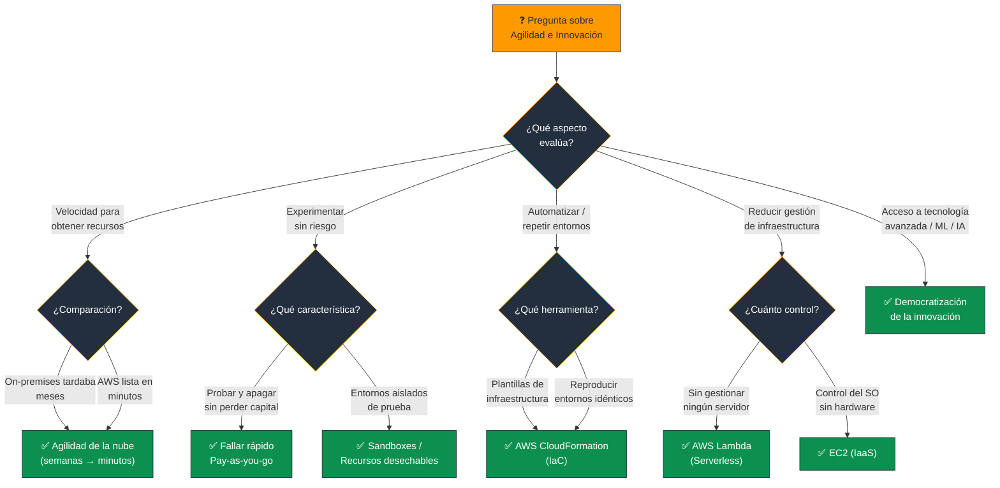

# Agilidad e Innovación en la Nube - Examen CLF-C02

En el contexto de los Beneficios de la Computación en la Nube (evaluado en el **Dominio 1** del examen), la agilidad y la innovación representan la capacidad de una organización para **reaccionar rápidamente a los cambios del mercado** y experimentar con nuevas tecnologías sin las barreras tradicionales de TI.

---

## 1. Velocidad de Aprovisionamiento Extrema

La agilidad comienza con la **rapidez** con la que se pueden obtener recursos.

### Contraste: On-Premises vs Nube

| Aspecto | On-Premises | AWS Cloud |
|---|---|---|
| **Tiempo para nuevo servidor** | Semanas o meses | Minutos o segundos |
| **Proceso** | Definir → Comprar → Aprovisionar → Implementar | Clic → Lanzar → Listo |
| **Inversión requerida** | CapEx masivo por adelantado | Sin inversión inicial |
| **Riesgo** | Alto (si la app falla, hardware inactivo) | Bajo (pagas solo lo consumido) |

- En AWS, los recursos de cómputo (como instancias **EC2**) se pueden solicitar, arrancar y estar listos para usar en **minutos o segundos**.
- Esta velocidad sin precedentes permite a las empresas pasar de la **idea a la implementación** casi instantáneamente.

> **Tip de examen:** "Pasar de la idea al mercado rápidamente", "de semanas a minutos", "velocidad de aprovisionamiento" → **Agilidad de la nube**.

### 📊 Diagrama: Velocidad de Aprovisionamiento - On-Premises vs AWS

```mermaid
flowchart TD
    subgraph ONPREM["🏢 On-Premises (Lento)"]
        direction LR
        O1["💡 Idea"] --> O2["📋 Definir<br/>requisitos"] --> O3["💰 Aprobar<br/>presupuesto CapEx"] --> O4["🛒 Comprar<br/>hardware"] --> O5["⏳ Esperar entrega<br/>(semanas)"] --> O6["🔧 Instalar y<br/>configurar"] --> O7["🚀 Disponible<br/>(meses después)"]
    end

    subgraph AWS["☁️ AWS (Ágil)"]
        direction LR
        A1["💡 Idea"] --> A2["🖱️ Seleccionar<br/>servicio en consola"] --> A3["⚡ Lanzar<br/>(minutos)"] --> A4["🚀 Disponible<br/>ahora"]
    end

    style ONPREM fill:#FF4444,stroke:#232F3E,color:#FFFFFF
    style AWS fill:#0d904f,stroke:#232F3E,color:#FFFFFF
    style O1 fill:#FF4444,stroke:#FFFFFF,color:#FFFFFF
    style O2 fill:#FF4444,stroke:#FFFFFF,color:#FFFFFF
    style O3 fill:#FF4444,stroke:#FFFFFF,color:#FFFFFF
    style O4 fill:#FF4444,stroke:#FFFFFF,color:#FFFFFF
    style O5 fill:#FF4444,stroke:#FFFFFF,color:#FFFFFF
    style O6 fill:#FF4444,stroke:#FFFFFF,color:#FFFFFF
    style O7 fill:#FF4444,stroke:#FFFFFF,color:#FFFFFF
    style A1 fill:#0d904f,stroke:#FFFFFF,color:#FFFFFF
    style A2 fill:#0d904f,stroke:#FFFFFF,color:#FFFFFF
    style A3 fill:#0d904f,stroke:#FFFFFF,color:#FFFFFF
    style A4 fill:#0d904f,stroke:#FFFFFF,color:#FFFFFF
```

---

## 2. Experimentación Libre de Riesgos ("Fallar Rápido")

La agilidad técnica se traduce en **agilidad financiera** gracias al modelo de pago por uso (pay-as-you-go).

### Recursos Desechables

- Los ingenieros pueden crear recursos, probarlos y luego verlos como **temporales y desechables**.
- Si un experimento falla o ya no se necesita, simplemente se **apagan los recursos y se deja de pagar inmediatamente**.
- No existe el concepto de "hardware inactivo desperdiciando dinero".

### Ejemplo Práctico (Caso Real)

Una universidad **"encendió" millones de CPUs** en cientos de miles de máquinas virtuales durante un solo fin de semana para realizar pruebas de Inteligencia Artificial. Al finalizar el fin de semana, **terminaron todas las instancias**. Hacer esto en un entorno local habría requerido una **inversión de capital (CapEx) masiva** para hardware que luego quedaría inactivo.

> **Tip de examen:** "Experimentar sin riesgo financiero", "fallar rápido y aprender", "recursos desechables", "sandboxes de prueba" → ventajas de la **agilidad + pay-as-you-go**.

### 📊 Diagrama: Ciclo de Experimentación en la Nube

---

## 3. Infraestructura como Código (IaC) para Entornos de Prueba

La agilidad también se logra mediante la **automatización y la repetibilidad**.

- Con herramientas como **AWS CloudFormation**, los equipos pueden usar **plantillas** para implementar instantáneamente arquitecturas completas y complejas con fines de experimentación y prueba.
- Permite crear **entornos aislados ("sandboxes")** para evaluar actualizaciones de aplicaciones de forma regular y segura.
- La misma plantilla puede usarse para reproducir entornos idénticos de **desarrollo, prueba y producción** en segundos.

| Herramienta IaC | Descripción |
|---|---|
| **AWS CloudFormation** | Servicio nativo de AWS para definir infraestructura como código (YAML/JSON) |
| **AWS CDK** | Kit de desarrollo en lenguajes de programación (Python, TypeScript, etc.) |
| **Terraform** | Herramienta de terceros compatible con AWS |

> **Tip de examen:** "Definir infraestructura como código", "reproducir entornos idénticos", "plantillas de arquitectura" → **AWS CloudFormation (IaC)**.

---

## 4. Ciclos de Innovación Acelerados y Time-to-Market

Al aprovechar la vasta cartera de servicios de AWS, las empresas **aceleran drásticamente** su ciclo de innovación y su tiempo de comercialización (*time-to-market*).

### Adiós a la Carga Pesada Indiferenciada

- Al delegar la gestión de la infraestructura física a AWS, los desarrolladores pueden **dejar de preocuparse por la infraestructura** y enfocarse enteramente en:
  - Crear **nuevas soluciones de negocio**.
  - Escribir **código de valor**.
  - Responder rápidamente a los **comentarios de los clientes**.

### Computación Serverless

- Servicios como **AWS Lambda** llevan esto al extremo.
- Permiten a los desarrolladores ejecutar código **en respuesta a eventos** sin tener que aprovisionar ni administrar ningún servidor subyacente.
- Elimina la sobrecarga administrativa y fomenta el **desarrollo ágil**.

> **Tip de examen:** "Ejecutar código sin gestionar servidores", "basado en eventos", "sin infraestructura que administrar" → **AWS Lambda (Serverless)**.

### 📊 Diagrama: Evolución del Modelo - De Servidores a Serverless

---

## 5. Creación de una Cultura de Innovación

El impacto más amplio de estos beneficios técnicos y económicos es un **cambio organizacional**.

- La facilidad para experimentar, sumada al **bajo riesgo financiero** de probar nuevas ideas de arquitectura, fomenta una verdadera **cultura de innovación** dentro de la empresa.
- Las organizaciones pueden:
  - **Iterar rápidamente** basándose en los comentarios de los clientes.
  - **Democratizar el acceso** a tecnologías avanzadas (ML, analítica de datos) que antes estaban fuera de su alcance debido a los costos de infraestructura.
  - Competir con empresas más grandes al tener acceso a la **misma infraestructura de clase mundial**.

### 📊 Diagrama: Habilitadores de la Cultura de Innovación

---

## Resumen para el Candidato

| Concepto | Descripción | Servicio / Herramienta |
|---|---|---|
| **Velocidad de aprovisionamiento** | De meses a minutos | EC2, todos los servicios AWS |
| **Experimentación sin riesgo** | Probar y apagar — pagas solo lo usado | Pay-as-you-go |
| **Fallar rápido** | Iterar sin perder capital | Recursos desechables |
| **Infraestructura como Código** | Reproducir entornos idénticos automáticamente | AWS CloudFormation |
| **Serverless** | Código sin gestionar servidores | AWS Lambda |
| **Time-to-market** | Llevar productos al mercado más rápido | Toda la plataforma AWS |
| **Cultura de innovación** | Democratizar tecnología avanzada | ML, Analytics, IA en AWS |

### Palabras clave que debes asociar

- **"De meses/semanas a minutos"** → Velocidad / Agilidad
- **"Probar sin riesgo financiero / sandbox"** → Experimentación libre de riesgos
- **"Recursos temporales / desechables"** → Pay-as-you-go + Agilidad
- **"Plantillas / reproducir entornos"** → AWS CloudFormation (IaC)
- **"Sin gestionar servidores / basado en eventos"** → Lambda (Serverless)
- **"Enfocarse en el negocio / no en la infraestructura"** → Undifferentiated heavy lifting
- **"Iterar rápido / comentarios de clientes"** → Cultura de Innovación

---

### 📊 Diagrama: Árbol de Decisión para Preguntas del Examen

