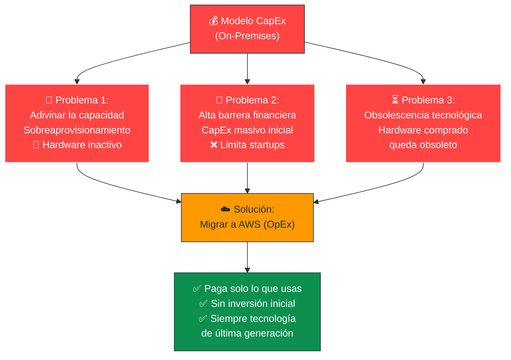
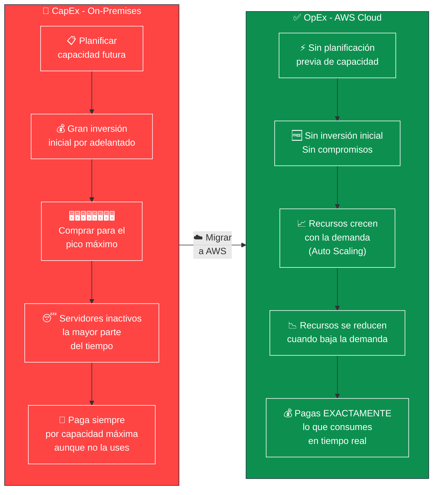
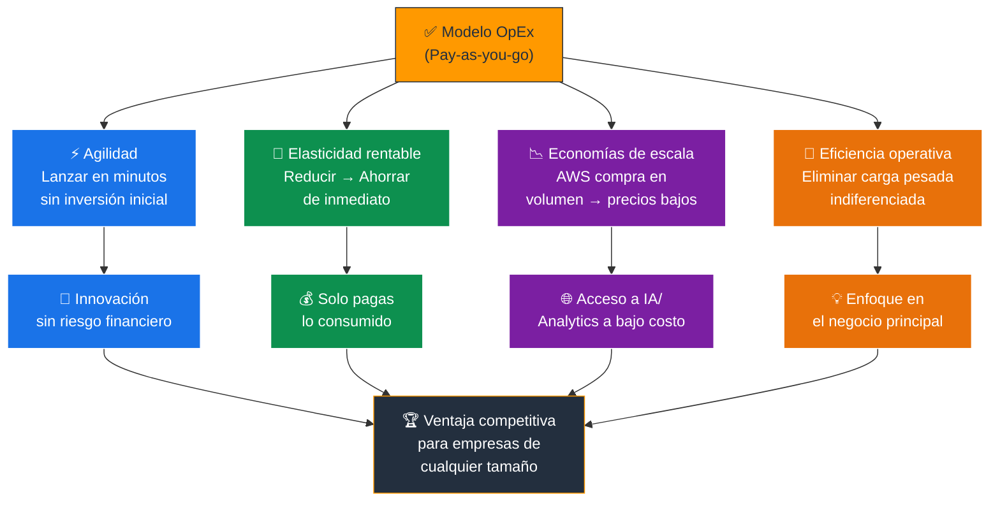
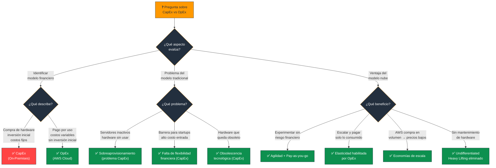

# CapEx vs OpEx en la Nube - Examen CLF-C02

El cambio fundamental del modelo financiero de **Gastos de Capital (CapEx)** a **Gastos Operativos (OpEx)** es el pilar de la economía de la nube y actúa como el motor que impulsa muchos de los beneficios más amplios de la computación en la nube.

---

## 1. El Problema del Modelo Tradicional (CapEx)

En la infraestructura de TI tradicional (on-premises), las empresas operan bajo un modelo de **costos fijos** fuertemente basado en CapEx. Esto implica realizar **inversiones de capital masivas y por adelantado** en servidores físicos, equipos de red, licencias de software e instalaciones **antes de poder ejecutar sus aplicaciones**.

### Las 3 Grandes Desventajas del CapEx

| Problema | Descripción | Consecuencia |
|---|---|---|
| **Adivinar la capacidad** | Predecir necesidades futuras → sobreaprovisionamiento | Recursos inactivos desperdiciando dinero |
| **Falta de flexibilidad financiera** | Alto costo de entrada que limita el presupuesto | Barrera crítica para startups y nuevos proyectos |
| **Obsolescencia tecnológica** | Hardware comprado queda obsoleto rápidamente | Limitación para usar avances más recientes |

> **Tip de examen:** Los tres problemas del CapEx son: **sobreaprovisionamiento**, **falta de flexibilidad financiera** y **obsolescencia tecnológica**.

### 📊 Diagrama: Los Problemas del Modelo CapEx (On-Premises)

---

## 2. La Transformación a la Nube (OpEx)

Migrar a AWS permite a las organizaciones sustituir estas pesadas inversiones de capital por **gastos operativos continuos y medidos (OpEx)**.

### Modelo de Pago por Uso (Pay-as-you-go)

- Los **costos fijos** se convierten en **costos variables**.
- Al igual que el recibo de la electricidad, la empresa solo paga por los recursos **exactos** que consume y durante el **tiempo** que los utiliza.
- Si apaga una instancia → **deja de pagar inmediatamente**.

### Sin Compromisos Iniciales

- Se elimina la necesidad de realizar negociaciones prolongadas o firmar compromisos contractuales a largo plazo para adquirir capacidad de infraestructura.
- Los recursos se pueden aprovisionar **en minutos** sin ningún contrato previo.

### 📊 Diagrama: CapEx vs OpEx - La Transformación Financiera

---

## 3. Impacto en los Beneficios Más Amplios de la Nube

El paso de CapEx a OpEx **no es solo un ahorro contable**, sino que habilita el resto de las ventajas estratégicas de la nube:

### Agilidad y Experimentación Libre de Riesgos

- Al no tener que comprar hardware costoso, las empresas pueden lanzar recursos en **minutos** y probar nuevas ideas.
- Si un proyecto no tiene éxito, simplemente se **apagan los servidores y se deja de pagar**.
- Reduce drásticamente el **riesgo financiero** y fomenta una cultura de innovación.

### Aprovechamiento Real de la Elasticidad

- El modelo OpEx hace que la elasticidad técnica sea **financieramente viable**.
- Con **Auto Scaling**, la infraestructura crece cuando la demanda es alta y se reduce cuando disminuye.
- Al pagar solo lo que se usa, **reducir la infraestructura se traduce en ahorro inmediato**.

### Economías de Escala Masivas

- AWS agrupa las necesidades de **cientos de miles de clientes** → poder de compra masivo.
- Estos ahorros se transfieren al cliente, permitiéndole acceder a:
  - Infraestructura de **nivel empresarial**.
  - Tecnología de punta (IA, analítica avanzada) a un **costo unitario mucho menor**.

### Eficiencia Operativa (Undifferentiated Heavy Lifting)

- Las empresas **ya no gastan** tiempo del personal de TI en:
  - Mantenimiento de hardware.
  - Refrigeración del datacenter.
  - Seguridad física del centro de datos.
- Ese **presupuesto y talento** se reasignan al desarrollo de aplicaciones y mejora del negocio principal.

### 📊 Diagrama: El Efecto Cascada del OpEx - Beneficios Habilitados

---

## Resumen para el Candidato

Abandonar el modelo CapEx a favor del OpEx **democratiza el acceso a la tecnología**, permitiendo a empresas de cualquier tamaño escalar globalmente **sin las barreras financieras restrictivas** de los centros de datos físicos.

| Dimensión | CapEx (On-Premises) | OpEx (AWS Cloud) |
|---|---|---|
| **Inversión inicial** | Masiva, por adelantado | Ninguna |
| **Modelo de pago** | Fijo (paga aunque no uses) | Variable (paga lo que consumes) |
| **Flexibilidad** | Baja (compromisos a largo plazo) | Alta (sin contratos de capacidad) |
| **Riesgo financiero** | Alto (si el negocio falla, hardware inactivo) | Bajo (apaga y deja de pagar) |
| **Escalado** | Manual, lento y costoso | Automático, inmediato (Auto Scaling) |
| **Tecnología** | Puede quedar obsoleta | Siempre actualizada (AWS la gestiona) |
| **Gestión** | Tu equipo administra todo | AWS gestiona la infraestructura |

### Palabras clave que debes asociar

- **"Gran inversión inicial / por adelantado"** → CapEx
- **"Pagar solo lo que consumes / variable"** → OpEx
- **"Sin compromisos / sin contratos de capacidad"** → Pay-as-you-go (OpEx)
- **"Sobreaprovisionamiento / capacidad ociosa"** → Problema del CapEx
- **"Reducir infraestructura = ahorro inmediato"** → Elasticidad habilitada por OpEx
- **"Cientos de miles de clientes / volumen"** → Economías de escala
- **"Mantenimiento / refrigeración / seguridad física"** → Undifferentiated heavy lifting (eliminado con OpEx)
- **"Democratizar el acceso / empresas de cualquier tamaño"** → Ventaja del modelo OpEx

---

### 📊 Diagrama: Árbol de Decisión para Preguntas del Examen

