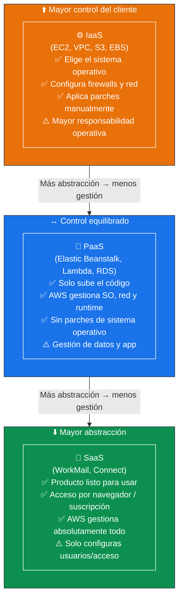
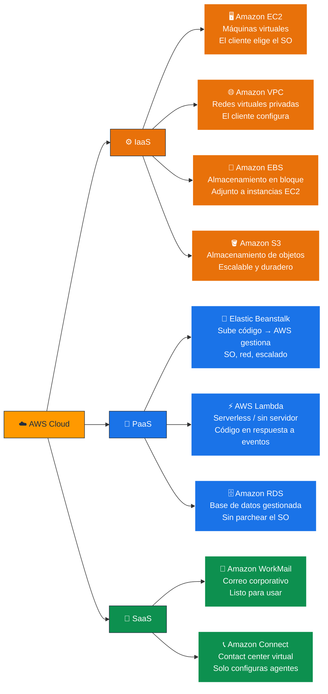
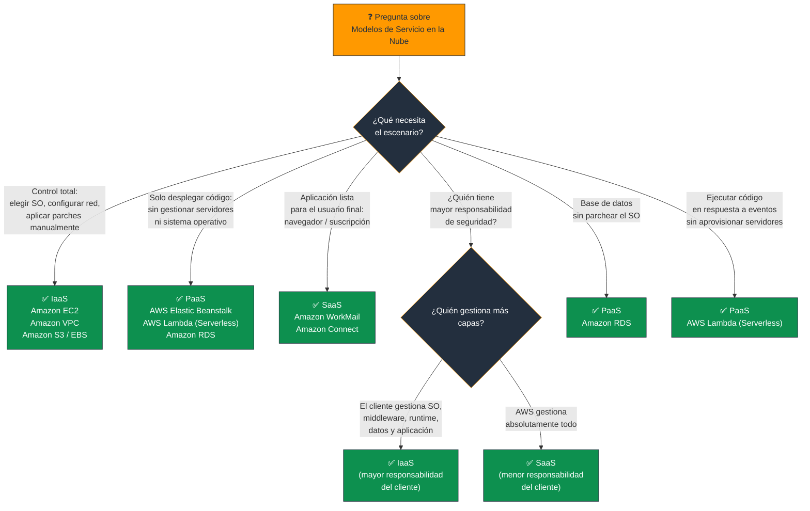

# Modelos de Servicio en la Nube - Examen CLF-C02

Los **modelos de servicio en la nube** definen el nivel de responsabilidad que asume cada parte (proveedor vs. cliente) sobre los distintos componentes de la infraestructura y las aplicaciones. Comprender las diferencias entre IaaS, PaaS y SaaS es fundamental para el examen CLF-C02.

---

## Contenido de Esta Sección

- [IaaS, PaaS y SaaS - Detalle Completo](IaaS/IaaS.md)

---

## 1. Los Tres Modelos de Servicio

| Modelo | Nombre completo | Control del cliente | Gestión AWS | Ejemplo en AWS |
|---|---|---|---|---|
| **IaaS** | Infraestructura como Servicio | Máximo | Infraestructura física | EC2, VPC, EBS |
| **PaaS** | Plataforma como Servicio | Medio | Infraestructura + SO + Runtime | Elastic Beanstalk, RDS |
| **SaaS** | Software como Servicio | Mínimo | Todo | Amazon WorkMail, Connect |

> **Regla de oro:** A mayor abstracción → menor control del cliente → menor responsabilidad operativa del cliente.

---

## 2. ¿Quién Gestiona Qué?

### 📊 Diagrama: Capas de Gestión por Modelo

```mermaid
flowchart LR
    subgraph ONPREM["🏢 On-Premises\n(Todo el cliente)"]
        direction TB
        O1["🔴 Redes físicas"]
        O2["🔴 Almacenamiento"]
        O3["🔴 Servidores"]
        O4["🔴 Virtualización"]
        O5["🔴 Sistema Operativo"]
        O6["🔴 Middleware"]
        O7["🔴 Runtime"]
        O8["🔴 Datos"]
        O9["🔴 Aplicación"]
    end

    subgraph IAAS["⚙️ IaaS\n(EC2, VPC, EBS)"]
        direction TB
        I1["🟢 Redes físicas"]
        I2["🟢 Almacenamiento"]
        I3["🟢 Servidores"]
        I4["🟢 Virtualización"]
        I5["🟠 Sistema Operativo"]
        I6["🟠 Middleware"]
        I7["🟠 Runtime"]
        I8["🟠 Datos"]
        I9["🟠 Aplicación"]
    end

    subgraph PAAS["🔧 PaaS\n(Beanstalk, RDS, Lambda)"]
        direction TB
        P1["🟢 Redes físicas"]
        P2["🟢 Almacenamiento"]
        P3["🟢 Servidores"]
        P4["🟢 Virtualización"]
        P5["🟢 Sistema Operativo"]
        P6["🟢 Middleware"]
        P7["🟢 Runtime"]
        P8["🔵 Datos"]
        P9["🔵 Aplicación"]
    end

    subgraph SAAS["📱 SaaS\n(WorkMail, Connect)"]
        direction TB
        S1["🟢 Redes físicas"]
        S2["🟢 Almacenamiento"]
        S3["🟢 Servidores"]
        S4["🟢 Virtualización"]
        S5["🟢 Sistema Operativo"]
        S6["🟢 Middleware"]
        S7["🟢 Runtime"]
        S8["🟢 Datos"]
        S9["🟢 Aplicación"]
    end

    style ONPREM fill:#FF4444,stroke:#232F3E,color:#FFFFFF
    style IAAS fill:#e8710a,stroke:#232F3E,color:#FFFFFF
    style PAAS fill:#1a73e8,stroke:#232F3E,color:#FFFFFF
    style SAAS fill:#0d904f,stroke:#232F3E,color:#FFFFFF
    style O1 fill:#FF4444,stroke:#FFFFFF,color:#FFFFFF
    style O2 fill:#FF4444,stroke:#FFFFFF,color:#FFFFFF
    style O3 fill:#FF4444,stroke:#FFFFFF,color:#FFFFFF
    style O4 fill:#FF4444,stroke:#FFFFFF,color:#FFFFFF
    style O5 fill:#FF4444,stroke:#FFFFFF,color:#FFFFFF
    style O6 fill:#FF4444,stroke:#FFFFFF,color:#FFFFFF
    style O7 fill:#FF4444,stroke:#FFFFFF,color:#FFFFFF
    style O8 fill:#FF4444,stroke:#FFFFFF,color:#FFFFFF
    style O9 fill:#FF4444,stroke:#FFFFFF,color:#FFFFFF
    style I1 fill:#0d904f,stroke:#FFFFFF,color:#FFFFFF
    style I2 fill:#0d904f,stroke:#FFFFFF,color:#FFFFFF
    style I3 fill:#0d904f,stroke:#FFFFFF,color:#FFFFFF
    style I4 fill:#0d904f,stroke:#FFFFFF,color:#FFFFFF
    style I5 fill:#e8710a,stroke:#FFFFFF,color:#FFFFFF
    style I6 fill:#e8710a,stroke:#FFFFFF,color:#FFFFFF
    style I7 fill:#e8710a,stroke:#FFFFFF,color:#FFFFFF
    style I8 fill:#e8710a,stroke:#FFFFFF,color:#FFFFFF
    style I9 fill:#e8710a,stroke:#FFFFFF,color:#FFFFFF
    style P1 fill:#0d904f,stroke:#FFFFFF,color:#FFFFFF
    style P2 fill:#0d904f,stroke:#FFFFFF,color:#FFFFFF
    style P3 fill:#0d904f,stroke:#FFFFFF,color:#FFFFFF
    style P4 fill:#0d904f,stroke:#FFFFFF,color:#FFFFFF
    style P5 fill:#0d904f,stroke:#FFFFFF,color:#FFFFFF
    style P6 fill:#0d904f,stroke:#FFFFFF,color:#FFFFFF
    style P7 fill:#0d904f,stroke:#FFFFFF,color:#FFFFFF
    style P8 fill:#1a73e8,stroke:#FFFFFF,color:#FFFFFF
    style P9 fill:#1a73e8,stroke:#FFFFFF,color:#FFFFFF
    style S1 fill:#0d904f,stroke:#FFFFFF,color:#FFFFFF
    style S2 fill:#0d904f,stroke:#FFFFFF,color:#FFFFFF
    style S3 fill:#0d904f,stroke:#FFFFFF,color:#FFFFFF
    style S4 fill:#0d904f,stroke:#FFFFFF,color:#FFFFFF
    style S5 fill:#0d904f,stroke:#FFFFFF,color:#FFFFFF
    style S6 fill:#0d904f,stroke:#FFFFFF,color:#FFFFFF
    style S7 fill:#0d904f,stroke:#FFFFFF,color:#FFFFFF
    style S8 fill:#0d904f,stroke:#FFFFFF,color:#FFFFFF
    style S9 fill:#0d904f,stroke:#FFFFFF,color:#FFFFFF
```

> **Leyenda:** 🟢 AWS gestiona | 🟠 Tú gestionas (IaaS) | 🔵 Tú gestionas (PaaS) | 🔴 Todo tú (On-Premises)

---

## 3. Espectro de Control vs. Abstracción

### 📊 Diagrama: De Mayor Control a Mayor Abstracción

---

## 4. Servicios AWS por Modelo

### 📊 Diagrama: Ejemplos Clave en AWS

---

## 5. Responsabilidad Compartida por Modelo

El **Modelo de Responsabilidad Compartida** de AWS varía según el modelo de servicio:

| Capa | On-Premises | IaaS | PaaS | SaaS |
|---|---|---|---|---|
| Infraestructura física | Cliente | **AWS** | **AWS** | **AWS** |
| Virtualización | Cliente | **AWS** | **AWS** | **AWS** |
| Sistema Operativo | Cliente | Cliente | **AWS** | **AWS** |
| Middleware / Runtime | Cliente | Cliente | **AWS** | **AWS** |
| Datos y Aplicación | Cliente | Cliente | Cliente | **AWS** |

> **IaaS tiene la mayor superficie de ataque para el cliente.** Si un cliente mal configura el SO o los firewalls en EC2, AWS no es responsable.

---

## 6. Resumen para el Examen

### Palabras clave que debes asociar

| Frase clave | Modelo |
|---|---|
| "Elegir el sistema operativo" | **IaaS** |
| "Configurar firewalls / aplicar parches al SO" | **IaaS** |
| "Ladrillos básicos de la nube" | **IaaS** |
| "Máximo control / máxima responsabilidad" | **IaaS** |
| "Solo subir código / sin gestionar servidores" | **PaaS** |
| "Plataforma para desarrolladores" | **PaaS** |
| "Base de datos gestionada (sin parchear SO)" | **PaaS** (RDS) |
| "Serverless / sin servidor / en respuesta a eventos" | **PaaS** (Lambda) |
| "Listo para usar / navegador / suscripción" | **SaaS** |
| "Aplicación completa para el usuario final" | **SaaS** |
| "Menor responsabilidad operativa del cliente" | **SaaS** |

---

### 📊 Diagrama: Árbol de Decisión para Preguntas del Examen

