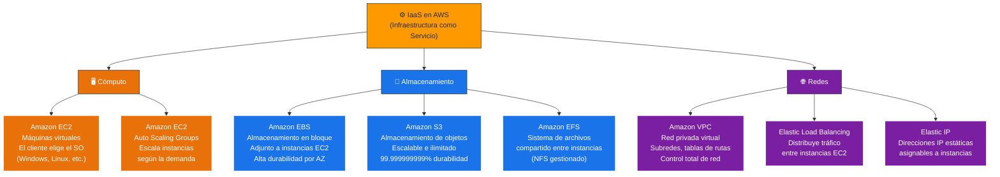
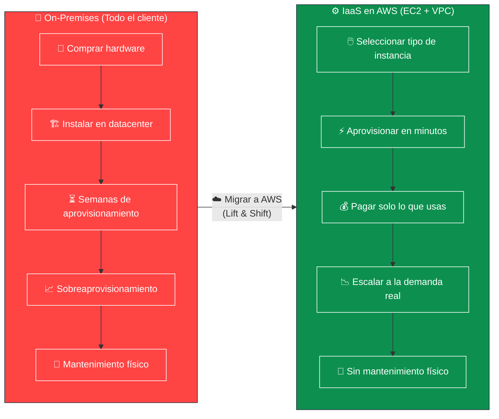
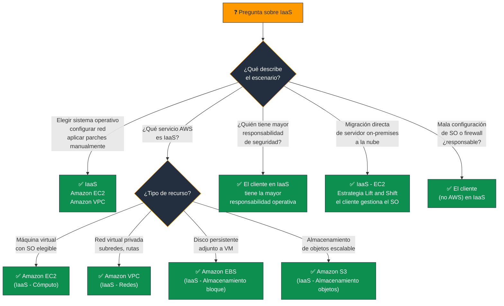

# IaaS - Infraestructura como Servicio - Examen CLF-C02

**IaaS (Infrastructure as a Service)** es el modelo de servicio en la nube que proporciona el mayor nivel de control al cliente. Ofrece los **bloques de construcción fundamentales** de la computación: cómputo, almacenamiento y redes — virtualizados y disponibles bajo demanda a través de Internet.

> **Concepto clave:** Con IaaS, el cliente alquila la infraestructura virtual. AWS gestiona el hardware físico; el cliente gestiona todo lo demás desde el sistema operativo hacia arriba.

---

## 1. ¿Qué es IaaS?

IaaS permite a las organizaciones aprovisionar los componentes básicos de TI sin comprar ni mantener hardware físico:

- **Cómputo:** Instancias virtuales con vCPUs y memoria RAM configurables.
- **Almacenamiento:** Discos en bloque, almacenamiento de objetos y archivos.
- **Redes:** Redes privadas virtuales, subredes, tablas de rutas, balanceadores de carga, IPs elásticas.

Al igual que arrendar una parcela de tierra vacía, IaaS te da el terreno — tú decides qué construyes encima.

### Características distintivas

| Característica | Descripción |
|---|---|
| **Máximo control** | El cliente elige el SO, configura la red y aplica parches |
| **Alta flexibilidad** | Selección de tipo de instancia, SO, región y configuración de red |
| **Pago por uso** | Se paga solo por los recursos aprovisionados y el tiempo de uso |
| **Sin CapEx** | No hay inversión inicial en hardware físico |
| **Mayor responsabilidad** | El cliente gestiona SO, middleware, runtime, datos y aplicación |

---

## 2. Servicios IaaS en AWS

### 📊 Diagrama: Principales Servicios IaaS de AWS

### Tabla de Servicios Clave

| Servicio | Tipo | Descripción | Caso de uso |
|---|---|---|---|
| **Amazon EC2** | Cómputo | Máquinas virtuales con SO elegido por el cliente | Servidores de aplicaciones, bases de datos |
| **Amazon EBS** | Almacenamiento bloque | Disco persistente adjunto a EC2 | Volumen de arranque, bases de datos |
| **Amazon S3** | Almacenamiento objetos | Almacén de objetos escalable e ilimitado | Backups, activos estáticos, data lakes |
| **Amazon EFS** | Almacenamiento archivos | Sistema de archivos NFS compartido | Contenido compartido entre instancias |
| **Amazon VPC** | Redes | Red privada virtual aislada | Aislar recursos, segmentar tráfico |
| **Elastic Load Balancing** | Redes | Distribuye tráfico entre instancias | Alta disponibilidad de aplicaciones |

---

## 3. Responsabilidad Compartida en IaaS

IaaS es el modelo donde el cliente asume la **mayor cantidad de responsabilidades operativas**.

### 📊 Diagrama: Responsabilidad Compartida en EC2 (IaaS)

```mermaid
flowchart LR
    subgraph AWS["🟢 AWS Gestiona (Seguridad DE la nube)"]
        direction TB
        A1["🏢 Instalaciones físicas
Centros de datos, seguridad física"]
        A2["🖥️ Hardware físico
Servidores, switches, routers"]
        A3["⚡ Red subyacente
Infraestructura de red global"]
        A4["🔧 Hipervisor
Capa de virtualización"]
    end

    subgraph CLIENTE["🟠 El Cliente Gestiona (Seguridad EN la nube)"]
        direction TB
        C1["💿 Sistema Operativo
Instalación, configuración, parches"]
        C2["🔒 Firewalls y grupos de seguridad
Reglas de entrada y salida"]
        C3["📦 Middleware y Runtime
Servidores web, motores de base de datos"]
        C4["🗄️ Datos y Aplicación
Cifrado, acceso, backups"]
        C5["👤 Gestión de identidades
IAM, usuarios, permisos en el SO"]
    end

    AWS -->|"Entrega infraestructura\nvirtual segura"| CLIENTE

    style AWS fill:#0d904f,stroke:#232F3E,color:#FFFFFF
    style CLIENTE fill:#e8710a,stroke:#232F3E,color:#FFFFFF
    style A1 fill:#0d904f,stroke:#FFFFFF,color:#FFFFFF
    style A2 fill:#0d904f,stroke:#FFFFFF,color:#FFFFFF
    style A3 fill:#0d904f,stroke:#FFFFFF,color:#FFFFFF
    style A4 fill:#0d904f,stroke:#FFFFFF,color:#FFFFFF
    style C1 fill:#e8710a,stroke:#FFFFFF,color:#FFFFFF
    style C2 fill:#e8710a,stroke:#FFFFFF,color:#FFFFFF
    style C3 fill:#e8710a,stroke:#FFFFFF,color:#FFFFFF
    style C4 fill:#e8710a,stroke:#FFFFFF,color:#FFFFFF
    style C5 fill:#e8710a,stroke:#FFFFFF,color:#FFFFFF
```

> **Implicación crítica para el examen:** Si un cliente mal configura un Security Group en EC2, **AWS no es responsable**. La seguridad de la configuración del SO, red y aplicación es 100% del cliente en IaaS.

---

## 4. Cuándo Usar IaaS

### Casos de Uso Típicos

| Escenario | Por qué IaaS |
|---|---|
| Migrar servidores on-premises a la nube | Requiere el mismo control sobre el SO que en local |
| Alojar base de datos personalizada (no gestionada) | Necesita configuración específica del motor |
| Aplicaciones legacy que requieren SO específico | No compatibles con PaaS o serverless |
| Cargas de trabajo con requisitos de red complejos | Control total sobre VPC, subredes y rutas |
| Entornos de desarrollo y pruebas | Máxima flexibilidad para configuración |

### 📊 Diagrama: IaaS vs. On-Premises — La Transformación

---

## 5. Resumen para el Examen

### Palabras clave que debes asociar con IaaS

- **"Elegir el sistema operativo"** → IaaS (EC2)
- **"Aplicar parches al SO manualmente"** → IaaS
- **"Configurar firewalls / Security Groups"** → IaaS
- **"Máximo control / máxima flexibilidad"** → IaaS
- **"Ladrillos básicos / bloques de construcción"** → IaaS
- **"Mayor responsabilidad del cliente"** → IaaS
- **"Lift and Shift / migración directa"** → IaaS (EC2)
- **"Red privada virtual / VPC"** → IaaS
- **"Disco persistente adjunto a instancia"** → IaaS (EBS)

### Comparación Rápida: IaaS vs. PaaS vs. SaaS

| Aspecto | IaaS | PaaS | SaaS |
|---|---|---|---|
| **Control del SO** | ✅ Cliente | ❌ AWS | ❌ AWS |
| **Parches del SO** | ✅ Cliente | ❌ AWS | ❌ AWS |
| **Configuración de red** | ✅ Cliente (VPC) | Parcial | ❌ AWS |
| **Despliegue de código** | ✅ Cliente | ✅ Cliente | ❌ N/A |
| **Gestión de datos** | ✅ Cliente | ✅ Cliente | ✅ Cliente |
| **Ejemplo AWS** | EC2, VPC, EBS | Beanstalk, RDS | WorkMail, Connect |

---

### 📊 Diagrama: Árbol de Decisión para Preguntas del Examen

