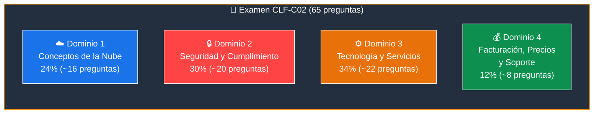
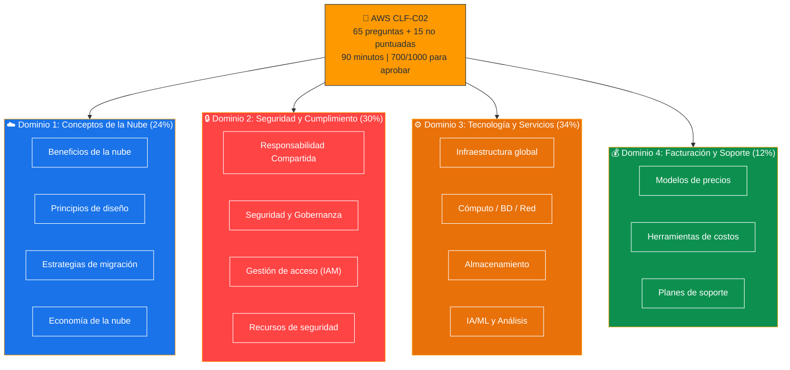
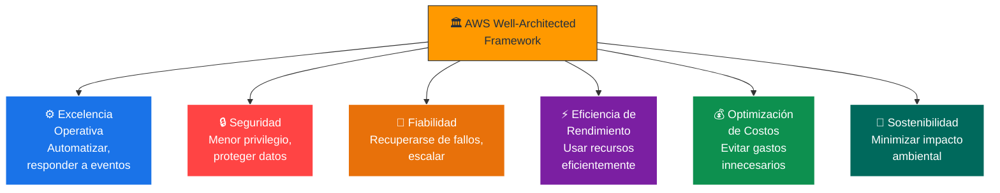
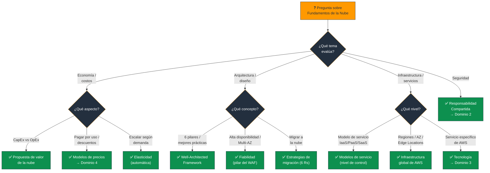

# Objetivos del Examen AWS CLF-C02 - Dominios y Fundamentos

Basado en las fuentes proporcionadas (Sequeira, Piper/Clinton y Kankaria), he analizado los Objetivos del Examen (Dominios) en el contexto de Introducción y Fundamentos.

Para aprobar el examen **AWS Certified Cloud Practitioner (CLF-C02)**, es crucial entender cómo los conceptos fundamentales de la nube se traducen directamente en los objetivos oficiales del examen. El examen no solo evalúa la memorización de servicios, sino la **comprensión del valor de la nube**.

---

## Menú de Navegación - Guía de Estudio CLF-C02

### Dominio 1: Conceptos de la Nube (24%)

| Tema | Archivo |
|---|---|
| Beneficios de la nube | [Beneficios.md](Beneficios.md) |
| Principios de diseño (Well-Architected) | [PrincipiosDiseno.md](PrincipiosDiseno.md) |
| Estrategias de migración | [EstrategiasMigracion.md](EstrategiasMigracion.md) |
| Conceptos de economía de la nube | [ConceptosEconomia.md](ConceptosEconomia.md) |

### Dominio 2: Seguridad y Cumplimiento (30%)

| Tema | Archivo |
|---|---|
| Modelo de Responsabilidad Compartida | [ResponsabilidadCompartida.md](ResponsabilidadCompartida.md) |
| Seguridad, cumplimiento y gobernanza | [SeguridadCumplimientoGober.md](SeguridadCumplimientoGober.md) |
| Gestión de acceso (IAM) | [GestionAcceso.md](GestionAcceso.md) |
| Componentes y recursos de seguridad | [ComponentesRecursosSeguridad.md](ComponentesRecursosSeguridad.md) |

### Dominio 3: Tecnología y Servicios en la Nube (34%)

| Tema | Archivo |
|---|---|
| Despliegue y operación | [DespliegueOperacion.md](DespliegueOperacion.md) |
| Infraestructura global de AWS | [InfraestructuraGlobal.md](InfraestructuraGlobal.md) |
| Servicios de cómputo | [ServiciosComputo.md](ServiciosComputo.md) |
| Servicios de bases de datos | [ServiciosBD.md](ServiciosBD.md) |
| Servicios de red | [ServiciosRed.md](ServiciosRed.md) |
| Servicios de almacenamiento | [ServiciosAlmacenamiento.md](ServiciosAlmacenamiento.md) |
| Servicios de IA/ML y análisis de datos | [ServiciosIAMLAnalisisDatos.md](ServiciosIAMLAnalisisDatos.md) |

### Dominio 4: Facturación, Precios y Soporte (12%)

| Tema | Archivo |
|---|---|
| Modelos de precios y facturación | [PreciosFacturacion.md](PreciosFacturacion.md) |
| Recursos de soporte técnico | [SoporteTecnico.md](SoporteTecnico.md) |

---

## 1. Desglose de Dominios y Ponderación

El examen se divide en **cuatro dominios principales**. Es vital notar que los "Fundamentos" (Dominio 1) representan casi una cuarta parte de la puntuación total, estableciendo la base para el resto de las preguntas.

### Dominio 1: Conceptos de la Nube (24%)

- Este es el dominio puramente "introductorio".
- Evalúa si entiendes **por qué** una empresa se movería a la nube (beneficios económicos, agilidad) y **cómo** debería diseñar sus soluciones (principios de diseño).

### Dominio 2: Seguridad y Cumplimiento (30%)

- Aunque técnico, este dominio se basa en el concepto fundamental de la **Responsabilidad Compartida**.
- Entender la diferencia entre la seguridad **"de"** la nube y **"en"** la nube es el concepto más crítico aquí.

### Dominio 3: Tecnología y Servicios en la Nube (34%)

- Este es el **dominio más extenso**.
- Requiere mapear los servicios fundamentales (Cómputo, Almacenamiento, Redes, Bases de Datos) con casos de uso específicos.

### Dominio 4: Facturación, Precios y Soporte (12%)

- Se enfoca en la **economía de la nube**, modelos de precios (CapEx vs. OpEx) y cómo obtener ayuda.

### 📊 Diagrama: Ponderación de los 4 Dominios

### 📊 Diagrama: Estructura del Examen por Dominio

---

## 2. Fundamentos de la Nube (Mapeo al Dominio 1)

El examen evalúa conceptos teóricos que definen la nube antes de preguntar sobre servicios específicos de AWS.

### Definición de la Nube (NIST)

Debes reconocer las **5 características esenciales** de la nube según el NIST:

| Característica | Descripción |
|---|---|
| **Autoservicio bajo demanda** | Aprovisionar recursos sin intervención humana del proveedor |
| **Acceso amplio a la red** | Acceso desde cualquier dispositivo conectado |
| **Agrupación de recursos** | Recursos compartidos entre múltiples clientes (multi-tenant) |
| **Elasticidad rápida** | Escalar hacia arriba y abajo automáticamente |
| **Servicio medido** | Pagar solo por lo que se consume |

### Propuesta de Valor (Cloud Value Proposition)

- **Economía:** El cambio de gastos de capital (**CapEx**) a gastos operativos (**OpEx**). Pagar solo por lo que usas en lugar de invertir en centros de datos físicos.
- **Agilidad y Velocidad:** La capacidad de lanzar recursos en **minutos** en lugar de semanas, permitiendo la experimentación rápida y la innovación ("fallar rápido").
- **Elasticidad vs. Escalabilidad:**
  - **Escalabilidad:** Capacidad de crecer para manejar más carga.
  - **Elasticidad:** Capacidad de escalar hacia afuera (crecer) y hacia adentro (encoger) **automáticamente** según la demanda para no pagar por recursos inactivos.

### Modelos de Servicio

| Modelo | Descripción | Ejemplo en AWS |
|---|---|---|
| **IaaS** (Infraestructura como Servicio) | Control total sobre la infraestructura virtual | EC2, VPC |
| **PaaS** (Plataforma como Servicio) | Plataforma gestionada para desplegar código | Elastic Beanstalk, Lambda |
| **SaaS** (Software como Servicio) | Software listo para usar | Amazon Connect, WorkMail |

### 📊 Diagrama: Modelos de Servicio - Nivel de Control

> **Leyenda:** Verde = AWS gestiona | Naranja/Azul = Tú gestionas | Rojo = Todo tú (On-Premises)

---

## 3. Introducción a la Infraestructura Global (Mapeo al Dominio 3)

La "Introducción" a AWS incluye comprender cómo está construida físicamente la nube. El examen requiere que diferencies estos componentes fundamentales:

- **Regiones:** Ubicaciones geográficas aisladas diseñadas para la soberanía de datos y la reducción de latencia.
- **Zonas de Disponibilidad (AZ):** Centros de datos físicos dentro de una región. El concepto fundamental es la **Alta Disponibilidad**; si despliegas en múltiples AZ, tu aplicación sobrevive al fallo de un centro de datos.
- **Ubicaciones de Borde (Edge Locations):** Puntos de presencia para CloudFront. Su función fundamental es reducir la latencia entregando contenido caché cerca de los usuarios finales.

> **Tip de examen:** Para más detalle, consulta [InfraestructuraGlobal.md](InfraestructuraGlobal.md).

---

## 4. Principios de Arquitectura (Diseño)

El examen no espera que seas un arquitecto de soluciones, pero sí que conozcas los fundamentos del **AWS Well-Architected Framework**. Las fuentes destacan **seis pilares** que guían las preguntas del examen sobre "buenas prácticas":

| Pilar | Enfoque |
|---|---|
| **Excelencia Operativa** | Automatizar cambios y responder a eventos |
| **Seguridad** | Proteger datos y sistemas (principio de menor privilegio) |
| **Fiabilidad** | Recuperarse de fallos y escalar dinámicamente |
| **Eficiencia de Rendimiento** | Usar recursos de computación de manera eficiente |
| **Optimización de Costos** | Evitar gastos innecesarios |
| **Sostenibilidad** | Minimizar el impacto ambiental |

> **Tip de examen:** Para más detalle, consulta [PrincipiosDiseno.md](PrincipiosDiseno.md).

### 📊 Diagrama: Los 6 Pilares del Well-Architected Framework

---

## Resumen para el Candidato

Para aprobar la sección introductoria y de fundamentos, asegúrese de poder responder:

| Pregunta de repaso | Concepto clave |
|---|---|
| ¿Cuál es la diferencia financiera entre un centro de datos local y AWS? | **CapEx vs. OpEx** |
| ¿Qué responsabilidad de seguridad recae siempre en el cliente? | **Datos, configuración de firewall** (Responsabilidad Compartida) |
| ¿Cuál es la diferencia entre una Región y una Zona de Disponibilidad? | **Región** = ubicación geográfica; **AZ** = centro de datos dentro de la región |
| ¿Qué pilar del WAF se enfoca en la recuperación ante desastres? | **Fiabilidad** |
| ¿Cuál es la diferencia entre escalabilidad y elasticidad? | **Escalabilidad** = crecer; **Elasticidad** = crecer Y encoger automáticamente |
| ¿Qué modelo de servicio te da más control? | **IaaS** (EC2) > **PaaS** (Beanstalk) > **SaaS** (WorkMail) |

### Palabras clave que debes asociar

- **"CapEx → OpEx / pagar por uso"** → Propuesta de valor de la nube
- **"Escalar automáticamente según demanda"** → Elasticidad
- **"Crecer para manejar más carga"** → Escalabilidad
- **"5 características NIST"** → Autoservicio, red amplia, recursos agrupados, elasticidad, medido
- **"IaaS / PaaS / SaaS"** → Modelos de servicio (más control → menos control)
- **"6 pilares"** → Well-Architected Framework
- **"Regiones / AZ / Edge Locations"** → Infraestructura global

---

### 📊 Diagrama: Árbol de Decisión para Preguntas del Examen

