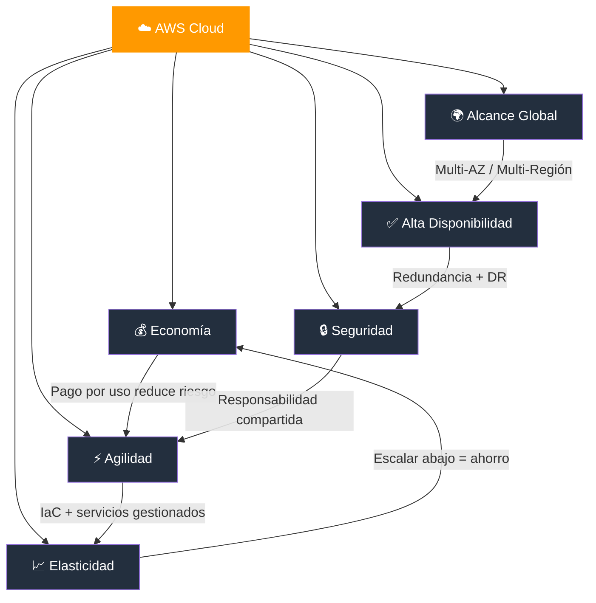
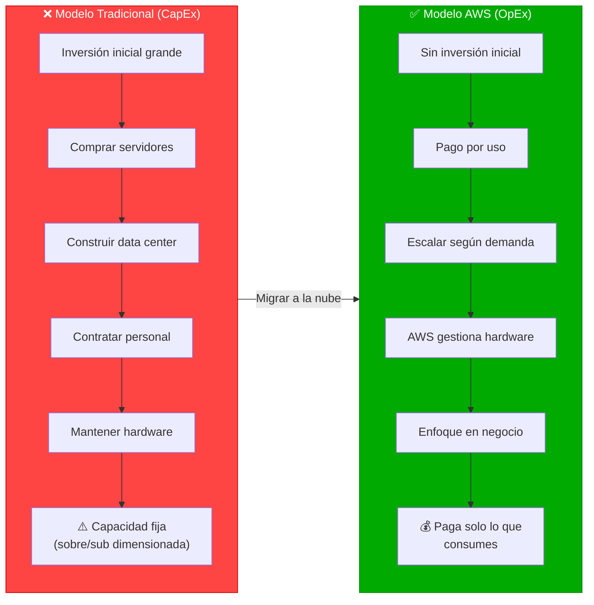
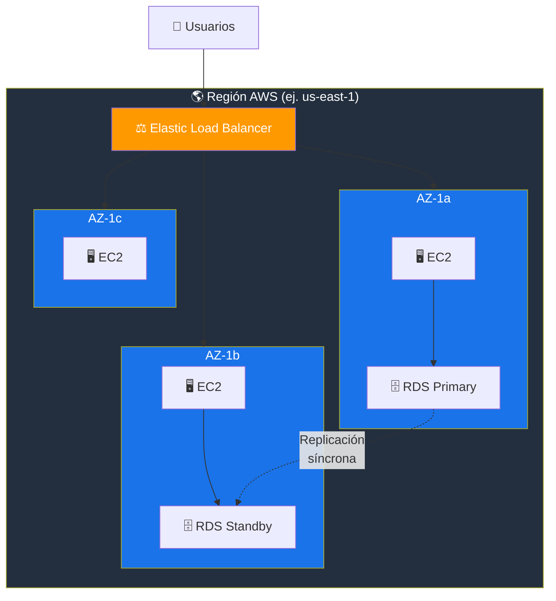
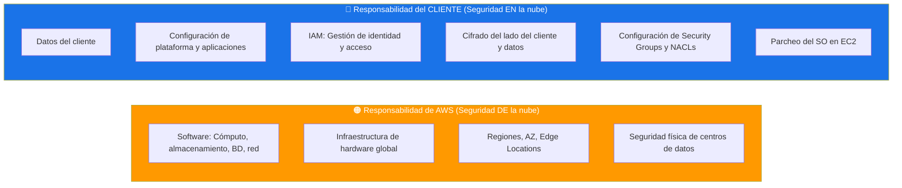
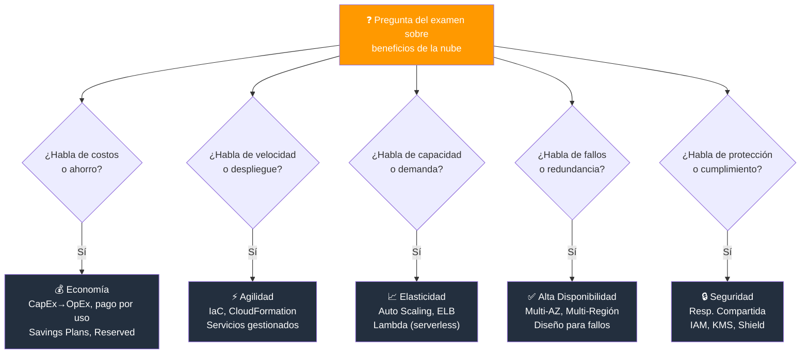

# Beneficios de AWS Cloud - Examen CLF-C02

Basado en las guías de estudio proporcionadas para el examen **AWS Certified Cloud Practitioner (CLF-C02)**, he analizado la información sobre los beneficios de AWS Cloud.

Para aprobar el examen, es crucial entender que los "Beneficios de AWS Cloud" no son solo una lista de ventajas de marketing, sino un componente fundamental del **Dominio 1: Conceptos de la Nube**, que representa el **24% de la puntuación total del examen**.

A continuación, presento un análisis detallado de estos beneficios alineados con los objetivos del examen.

---

## 1. Contexto en los Objetivos del Examen

El examen CLF-C02 se divide en cuatro dominios. El Dominio 1 (Conceptos de la Nube) cubre específicamente la **"Declaración de Tarea 1.1: Definir los beneficios de AWS Cloud"**. Para tener éxito en esta sección, el candidato debe ser capaz de explicar el valor de la nube más allá de la tecnología, enfocándose en cómo resuelve problemas empresariales.

### Los 6 pilares de beneficios que evalúa el examen:

| Beneficio | Concepto clave |
|---|---|
| Economía de la nube | De CapEx a OpEx, pago por uso |
| Agilidad y velocidad | Aprovisionamiento en minutos |
| Elasticidad y escalabilidad | Ajuste automático de recursos |
| Alta disponibilidad | Regiones y Zonas de Disponibilidad |
| Seguridad | Modelo de responsabilidad compartida |
| Alcance global | Despliegue multirregional |

### Mapa de interrelación de los 6 beneficios

---

## 2. Beneficios Económicos (Cloud Economics)

Este es un tema recurrente y crítico en el examen. Evalúa si comprendes el cambio de modelo financiero que implica la nube.

- **De CapEx a OpEx:** Uno de los beneficios más citados es el cambio de gastos de capital (CapEx) a gastos operativos (OpEx). En lugar de invertir grandes sumas por adelantado en centros de datos y servidores físicos (infraestructura tradicional), las empresas pagan por los recursos de TI como un gasto operativo variable.
- **Modelo de pago por uso (Pay-as-you-go):** AWS permite pagar solo por los recursos consumidos, similar a una factura de servicios públicos (como la electricidad). Esto elimina el riesgo financiero de comprar hardware que podría no utilizarse.
- **Economías de escala:** Debido a que AWS tiene cientos de miles de clientes, puede lograr economías de escala masivas que una empresa individual no podría alcanzar. Esto se traduce en precios más bajos para el usuario final a medida que AWS crece.
- **Dejar de adivinar la capacidad:** En el modelo local, los ingenieros deben estimar la capacidad máxima requerida, lo que lleva a un aprovisionamiento excesivo (gasto inútil) o insuficiente (caída del sistema). En AWS, la capacidad se ajusta a la demanda real.
- **Reducción del TCO (Total Cost of Ownership):** AWS ofrece herramientas como **AWS Pricing Calculator** y **Migration Evaluator** para comparar el costo total de propiedad entre infraestructura on-premises y la nube, considerando costos ocultos como mantenimiento, refrigeración, espacio físico y personal.

### CapEx vs OpEx

> **Tip de examen:** Cuando veas preguntas sobre "reducir costos" o "optimizar gastos", piensa en pago por uso, Reserved Instances, Savings Plans y el cambio de CapEx a OpEx.

---

## 3. Agilidad y Velocidad

El examen vincula directamente la agilidad con la capacidad de innovar y desplegar recursos rápidamente.

- **Velocidad de aprovisionamiento:** En un entorno local, obtener un servidor puede llevar semanas. En AWS, los recursos (como instancias EC2) se pueden lanzar en minutos o segundos.
- **Experimentación y menor riesgo:** Gracias al bajo costo y la velocidad, las empresas pueden experimentar con nuevas ideas ("fallar rápido") sin grandes riesgos financieros. Si un experimento falla, simplemente se apagan los recursos.
- **Alcance global en minutos:** AWS permite desplegar aplicaciones en múltiples regiones geográficas en cuestión de minutos, acercando los recursos a los usuarios finales para reducir la latencia.
- **Infraestructura como código (IaC):** Servicios como **AWS CloudFormation** y **AWS CDK** permiten definir y desplegar infraestructura de forma programática, lo que acelera los despliegues y reduce errores humanos.
- **Servicios gestionados:** AWS ofrece servicios gestionados (como RDS, Lambda, DynamoDB) que eliminan la carga operativa de administrar infraestructura, permitiendo a los equipos enfocarse en la lógica de negocio.

> **Tip de examen:** La "agilidad" en el contexto de AWS se refiere principalmente a la velocidad con la que se pueden aprovisionar recursos, no a la metodología Agile de desarrollo de software.

---

## 4. Elasticidad y Escalabilidad

Las fuentes enfatizan la distinción entre estos dos términos, y el examen a menudo presenta escenarios para probar tu comprensión de ellos.

- **Escalabilidad:** Es la capacidad de aumentar los recursos para satisfacer una demanda creciente (por ejemplo, una aplicación que crece de 100 a 1 millón de usuarios).
  - **Escalabilidad vertical (scale up):** Aumentar la capacidad de una instancia existente (más CPU, RAM).
  - **Escalabilidad horizontal (scale out):** Agregar más instancias para distribuir la carga.
- **Elasticidad:** Es la capacidad de escalar hacia afuera (agregar recursos) y hacia adentro (eliminar recursos) **automáticamente** según la demanda. Esto es crucial para no pagar por recursos inactivos cuando la demanda baja. Se compara frecuentemente con una banda elástica que se estira y vuelve a su tamaño original.
- **Herramientas clave:**
  - **Amazon EC2 Auto Scaling:** Ajusta automáticamente el número de instancias EC2.
  - **Elastic Load Balancing (ELB):** Distribuye el tráfico entre múltiples instancias.
  - **AWS Lambda:** Escala automáticamente sin necesidad de gestionar servidores (serverless).

> **Tip de examen:** Elasticidad = automático y bidireccional (sube y baja). Escalabilidad = capacidad de crecer. No son sinónimos.

### Escalabilidad vs Elasticidad

```mermaid
flowchart TB
    subgraph ESCV["Escalabilidad Vertical (Scale Up)"]
        direction LR
        V1["🖥️ t3.micro\n2 vCPU, 1 GB"] -->|"Más potencia"| V2["🖥️ m5.xlarge\n4 vCPU, 16 GB"] -->|"Más potencia"| V3["🖥️ r5.4xlarge\n16 vCPU, 128 GB"]
    end

    subgraph ESCH["Escalabilidad Horizontal (Scale Out)"]
        direction LR
        H1["🖥️ 1 instancia"] -->|"Más instancias"| H2["🖥️🖥️ 2 instancias"] -->|"Más instancias"| H3["🖥️🖥️🖥️ 3 instancias"]
    end

    subgraph ELAST["Elasticidad (Automática)"]
        direction LR
        E1["📉 Baja demanda\n1 instancia"] -->|"Auto Scale Out"| E2["📊 Alta demanda\n5 instancias"] -->|"Auto Scale In"| E3["📉 Baja demanda\n1 instancia"]
    end

    style ESCV fill:#1a73e8,color:#fff
    style ESCH fill:#e8710a,color:#fff
    style ELAST fill:#0d904f,color:#fff
```

---

## 5. Alta Disponibilidad y Fiabilidad

El diseño de la Infraestructura Global de AWS es un habilitador clave de estos beneficios.

- **Regiones y Zonas de Disponibilidad (AZ):** AWS permite desplegar recursos en múltiples AZ dentro de una Región. Dado que las AZ son centros de datos físicamente aislados (con energía y redes independientes), una falla en una AZ no afecta a las demás, garantizando alta disponibilidad y tolerancia a fallos.
- **Recuperación ante desastres (DR):** La nube facilita y abarata la implementación de estrategias de recuperación ante desastres que serían prohibitivamente costosas en entornos locales.
- **Edge Locations:** AWS cuenta con más de 400 ubicaciones de borde (edge locations) a través de **Amazon CloudFront**, que permiten entregar contenido con baja latencia a usuarios de todo el mundo.
- **Diseño para fallos (Design for Failure):** AWS promueve el principio de diseñar aplicaciones asumiendo que los componentes fallarán, utilizando arquitecturas desacopladas y redundantes.

> **Tip de examen:** Recuerda la jerarquía: **Regiones > Zonas de Disponibilidad > Edge Locations**. Cada Región tiene mínimo 3 AZ.

### Arquitectura de Alta Disponibilidad Multi-AZ

---

## 6. Seguridad (Beneficio Heredado)

Aunque la seguridad es un dominio propio (Dominio 2), también se considera un beneficio clave de la nube.

- **Infraestructura asegurada profesionalmente:** Al usar AWS, los clientes heredan una infraestructura física y de red vigilada por expertos en seguridad de clase mundial, algo que muchas empresas no podrían replicar por sí mismas.
- **Modelo de Responsabilidad Compartida:**
  - **AWS es responsable de:** La seguridad **"de"** la nube (hardware, software, redes e instalaciones).
  - **El cliente es responsable de:** La seguridad **"en"** la nube (datos, configuración, acceso, cifrado).
- **Cumplimiento y certificaciones:** AWS mantiene certificaciones como SOC, ISO 27001, PCI DSS, HIPAA, entre otras, lo que facilita que los clientes cumplan con normativas regulatorias al heredar estos controles.
- **Herramientas de seguridad integradas:** AWS proporciona servicios como **IAM**, **AWS Shield**, **AWS WAF**, **GuardDuty** y **AWS KMS** para gestionar identidades, proteger contra ataques y cifrar datos.

> **Tip de examen:** El modelo de responsabilidad compartida es uno de los temas más preguntados. Asegúrate de saber qué le corresponde a AWS y qué al cliente.

### Modelo de Responsabilidad Compartida

---

## Resumen para el Examen

Al prepararse para el CLF-C02, debe recordar que los beneficios de la nube **no son aislados**, sino que están interconectados:

| Conexión | Explicación |
|---|---|
| Elasticidad → Ahorro | Escalar hacia abajo reduce costos (beneficio económico) |
| Infraestructura global → Alta disponibilidad | Múltiples AZ y Regiones protegen contra fallos |
| Agilidad → Innovación | La velocidad de despliegue permite experimentar rápidamente |
| Seguridad → Confianza | La responsabilidad compartida reduce la carga operativa |
| Pago por uso → Menor riesgo | Solo pagas lo que consumes, sin inversión inicial |

### Árbol de decisión para preguntas del examen

### Palabras clave que debes asociar

- **"Reducir costos"** → Pago por uso, OpEx, Reserved Instances, Savings Plans
- **"Alta disponibilidad"** → Multi-AZ, Regiones, ELB
- **"Escalar automáticamente"** → Elasticidad, Auto Scaling, Lambda
- **"Desplegar rápidamente"** → Agilidad, CloudFormation, IaC
- **"Seguridad física"** → Responsabilidad de AWS
- **"Configuración y datos"** → Responsabilidad del cliente
