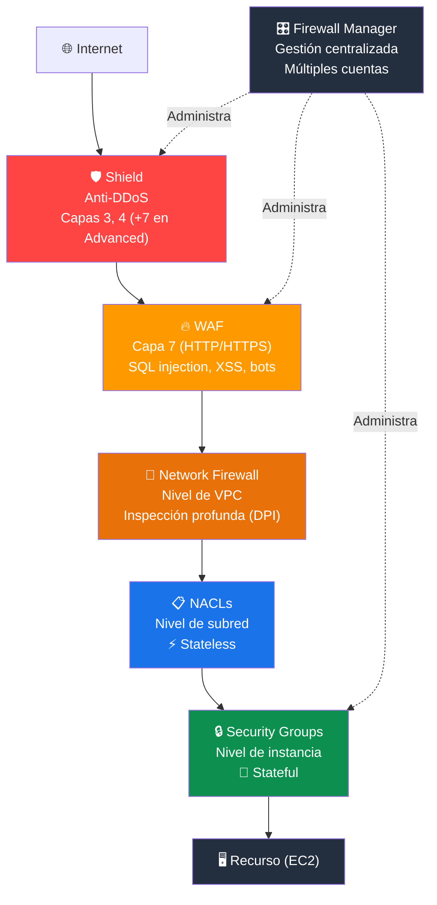
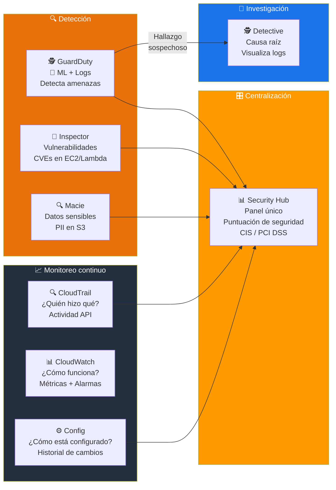
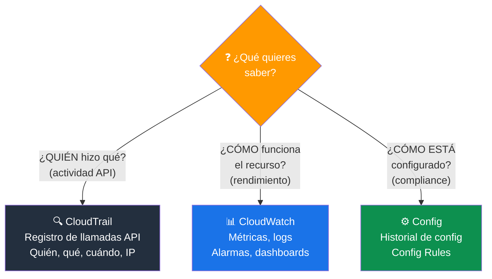
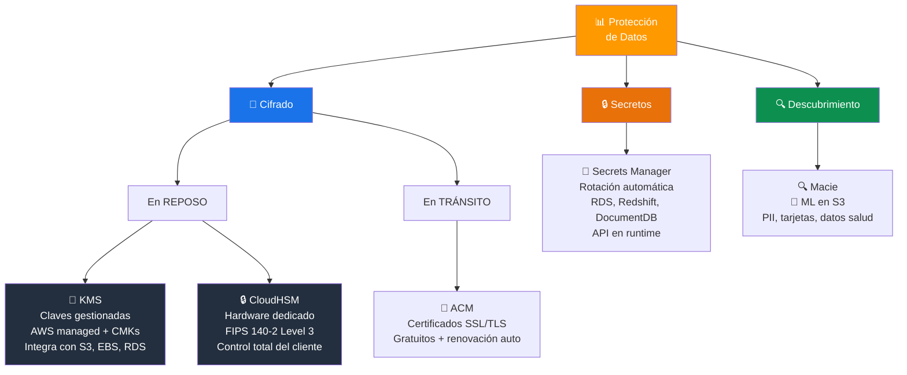
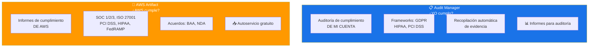
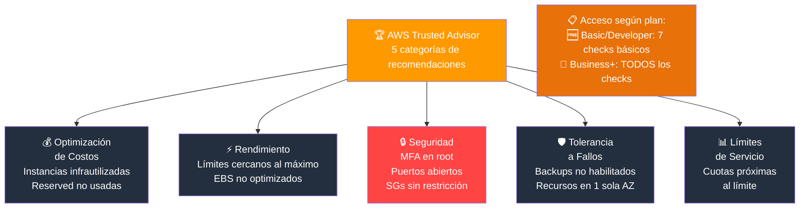

# Componentes y Recursos de Seguridad - Examen CLF-C02

Basado en las tres fuentes proporcionadas (Sequeira, Piper/Clinton y Kankaria), he analizado los Componentes y Recursos de Seguridad.

En el contexto del examen **AWS Certified Cloud Practitioner (CLF-C02)**, este tema aborda directamente la **Declaración de Tarea 2.4: Identificar componentes y recursos de seguridad** dentro del **Dominio 2 (Seguridad y Cumplimiento)**, el cual representa el **30% del examen**.

A continuación, presento un análisis detallado estructurado para el examen, dividiendo el contenido entre **Componentes Tecnológicos (Servicios)** y **Recursos de Información (Apoyo)**.

---

## 1. Componentes de Protección de Red e Infraestructura

El examen evalúa su capacidad para distinguir entre las diferentes capas de defensa de la red.

### Firewalls Virtuales (La distinción clásica del examen)

| Control | Nivel | Estado | Reglas por defecto | Comportamiento |
|---|---|---|---|---|
| **Security Groups** | Instancia (EC2) | **Stateful** | Deny all inbound, Allow all outbound | Si permite entrada, la salida se permite automáticamente |
| **NACLs** | Subred | **Stateless** | Allow all inbound/outbound | Debe configurar reglas explícitas de entrada Y salida |

#### Security Groups (Grupos de Seguridad)

- Actúan como un firewall **a nivel de instancia** (EC2).
- Son **stateful**: si permite el tráfico de entrada, la respuesta de salida se permite automáticamente.
- Solo admiten reglas de **Allow** (no se pueden crear reglas Deny explícitas).
- Se pueden **referenciar entre sí** (ej. "permitir tráfico desde el SG del balanceador de carga").
- Por defecto: **bloquean todo el tráfico entrante** y permiten todo el tráfico saliente.

#### NACLs (Listas de Control de Acceso de Red)

- Actúan como un firewall **a nivel de subred**.
- Son **stateless**: debe configurar reglas explícitas tanto para entrada como para salida.
- Admiten reglas de **Allow y Deny**.
- Se evalúan en **orden numérico** (la primera regla que coincida se aplica).
- Se usan como una **capa adicional de defensa** junto con Security Groups.

> **Tip de examen:** Security Groups = **stateful**, nivel de instancia, solo Allow. NACLs = **stateless**, nivel de subred, Allow y Deny. Esta distinción es una de las más preguntadas.

### Security Groups vs NACLs

```mermaid
flowchart LR
    subgraph SG["🔒 Security Groups"]
        direction TB
        SG1["🔄 Stateful"]
        SG2["📍 Nivel de instancia"]
        SG3["✅ Solo reglas Allow"]
        SG4["🚫 Deny implícito"]
        SG5["🔗 Se referencian entre sí"]
        SG6["Por defecto:\n❌ Deny all inbound\n✅ Allow all outbound"]
    end

    subgraph NACL["📋 NACLs"]
        direction TB
        N1["⚡ Stateless"]
        N2["📍 Nivel de subred"]
        N3["✅ Reglas Allow Y Deny"]
        N4["🔢 Se evalúan en orden"]
        N5["📋 Reglas entrada Y salida"]
        N6["Por defecto:\n✅ Allow all inbound\n✅ Allow all outbound"]
    end

    SG ~~~ NACL

    style SG fill:#0d904f,color:#fff
    style NACL fill:#1a73e8,color:#fff
```

### Protección de Aplicaciones Web

| Servicio | Protege contra | Capa |
|---|---|---|
| **AWS WAF** | SQL injection, XSS, bots, patrones maliciosos | Capa 7 (HTTP/HTTPS) |
| **AWS Shield Standard** | Ataques DDoS comunes | Capas 3 y 4 (gratis, automático) |
| **AWS Shield Advanced** | Ataques DDoS sofisticados + equipo DRT + protección de costos | Capas 3, 4 y 7 ($3,000/mes) |

#### AWS WAF (Web Application Firewall)

- Protege aplicaciones web contra exploits comunes filtrando el tráfico HTTP/HTTPS.
- Permite crear **reglas personalizadas** para bloquear patrones de tráfico malicioso.
- Se integra con **CloudFront**, **ALB (Application Load Balancer)** y **API Gateway**.
- Soporta **Managed Rules** (reglas preconfiguradas por AWS y socios del Marketplace).
- Casos de protección: inyección SQL, Cross-Site Scripting (XSS), bots maliciosos, geo-restricción.

#### AWS Shield

- **Standard:** Gratuito y activado por defecto para todos los clientes. Protege contra ataques DDoS comunes de capas 3 y 4.
- **Advanced:** Protección pagada ($3,000/mes) con:
  - Mitigación de ataques sofisticados en capas 3, 4 y 7.
  - Acceso al **equipo de respuesta DDoS (DRT)** 24/7.
  - **Protección de costos**: reembolso por picos de facturación causados por DDoS.
  - Métricas avanzadas y diagnósticos en tiempo real.
  - Integración con WAF sin costo adicional.

> **Tip de examen:** "Proteger app web contra SQL injection" = **WAF**. "Proteger contra DDoS" = **Shield**. Shield Standard es gratis y automático; Advanced requiere activación y pago.

### Gestión Centralizada de Firewalls

| Servicio | Función |
|---|---|
| **AWS Firewall Manager** | Configurar y administrar reglas de firewall (WAF, Shield, Security Groups) de forma centralizada a través de múltiples cuentas en Organizations |
| **AWS Network Firewall** | Firewall gestionado para proteger VPCs con inspección profunda de paquetes (DPI) y filtrado de dominio |

> **Tip de examen:** "Gestionar reglas de firewall en múltiples cuentas" = **Firewall Manager**. "Inspección profunda de paquetes en VPC" = **Network Firewall**.

### Arquitectura de protección de red completa

---

## 2. Componentes de Detección de Amenazas y Monitoreo

Debe identificar qué herramienta utilizar según el tipo de amenaza o análisis necesario.

### Mapa de servicios de detección

| Servicio | Función | Qué analiza / evalúa |
|---|---|---|
| **Amazon GuardDuty** | Detección inteligente de amenazas | CloudTrail logs, VPC Flow Logs, DNS logs, S3 data events |
| **Amazon Inspector** | Evaluación de vulnerabilidades | EC2, imágenes de contenedores ECR, funciones Lambda |
| **AWS Security Hub** | Vista centralizada de seguridad | Hallazgos de GuardDuty, Inspector, Macie, Config, Firewall Manager |
| **Amazon Detective** | Investigación de causa raíz | Visualización de datos de logs para análisis forense |
| **AWS CloudTrail** | Registro de actividad de la API | Todas las llamadas API (quién, qué, cuándo, desde dónde) |
| **Amazon CloudWatch** | Monitoreo de métricas y logs | Rendimiento de recursos, logs de aplicación, alarmas |
| **AWS Config** | Auditoría de configuración | Historial de configuración de recursos, cumplimiento de reglas |

### Amazon GuardDuty

- Servicio de detección de amenazas **inteligente** (usa machine learning).
- Analiza logs de **CloudTrail**, **VPC Flow Logs**, **DNS logs** y **S3 data events**.
- Detecta actividades sospechosas como:
  - Minería de criptomonedas no autorizada.
  - Acceso desde IPs maliciosas conocidas.
  - Comportamiento anómalo de credenciales IAM.
  - Llamadas API inusuales.
- **No requiere agentes** ni infraestructura adicional; se activa con un clic.

### Amazon Inspector

- Evaluación **automatizada** de vulnerabilidades de seguridad.
- Busca **vulnerabilidades de software (CVEs)** y exposiciones de red.
- Evalúa: instancias **EC2**, imágenes de contenedores en **ECR** y funciones **Lambda**.
- Genera hallazgos priorizados por severidad.
- Se ejecuta **continuamente** (no requiere programar escaneos manualmente).

### AWS Security Hub

- **Panel centralizado** que agrega y prioriza hallazgos de seguridad de múltiples servicios.
- Integra hallazgos de: GuardDuty, Inspector, Macie, Config, Firewall Manager y socios terceros.
- Permite verificar cumplimiento con estándares como **CIS AWS Foundations** y **PCI DSS**.
- Proporciona una **puntuación de seguridad** general de la cuenta.

### Amazon Detective

- Ayuda a **investigar la causa raíz** de problemas de seguridad o actividades sospechosas.
- Analiza y **visualiza datos de logs** (CloudTrail, VPC Flow Logs, GuardDuty findings).
- Se usa **después** de que GuardDuty detecta algo sospechoso, para profundizar en la investigación.

### CloudTrail vs. CloudWatch vs. Config

| Pregunta | Servicio |
|---|---|
| "¿Quién hizo esta acción?" | **CloudTrail** (registro de API) |
| "¿Cómo está funcionando el recurso?" | **CloudWatch** (métricas y logs) |
| "¿Cómo estaba configurado el recurso?" | **Config** (historial de configuración) |

> **Tip de examen:** "Detectar amenazas con ML" = **GuardDuty**. "Buscar vulnerabilidades CVE" = **Inspector**. "Vista centralizada de seguridad" = **Security Hub**. "Investigar causa raíz" = **Detective**.

### Pipeline de detección → investigación → centralización

### CloudTrail vs CloudWatch vs Config

---

## 3. Componentes de Protección de Datos y Secretos

| Servicio | Función | Caso de uso |
|---|---|---|
| **Amazon Macie** | Descubrimiento de datos sensibles en S3 | Encontrar PII, datos financieros, datos de salud |
| **AWS KMS** | Gestión de claves de cifrado | Cifrar datos en reposo (EBS, S3, RDS) |
| **AWS CloudHSM** | HSM dedicado en la nube | Cumplimiento estricto que requiere control total del hardware de cifrado |
| **AWS Secrets Manager** | Gestión y rotación de credenciales | Contraseñas de BD, claves API, tokens |
| **AWS Certificate Manager (ACM)** | Certificados SSL/TLS | Cifrado en tránsito (HTTPS) |

### Amazon Macie

- Utiliza **machine learning** para descubrir y proteger datos confidenciales en **Amazon S3**.
- Detecta: información de identificación personal (**PII**), números de tarjetas de crédito, datos de salud.
- Genera alertas cuando encuentra datos sensibles expuestos o sin protección adecuada.
- Proporciona un **inventario de buckets S3** con evaluación de seguridad y acceso.

### AWS KMS (Key Management Service)

- Servicio **gestionado** para crear y controlar claves de cifrado.
- Se integra con la mayoría de servicios AWS: **EBS**, **S3**, **RDS**, **Redshift**, **Lambda**, etc.
- Tipos de claves:
  - **AWS managed keys:** AWS las crea y gestiona automáticamente.
  - **Customer managed keys (CMKs):** El cliente las crea y controla (rotación, políticas de acceso).
- Soporta **rotación automática** de claves anualmente.

### AWS CloudHSM

- Módulos de seguridad de hardware (**HSM**) **dedicados** en la nube.
- El cliente tiene **control total** sobre las claves (AWS no puede acceder a ellas).
- Se usa cuando las regulaciones exigen que el hardware de cifrado sea exclusivo para el cliente.
- Casos: estándares **FIPS 140-2 Level 3**, aplicaciones financieras, firmas digitales.

### AWS Secrets Manager

- Gestiona y **rota automáticamente** credenciales de bases de datos, claves API y otros secretos.
- Elimina la necesidad de **codificar credenciales** en las aplicaciones.
- Integración nativa con **RDS**, **Redshift**, **DocumentDB** para rotación automática.
- Las aplicaciones obtienen secretos **vía API** en tiempo de ejecución.

> **Tip de examen:** "Datos sensibles en S3" = **Macie**. "Cifrar datos almacenados" = **KMS**. "Control total del hardware de cifrado" = **CloudHSM**. "Rotar contraseñas de BD" = **Secrets Manager**.

### Protección de datos: cifrado y secretos

---

## 4. Recursos de Cumplimiento y Auditoría

El examen distingue entre herramientas que configuran seguridad y herramientas que reportan cumplimiento.

| Servicio | Qué proporciona | Cuándo usarlo |
|---|---|---|
| **AWS Artifact** | Informes de cumplimiento **de AWS** (SOC, PCI, ISO) y acuerdos (BAA, NDA) | Auditor pide certificaciones de la infraestructura de AWS |
| **AWS Audit Manager** | Auditoría del **uso del cliente** en AWS | Demostrar que sus configuraciones cumplen GDPR, HIPAA, PCI |

### AWS Artifact

- Portal de **autoservicio** para descargar informes de cumplimiento de AWS.
- Incluye: **SOC 1/2/3**, **ISO 27001**, **PCI DSS**, **HIPAA**, **FedRAMP**, entre otros.
- Permite revisar y aceptar **acuerdos** como el BAA (Business Associate Addendum) para HIPAA.
- Es **gratuito** y accesible desde la consola de AWS.

### AWS Audit Manager

- Automatiza la **recopilación continua de evidencia** para demostrar cumplimiento.
- Genera informes listos para auditoría basados en frameworks como GDPR, HIPAA, PCI DSS.
- Mapea los controles de AWS a los requisitos de la normativa seleccionada.

> **Tip de examen:** "Descargar certificación ISO/SOC de AWS" = **Artifact**. "Demostrar que mi configuración cumple GDPR" = **Audit Manager**.

### Artifact vs Audit Manager

---

## 5. Recursos de Soporte y Conocimiento

Además de los servicios, el examen evalúa si conoce dónde buscar información oficial o asistencia.

| Recurso | Función | Acceso |
|---|---|---|
| **AWS Trusted Advisor** | Recomendaciones en 5 categorías (incluye Seguridad) | Básico: 7 checks gratuitos. Completo: Business+ |
| **AWS Knowledge Center** | Preguntas frecuentes y artículos de soporte técnico | Gratuito, público |
| **AWS Security Blog** | Mejores prácticas y novedades de seguridad | Gratuito, público |
| **AWS Marketplace** | Catálogo de software de terceros (firewalls, antivirus, etc.) | Pay-as-you-go o suscripción |
| **AWS Well-Architected Tool** | Evaluación de arquitectura contra mejores prácticas | Gratuito |
| **Centro de Seguridad de AWS** | Documentación centralizada de seguridad | Gratuito, público |

### AWS Trusted Advisor

Herramienta que escanea su infraestructura y ofrece recomendaciones en **5 categorías**:

| Categoría | Ejemplo de recomendación |
|---|---|
| **Optimización de costos** | Instancias EC2 infrautilizadas |
| **Rendimiento** | Límites de servicio cercanos al máximo |
| **Seguridad** | Grupos de seguridad sin restricciones, falta de MFA en root |
| **Tolerancia a fallos** | Backups de RDS no habilitados, recursos en una sola AZ |
| **Límites de servicio** | Cuotas de servicio próximas al límite |

- **Plan Basic/Developer:** Solo 7 checks básicos gratuitos (incluye checks de seguridad críticos como MFA en root y puertos abiertos).
- **Plan Business y superiores:** Acceso a **todos los checks** de Trusted Advisor.

### AWS Marketplace

- Catálogo digital para encontrar, comprar y desplegar **software de terceros**.
- Incluye: firewalls (Palo Alto, Fortinet), antivirus, herramientas SIEM, soluciones de cumplimiento.
- Se integra con la facturación de AWS (pago consolidado).
- Soporta modelos: BYOL, suscripción por hora/mes/año, contrato.

> **Tip de examen:** "Recomendaciones de seguridad automatizadas" = **Trusted Advisor**. "Comprar software de terceros para AWS" = **Marketplace**.

### Las 5 categorías de Trusted Advisor

---

## Resumen para el Candidato

Para aprobar las preguntas sobre componentes y recursos de seguridad en el CLF-C02:

### Escenarios de detección vs. prevención

| Escenario | Servicio |
|---|---|
| Detectar amenazas analizando logs con ML | **Amazon GuardDuty** |
| Evaluar vulnerabilidades (CVEs) en EC2 | **Amazon Inspector** |
| Investigar la causa raíz de un incidente | **Amazon Detective** |
| Vista centralizada de todos los hallazgos | **AWS Security Hub** |

### Escenarios de protección

| Escenario | Servicio |
|---|---|
| Proteger app web contra SQL injection / XSS | **AWS WAF** |
| Proteger contra ataques DDoS (gratis) | **AWS Shield Standard** |
| Proteger contra DDoS avanzado + equipo DRT | **AWS Shield Advanced** |
| Firewall a nivel de instancia (stateful) | **Security Groups** |
| Firewall a nivel de subred (stateless) | **NACLs** |
| Gestionar firewalls en múltiples cuentas | **AWS Firewall Manager** |

### Escenarios de datos y cifrado

| Escenario | Servicio |
|---|---|
| Encontrar datos sensibles (PII) en S3 | **Amazon Macie** |
| Cifrar datos almacenados | **AWS KMS** |
| Control total del hardware de cifrado | **AWS CloudHSM** |
| Rotar contraseñas de BD automáticamente | **AWS Secrets Manager** |
| Certificados SSL/TLS para HTTPS | **AWS Certificate Manager** |

### Escenarios de auditoría y soporte

| Escenario | Servicio |
|---|---|
| Descargar certificación ISO/SOC de AWS | **AWS Artifact** |
| Auditar cumplimiento de mis configuraciones | **AWS Audit Manager** |
| Recomendaciones automatizadas de seguridad | **AWS Trusted Advisor** |
| Comprar software de seguridad de terceros | **AWS Marketplace** |

### Palabras clave que debes asociar

- **"Stateful / nivel de instancia"** → Security Groups
- **"Stateless / nivel de subred"** → NACLs
- **"SQL injection / XSS / capa 7"** → WAF
- **"DDoS gratis"** → Shield Standard
- **"DDoS + equipo DRT"** → Shield Advanced
- **"Amenazas + machine learning + logs"** → GuardDuty
- **"Vulnerabilidades / CVEs"** → Inspector
- **"PII en S3"** → Macie
- **"Causa raíz de incidente"** → Detective
- **"Panel centralizado de seguridad"** → Security Hub
- **"Informe SOC/ISO para auditor"** → Artifact
- **"Cifrado en reposo"** → KMS
- **"Cifrado en tránsito"** → ACM + SSL/TLS
- **"Rotar secretos"** → Secrets Manager
- **"5 categorías de recomendaciones"** → Trusted Advisor

### Árbol de decisión para preguntas del examen

```mermaid
flowchart TD
    Q["❓ Pregunta sobre\nComponentes y Recursos\nde Seguridad"] --> Q1{"¿Sobre firewall\no protección de red?"}
    Q --> Q2{"¿Sobre detección\nde amenazas?"}
    Q --> Q3{"¿Sobre cifrado\no datos?"}
    Q --> Q4{"¿Sobre auditoría\no cumplimiento?"}
    Q --> Q5{"¿Sobre soporte\no recomendaciones?"}

    Q1 -->|"Nivel de instancia\nstateful"| A1["🔒 Security Groups"]
    Q1 -->|"Nivel de subred\nstateless"| A1B["📋 NACLs"]
    Q1 -->|"SQL injection\nXSS, bots"| A1C["🔥 WAF"]
    Q1 -->|"Anti-DDoS"| A1D{"¿Gratis o\npagado?"}
    Q1 -->|"Múltiples cuentas\ncentralizado"| A1E["🎛️ Firewall Manager"]
    A1D -->|"Gratis"| A1F["🛡️ Shield Standard"]
    A1D -->|"Equipo DRT\nprotección costos"| A1G["🛡️ Shield Advanced"]

    Q2 -->|"Amenazas + ML\nen logs"| A2["🕵️ GuardDuty"]
    Q2 -->|"Vulnerabilidades\nCVEs"| A2B["🔬 Inspector"]
    Q2 -->|"Causa raíz\nde incidente"| A2C["🕵️ Detective"]
    Q2 -->|"Panel único\ncentralizado"| A2D["📊 Security Hub"]
    Q2 -->|"Quién hizo qué\n(API)"| A2E["🔍 CloudTrail"]
    Q2 -->|"Métricas y\nalarmas"| A2F["📊 CloudWatch"]

    Q3 -->|"Cifrar datos\nen reposo"| A3["🔑 KMS"]
    Q3 -->|"Hardware dedicado\nFIPS 140-2"| A3B["🔒 CloudHSM"]
    Q3 -->|"PII / datos\nsensibles en S3"| A3C["🔍 Macie"]
    Q3 -->|"Rotar contraseñas\nde BD"| A3D["🔑 Secrets Manager"]
    Q3 -->|"Certificados\nSSL/TLS"| A3E["📜 ACM"]

    Q4 -->|"Certificaciones\nde AWS (SOC, ISO)"| A4["📜 Artifact"]
    Q4 -->|"Mi cuenta cumple\nGDPR/HIPAA"| A4B["📋 Audit Manager"]
    Q4 -->|"Historial de\nconfiguración"| A4C["⚙️ Config"]

    Q5 -->|"Recomendaciones\nautomáticas\n5 categorías"| A5["🏆 Trusted Advisor"]
    Q5 -->|"Software de\nterceros"| A5B["🛒 Marketplace"]

    style Q fill:#FF9900,color:#fff
    style A1 fill:#0d904f,color:#fff
    style A1B fill:#1a73e8,color:#fff
    style A1C fill:#FF9900,color:#fff
    style A1F fill:#0d904f,color:#fff
    style A1G fill:#FF4444,color:#fff
    style A1E fill:#232F3E,color:#fff
    style A2 fill:#232F3E,color:#fff
    style A2B fill:#232F3E,color:#fff
    style A2C fill:#232F3E,color:#fff
    style A2D fill:#232F3E,color:#fff
    style A2E fill:#232F3E,color:#fff
    style A2F fill:#1a73e8,color:#fff
    style A3 fill:#e8710a,color:#fff
    style A3B fill:#e8710a,color:#fff
    style A3C fill:#0d904f,color:#fff
    style A3D fill:#e8710a,color:#fff
    style A3E fill:#e8710a,color:#fff
    style A4 fill:#1a73e8,color:#fff
    style A4B fill:#1a73e8,color:#fff
    style A4C fill:#1a73e8,color:#fff
    style A5 fill:#FF9900,color:#fff
    style A5B fill:#FF9900,color:#fff
```

