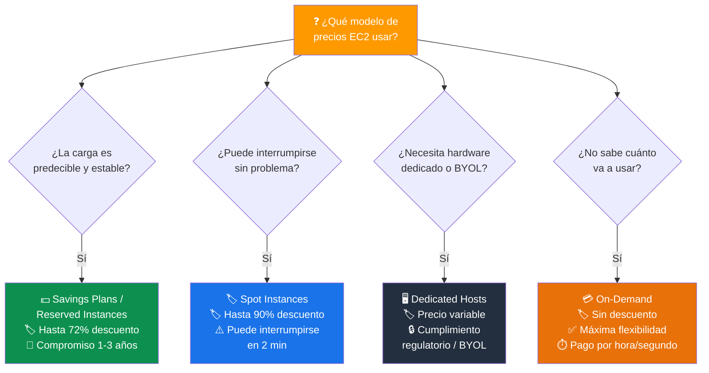
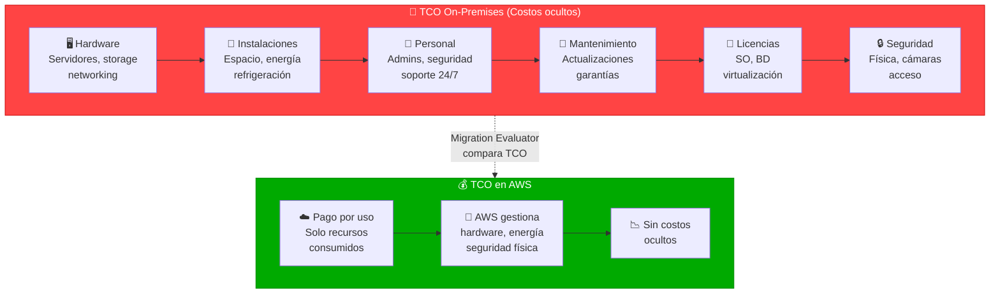
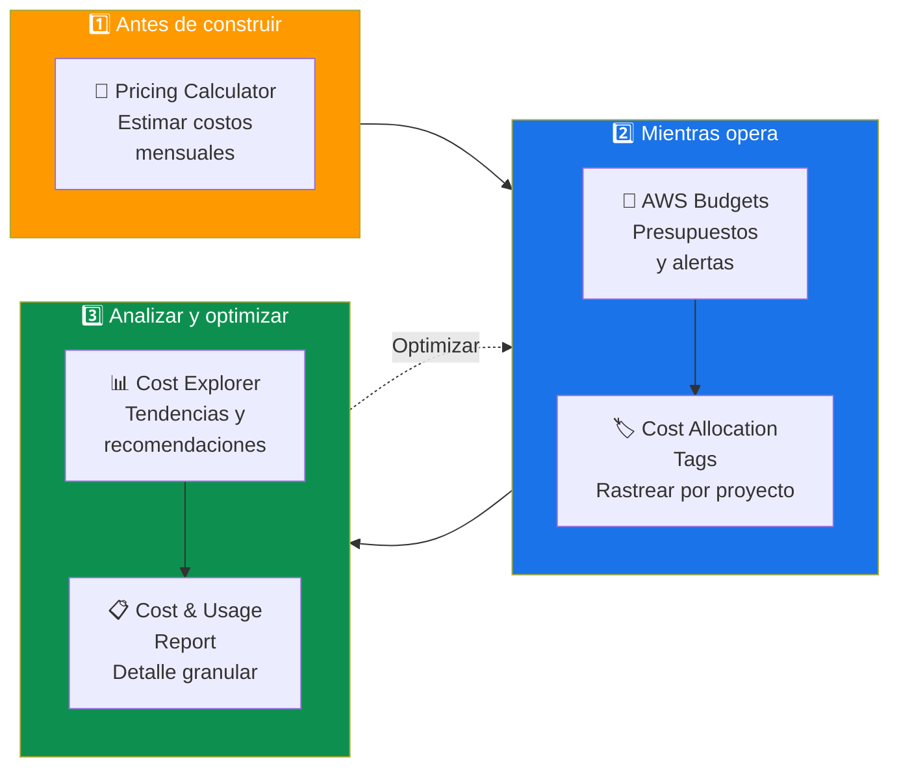
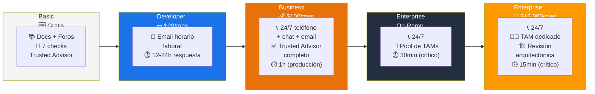
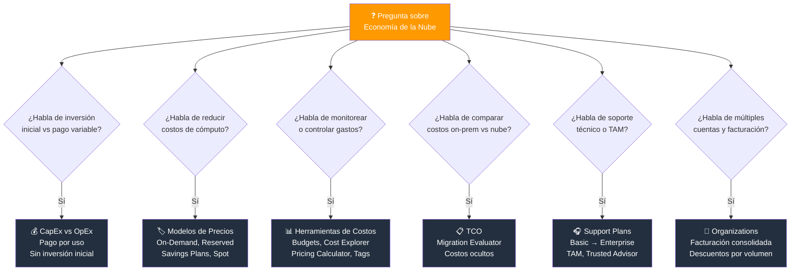

# Conceptos de Economía de la Nube - Examen CLF-C02

Basado en las tres fuentes proporcionadas (Sequeira, Piper/Clinton y Kankaria), he analizado los Conceptos de Economía de la Nube.

En el contexto del examen **AWS Certified Cloud Practitioner (CLF-C02)**, este es un tema transversal crítico. Se evalúa principalmente en:

- **Dominio 1: Conceptos de la Nube** — Declaración de Tarea 1.4: Comprender los conceptos de economía de la nube.
- **Dominio 4: Facturación, Precios y Soporte** — Comparación de modelos de precios y recursos de gestión de costos.

A continuación, presento un análisis detallado de cómo estos conceptos se alinean con los objetivos del examen.

---

## 1. Fundamentos: CapEx vs. OpEx

El examen evalúa si el candidato comprende el cambio financiero fundamental que supone la migración a la nube. Las fuentes coinciden en que este es el pilar de la economía de la nube.

### De Gastos de Capital (CapEx) a Gastos Operativos (OpEx)

| Aspecto | On-Premises (CapEx) | Nube - AWS (OpEx) |
|---|---|---|
| **Inversión** | Grandes inversiones iniciales en hardware, centros de datos y servidores | Pago variable por consumo, sin inversión inicial |
| **Capacidad** | Hay que adivinar la capacidad necesaria (riesgo de sobre/sub-aprovisionamiento) | Se ajusta automáticamente a la demanda real |
| **Riesgo** | Alto: compras activos fijos que pueden no utilizarse | Bajo: solo pagas por lo que consumes |
| **Flexibilidad** | Contratos a largo plazo, difícil de escalar | Escala sin penalizaciones contractuales |

- **Ventaja clave:** Este cambio aumenta la agilidad y reduce el riesgo financiero, permitiendo a las empresas escalar sin compromisos a largo plazo.

> **Tip de examen:** Cualquier pregunta que compare "inversión inicial grande" vs. "pago variable" está evaluando CapEx vs. OpEx. La respuesta correcta siempre favorece OpEx como beneficio de la nube.

### CapEx vs OpEx: Flujo de inversión

```mermaid
flowchart LR
    subgraph CAPEX["❌ CapEx (On-Premises)"]
        direction TB
        C1["💸 Inversión inicial\n$$$$$"] --> C2["🏗️ Comprar hardware\ny construir DC"]
        C2 --> C3["👷 Contratar personal\nde mantenimiento"]
        C3 --> C4["📉 Depreciación\ndel hardware"]
        C4 --> C5["🔄 Renovar cada\n3-5 años"]
        C5 --> C1
    end

    subgraph OPEX["✅ OpEx (AWS Cloud)"]
        direction TB
        O1["💰 $0 inversión\ninicial"] --> O2["📊 Pago mensual\npor consumo"]
        O2 --> O3["📈 Escalar según\ndemanda"]
        O3 --> O4["🎯 Enfoque en\ninnovación"]
        O4 --> O2
    end

    CAPEX -.->|"Migrar\na la nube"| OPEX

    style CAPEX fill:#FF4444,color:#fff,stroke:#CC0000
    style OPEX fill:#00AA00,color:#fff,stroke:#008800
```

---

## 2. Modelos de Precios y Pago por Uso

El examen CLF-C02 requiere que el candidato identifique los diferentes modelos de precios para los servicios de cómputo (EC2). Las fuentes detallan **cuatro categorías principales**:

| Modelo | Descuento | Compromiso | Ideal para |
|---|---|---|---|
| **On-Demand** | 0% (precio base) | Ninguno | Cargas irregulares, corto plazo, no interrumpibles |
| **Savings Plans / Reserved** | Hasta 72% | 1 o 3 años | Cargas estables y predecibles |
| **Spot Instances** | Hasta 90% | Ninguno (pero puede interrumpirse) | Cargas tolerantes a fallos, sin estado |
| **Dedicated Hosts** | Variable | Variable | Cumplimiento regulatorio, licencias BYOL |

### 2.1 Bajo Demanda (On-Demand)

- Modelo predeterminado y más flexible.
- Pagas por **hora o segundo** sin compromisos a largo plazo.
- Es el modelo **más costoso** por unidad de tiempo, pero ofrece la mayor flexibilidad.
- Ideal para cargas de trabajo irregulares o de prueba.

### 2.2 Savings Plans e Instancias Reservadas (Reserved Instances)

- Descuentos significativos (hasta el **72%**) a cambio de un compromiso de uso por **1 o 3 años**.
- **Savings Plans:** Más flexibles que las instancias reservadas tradicionales. Se comprometen a un gasto por hora, no a un tipo de instancia específico.
- **Reserved Instances:** Se comprometen a un tipo de instancia, región y sistema operativo específicos.
- Se recomiendan para cargas de trabajo **estables y consistentes**.

### 2.3 Spot Instances (Instancias de Subasta)

- Capacidad de cómputo **no utilizada** de AWS con descuentos de hasta el **90%**.
- AWS puede reclamar la instancia con solo **2 minutos de aviso**.
- Solo viables para cargas de trabajo **tolerantes a fallos** o sin estado (procesamiento por lotes, análisis de datos, CI/CD).

### 2.4 Dedicated Hosts (Hosts Dedicados)

- Servidores físicos dedicados al uso **exclusivo** de un cliente.
- Se usan para cumplir con requisitos **regulatorios estrictos** o para utilizar licencias de software existentes (**BYOL** - Bring Your Own License) vinculadas al hardware.

> **Tip de examen:** Escenario → Modelo de precios:
> - "Carga estable, predecible" → **Savings Plans / Reserved**
> - "Proceso que puede interrumpirse, el más barato" → **Spot**
> - "Cumplimiento normativo, licencias propias" → **Dedicated Hosts**
> - "No sé cuánto voy a usar" → **On-Demand**

### Modelos de precios EC2: Costo vs Flexibilidad



---

## 3. Economías de Escala y Costo Total de Propiedad (TCO)

Un objetivo clave del examen es entender por qué la nube suele ser más barata que un centro de datos propio, más allá del precio por servidor.

- **Economías de escala masivas:** AWS compra infraestructura para cientos de miles de clientes, obteniendo precios por unidad mucho más bajos. Estos ahorros se trasladan al cliente en forma de precios más bajos a medida que AWS crece.
- **Eliminar la "carga pesada indiferenciada":** AWS gestiona la infraestructura física (energía, seguridad física, apilamiento de servidores), permitiendo a las empresas enfocarse en lo que diferencia su negocio.
- **Elasticidad y costos:** La capacidad de escalar hacia afuera y hacia adentro según la demanda evita pagar por recursos inactivos, algo imposible en un modelo de hardware fijo.

### Costo Total de Propiedad (TCO)

El TCO compara el costo **real** de operar on-premises vs. en la nube, incluyendo costos ocultos:

| Costo | On-Premises | AWS |
|---|---|---|
| Hardware (servidores, almacenamiento) | Cliente | AWS |
| Instalaciones (espacio, energía, refrigeración) | Cliente | AWS |
| Personal de TI (administradores de sistemas) | Cliente | Reducido significativamente |
| Mantenimiento y actualizaciones | Cliente | AWS |
| Licencias de software | Cliente | Variable (puede incluirse) |
| Seguridad física | Cliente | AWS |

> **Tip de examen:** Si la pregunta menciona "comparar costos entre on-premises y la nube", piensa en **TCO** y en la herramienta **Migration Evaluator** (antes TSO Logic).

### TCO: Costos ocultos de On-Premises



---

## 4. Herramientas de Gestión de Costos

El Dominio 4 del examen se centra en las herramientas disponibles para monitorear y controlar el gasto:

| Herramienta | Función principal | Cuándo usarla |
|---|---|---|
| **AWS Pricing Calculator** | Estimar costos mensuales antes de construir | Planificación de arquitectura |
| **AWS Budgets** | Establecer presupuestos y alertas | Controlar gastos, evitar sorpresas |
| **AWS Cost Explorer** | Analizar gastos históricos y actuales | Visualizar tendencias, optimizar |
| **Cost Allocation Tags** | Rastrear costos por proyecto/departamento | Atribución de gastos en organizaciones |
| **AWS Cost and Usage Report** | Informe detallado de consumo | Auditoría y análisis profundo |
| **AWS Billing Dashboard** | Vista general de la factura actual | Revisión rápida del gasto |

### Detalle de cada herramienta

- **AWS Pricing Calculator:** Modela diferentes soluciones y estima costos mensuales **antes** de desplegar recursos.
- **AWS Budgets:** Establece presupuestos personalizados (de costos o uso) y envía alertas (email, SNS) cuando se superan los umbrales definidos. Clave para **evitar sorpresas** en la facturación.
- **AWS Cost Explorer:** Herramienta **visual** para analizar gastos. Permite ver tendencias, filtrar por servicio o etiqueta, y ofrece recomendaciones de Savings Plans e instancias reservadas.
- **Cost Allocation Tags:** Etiquetas que se activan para rastrear costos detallados por proyecto, departamento o entorno. Esenciales para la atribución de gastos en organizaciones grandes.
- **AWS Cost and Usage Report:** El informe más detallado y granular de AWS sobre consumo y costos. Se puede integrar con Amazon Athena o Amazon QuickSight para análisis avanzado.

> **Tip de examen:** "Alertar cuando el gasto supere X" = **AWS Budgets**. "Visualizar tendencias de gasto" = **Cost Explorer**. "Estimar costos antes de construir" = **Pricing Calculator**.

### Ciclo de gestión de costos en AWS



---

## 5. Nivel Gratuito (AWS Free Tier)

Para los nuevos usuarios, AWS ofrece un nivel gratuito que es vital conocer para el examen y la práctica personal:

| Tipo | Duración | Ejemplos |
|---|---|---|
| **Gratis para siempre** | Sin expiración | Lambda (1M solicitudes/mes), DynamoDB (25 GB), SNS, SQS |
| **12 meses gratis** | Primer año de la cuenta | EC2 t2.micro/t3.micro (750 hrs/mes), S3 (5 GB), RDS (750 hrs/mes) |
| **Pruebas a corto plazo** | Tiempo limitado por servicio | Amazon SageMaker, Amazon Redshift, etc. |

> **Tip de examen:** Recuerda que Lambda y DynamoDB tienen nivel gratuito **permanente**, mientras que EC2 y S3 solo son gratis los primeros **12 meses**.

---

## 6. Otros Conceptos de Facturación

### AWS Organizations y Facturación Consolidada

- **AWS Organizations:** Permite gestionar múltiples cuentas AWS de forma centralizada.
- **Facturación consolidada (Consolidated Billing):** Combina el uso de todas las cuentas de la organización en una sola factura, lo que permite beneficiarse de **descuentos por volumen** y compartir Savings Plans/Reserved Instances entre cuentas.

### AWS Support Plans

| Plan | Costo | Soporte técnico | Caso de uso |
|---|---|---|---|
| **Basic** | Gratis | Solo documentación y foros | Exploración, cuentas personales |
| **Developer** | Desde $29/mes | Email en horario laboral | Desarrollo y pruebas |
| **Business** | Desde $100/mes | 24/7 por teléfono, chat y email | Producción |
| **Enterprise On-Ramp** | Desde $5,500/mes | 24/7 + pool de TAMs | Cargas críticas |
| **Enterprise** | Desde $15,000/mes | 24/7 + TAM dedicado + revisión arquitectónica | Misión crítica |

> **Tip de examen:** Solo los planes **Business** y superiores incluyen acceso a **AWS Trusted Advisor** completo y soporte 24/7 por teléfono. El plan **Enterprise** incluye un **Technical Account Manager (TAM)** dedicado.

### Planes de soporte: Escalamiento de capacidades



---

## Resumen para el Candidato

Para aprobar las secciones de economía en el examen CLF-C02, debe dominar estos conceptos:

| Escenario en el examen | Respuesta |
|---|---|
| "Inversión inicial grande vs. pago variable" | **CapEx vs. OpEx** |
| "Carga de trabajo estable, reducir costos" | **Savings Plans / Reserved Instances** |
| "Proceso flexible, el más barato posible" | **Spot Instances** |
| "Licencias propias, cumplimiento regulatorio" | **Dedicated Hosts** |
| "Alertar cuando el gasto supere el presupuesto" | **AWS Budgets** |
| "Visualizar y analizar tendencias de gasto" | **AWS Cost Explorer** |
| "Estimar costos antes de migrar" | **AWS Pricing Calculator** |
| "Rastrear costos por departamento" | **Cost Allocation Tags** |
| "Descuentos por uso combinado de cuentas" | **Facturación consolidada (Organizations)** |
| "Soporte 24/7 con TAM dedicado" | **Enterprise Support** |

### Palabras clave que debes asociar

- **"Pago por uso"** → OpEx, On-Demand, modelo de consumo variable
- **"Reducir costos a largo plazo"** → Savings Plans, Reserved Instances (1-3 años)
- **"Más barato pero puede interrumpirse"** → Spot Instances
- **"Presupuesto y alertas"** → AWS Budgets
- **"Analizar gastos pasados"** → AWS Cost Explorer
- **"Múltiples cuentas, una factura"** → AWS Organizations, Consolidated Billing
- **"Soporte técnico avanzado"** → Business, Enterprise On-Ramp, Enterprise

### Árbol de decisión para preguntas del examen


