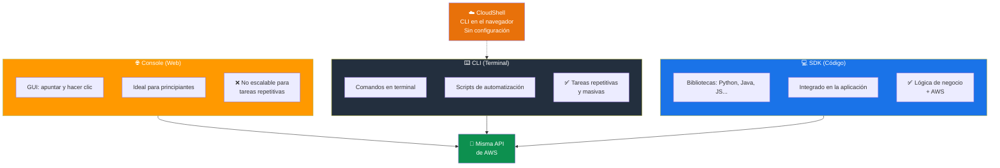
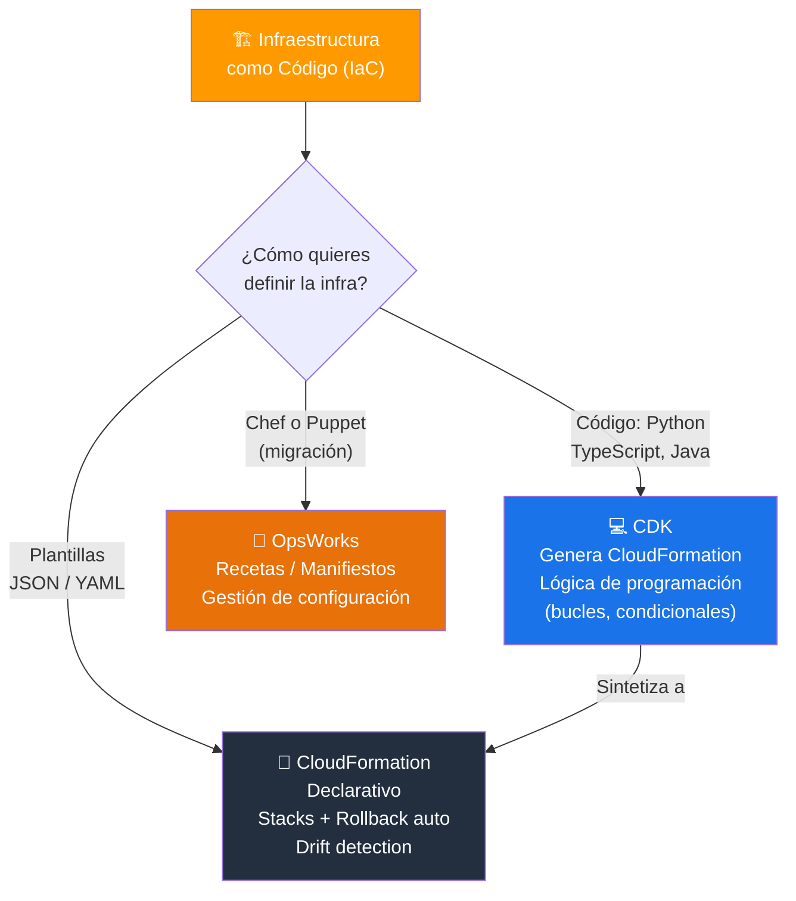
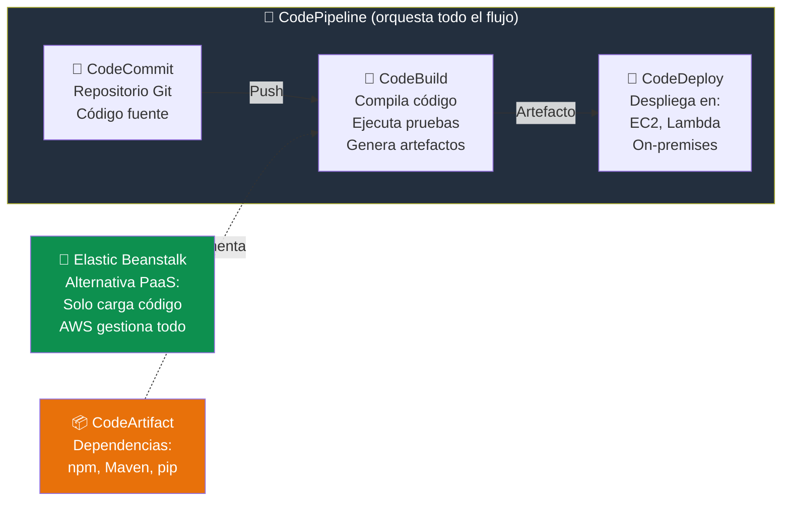
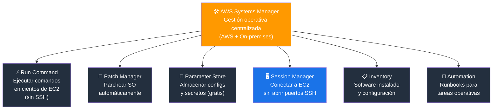
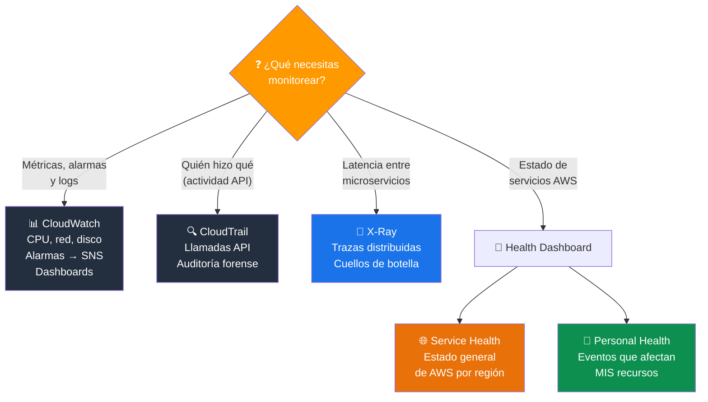
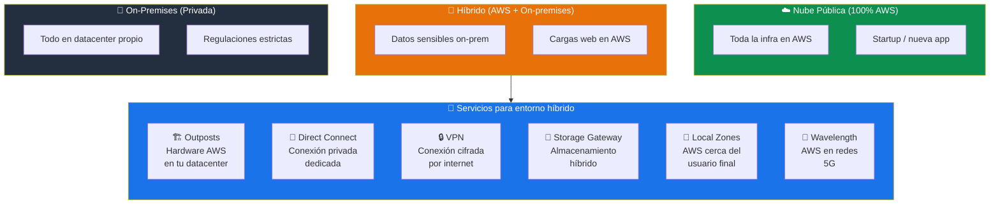

# Métodos de Despliegue y Operación en AWS - Examen CLF-C02

Basado en las tres fuentes proporcionadas (Sequeira, Piper/Clinton y Kankaria), he analizado los Métodos de Despliegue y Operación en AWS.

En el contexto del examen **AWS Certified Cloud Practitioner (CLF-C02)**, este tema se encuadra en el **Dominio 3: Tecnología y Servicios en la Nube**, específicamente en la **Declaración de Tarea 3.1: Definir métodos de despliegue y operación en la nube de AWS**.

A continuación, presento un análisis detallado de cómo se estructuran estos métodos para el examen.

---

## 1. Interfaces de Interacción y Gestión

El examen evalúa si conoce las distintas formas de interactuar con AWS y cuándo usar cada una.

| Interfaz | Tipo | Ideal para | Credenciales |
|---|---|---|---|
| **AWS Management Console** | Web (GUI) | Principiantes, visualización, tareas puntuales | Usuario + Contraseña + MFA |
| **AWS CLI** | Línea de comandos | Automatización, scripts, tareas repetitivas | Access Key ID + Secret Access Key |
| **AWS SDKs** | Bibliotecas de código | Integrar AWS en aplicaciones (Java, Python, .NET) | Access Key ID + Secret Access Key |
| **AWS CloudShell** | Terminal en el navegador | Acceso rápido a CLI sin configuración local | Hereda credenciales del usuario logueado |
| **APIs REST** | Llamadas HTTP | Integración directa con endpoints de AWS | Firma v4 (Signature Version 4) |

### AWS Management Console

- Interfaz web basada en "apuntar y hacer clic".
- Ideal para **principiantes** y para visualizar recursos mediante gráficos (como Cost Explorer).
- **No es escalable** para tareas repetitivas o masivas.
- Plataforma centralizada para configurar seguridad y monitorear servicios.

### AWS CLI (Command Line Interface)

- Herramienta unificada para gestionar servicios desde una **terminal**.
- Fundamental para la **automatización mediante scripts**.
- Permite realizar tareas repetitivas o masivas que serían lentas en la consola.
- Gestiona recursos como instancias EC2, buckets S3 y más directamente mediante comandos.
- Disponible para Windows, macOS y Linux.

### AWS SDKs (Software Development Kits)

- Permiten interactuar con AWS directamente desde el **código de la aplicación**.
- Disponibles para múltiples lenguajes: Python (Boto3), Java, JavaScript, .NET, Go, Ruby, PHP, etc.
- A diferencia de la CLI (scripts de administración), los SDKs se integran en la **lógica de la aplicación**.
- Manejan automáticamente la firma de solicitudes, reintentos y paginación.

### AWS CloudShell

- Terminal basada en el navegador, **preconfigurada** con AWS CLI y otros SDK.
- No requiere configurar credenciales ni instalar herramientas localmente.
- Incluye **1 GB de almacenamiento persistente** por región.
- Ideal para ejecutar comandos rápidos sin salir de la consola.

> **Tip de examen:** Las tres formas principales de acceder a AWS son: **Console**, **CLI** y **SDK**. Todas llaman a la misma API por debajo. "Automatizar tareas con scripts" = **CLI**. "Integrar AWS en la app" = **SDK**.

### Las 3 formas de interactuar con AWS

---

## 2. Infraestructura como Código (IaC) y Aprovisionamiento

Un concepto crítico para el examen es la automatización del despliegue de infraestructura para evitar errores humanos y asegurar la consistencia.

| Servicio | Enfoque | Caso de uso |
|---|---|---|
| **AWS CloudFormation** | IaC declarativa (plantillas JSON/YAML) | Despliegue repetible y consistente de infraestructura |
| **AWS CDK** | IaC con lenguajes de programación | Definir infraestructura con Python, TypeScript, Java, etc. |
| **AWS OpsWorks** | Gestión de configuración (Chef/Puppet) | Migrar configuraciones Chef/Puppet existentes a AWS |
| **AWS Proton** | Plantillas de infraestructura para contenedores/serverless | Equipos de plataforma que crean plantillas para desarrolladores |

### AWS CloudFormation

Herramienta **principal** de Infraestructura como Código (IaC) en AWS:

- Modela y aprovisiona recursos mediante archivos de texto (**plantillas JSON o YAML**).
- Enfoque **declarativo**: usted define **qué** quiere, no cómo construirlo.
- Gestiona los recursos en grupos llamados **Stacks** (pilas).
- Si una parte del stack falla, CloudFormation hace **rollback automático** de todos los cambios.
- Soporta **drift detection** para identificar cambios manuales no autorizados.
- Permite crear **entornos idénticos** en múltiples regiones o cuentas.

### AWS CDK (Cloud Development Kit)

- Framework que permite definir infraestructura usando **lenguajes de programación** conocidos (Python, TypeScript, Java, C#, Go).
- Genera plantillas de CloudFormation por debajo (**sintetiza** a CloudFormation).
- Permite usar lógica de programación (bucles, condicionales) para definir infraestructura.
- Ideal para desarrolladores que prefieren código sobre YAML/JSON.

### AWS OpsWorks

- Servicio de gestión de configuración que utiliza **Chef** y **Puppet**.
- Configura instancias y servidores usando recetas (cookbooks) y manifiestos.
- Es la respuesta correcta si el examen menciona **migrar configuraciones existentes de Chef o Puppet** a AWS.

> **Tip de examen:** "Plantillas JSON/YAML" o "despliegue repetible de infraestructura" = **CloudFormation**. "Chef o Puppet" = **OpsWorks**. "Definir infraestructura con Python/TypeScript" = **CDK**.

### Herramientas de IaC: ¿Cuál elegir?

---

## 3. Modelos de Despliegue de Aplicaciones

El examen distingue entre servicios que requieren gestión manual y aquellos que automatizan el despliegue del código.

### AWS Elastic Beanstalk

Servicio **PaaS** (Plataforma como Servicio) fácil de usar:

- Usted solo **carga el código** y Elastic Beanstalk maneja automáticamente:
  - Aprovisionamiento de capacidad.
  - Equilibrio de carga (ELB).
  - Escalado automático (Auto Scaling).
  - Monitoreo de la salud de la aplicación.
- Ideal para desarrolladores que **no quieren gestionar la infraestructura** subyacente.
- Soporta: Java, .NET, PHP, Node.js, Python, Ruby, Go, Docker.
- Usted **mantiene el control total** de los recursos subyacentes si lo necesita.
- **No tiene costo adicional**: solo paga por los recursos de AWS que utiliza (EC2, ELB, etc.).

### AWS Developer Tools (CI/CD)

Para una automatización más granular (DevOps), el examen evalúa el pipeline completo:

| Servicio | Fase del pipeline | Función |
|---|---|---|
| **AWS CodeCommit** | Código fuente | Repositorios **Git** privados y seguros (control de versiones) |
| **AWS CodeBuild** | Compilación | Compila código, ejecuta pruebas y produce paquetes de software |
| **AWS CodeDeploy** | Despliegue | Automatiza el despliegue en EC2, Lambda o servidores locales |
| **AWS CodePipeline** | Orquestación | Orquesta todo el proceso CI/CD conectando las herramientas anteriores |
| **AWS CodeArtifact** | Artefactos | Repositorio de paquetes/dependencias (npm, Maven, pip) |

### Pipeline CI/CD en AWS

### AWS Amplify

- Plataforma para construir y desplegar **aplicaciones web y móviles** full-stack.
- Incluye hosting, autenticación (Cognito), API (AppSync), almacenamiento.
- Ideal para **desarrolladores frontend** que quieren backend gestionado.

> **Tip de examen:** "Desplegar app web sin gestionar servidores (pero con control)" = **Elastic Beanstalk**. "Pipeline CI/CD completo" = **CodePipeline**. "Repositorio Git privado" = **CodeCommit**. "Desplegar en EC2 o Lambda automáticamente" = **CodeDeploy**.

---

## 4. Gestión Operativa y Automatización de Tareas

Una vez desplegada la infraestructura, ¿cómo se opera eficientemente?

### AWS Systems Manager

Servicio central para la gestión operativa:

- **Visibilidad y control** sobre toda la infraestructura AWS y on-premises.
- Capacidades principales:

| Capacidad | Función |
|---|---|
| **Run Command** | Ejecutar comandos de forma remota en instancias EC2 (sin SSH) |
| **Patch Manager** | Automatizar la aplicación de parches de seguridad |
| **Parameter Store** | Almacenar configuraciones y secretos (gratis, alternativa básica a Secrets Manager) |
| **Session Manager** | Conectarse a instancias EC2 sin abrir puertos SSH (más seguro) |
| **Inventory** | Recopilar información de software instalado y configuración |
| **Automation** | Crear runbooks para automatizar tareas operativas comunes |

> **Tip de examen:** "Ejecutar comandos en cientos de EC2 a la vez" o "parchear servidores automáticamente" = **Systems Manager**. "Conectarse a EC2 sin SSH" = **Session Manager**.

### AWS Systems Manager: Capacidades principales

### Automatización vs. Orquestación

| Concepto | Definición | Ejemplo |
|---|---|---|
| **Automatización** | Realizar una tarea **sin intervención humana** | Script que detiene instancias EC2 a las 6 PM |
| **Orquestación** | Coordinar **muchas tareas automatizadas** en un flujo de trabajo | CloudFormation desplegando VPC + EC2 + RDS + ELB en orden |

---

## 5. Monitoreo y Observabilidad

El examen evalúa cómo supervisar la salud y el rendimiento de los recursos desplegados.

| Servicio | Función | Qué monitorea |
|---|---|---|
| **Amazon CloudWatch** | Métricas, logs y alarmas | CPU, memoria, logs de aplicación, facturación |
| **AWS CloudTrail** | Registro de actividad API | Quién hizo qué, cuándo, desde dónde |
| **AWS X-Ray** | Trazabilidad de aplicaciones distribuidas | Latencia, errores y cuellos de botella entre microservicios |
| **AWS Health Dashboard** | Estado de los servicios de AWS | Interrupciones de servicio, mantenimiento programado |

### Amazon CloudWatch

Servicio central de **monitoreo y observabilidad**:

- **Métricas:** Monitorea CPU, red, disco, etc. de instancias EC2 y otros servicios.
- **Alarmas:** Envía notificaciones (SNS) o ejecuta acciones automáticas cuando una métrica supera un umbral.
- **Logs:** Centraliza y analiza logs de aplicaciones y servicios.
- **Dashboards:** Paneles visuales personalizables para ver el estado de los recursos.
- **Events / EventBridge:** Responde a cambios de estado en recursos AWS (ej. "cuando una instancia se detenga, enviar alerta").

### AWS CloudTrail

- Registra **todas las llamadas a la API** en la cuenta.
- Fundamental para **auditoría**, seguridad y cumplimiento.
- Responde a: "¿Quién eliminó este recurso?" o "¿Quién cambió esta configuración?".

### AWS X-Ray

- Analiza y depura aplicaciones **distribuidas** (microservicios).
- Visualiza el flujo de solicitudes entre servicios, identificando **latencia** y **errores**.
- Se integra con Lambda, API Gateway, ECS, Elastic Beanstalk y EC2.

### AWS Health Dashboard

Dos variantes:

- **Service Health Dashboard:** Estado general de todos los servicios de AWS por región.
- **Personal Health Dashboard:** Alertas personalizadas sobre eventos de AWS que afectan **sus recursos específicos**.

> **Tip de examen:** "Monitorear CPU y crear alarmas" = **CloudWatch**. "Quién hizo qué en la cuenta" = **CloudTrail**. "Depurar latencia entre microservicios" = **X-Ray**. "Estado de los servicios de AWS" = **Health Dashboard**.

### Monitoreo: ¿Qué servicio usar?

---

## 6. Modelos de Implementación en la Nube

El examen puede preguntar sobre los diferentes modelos de despliegue:

| Modelo | Descripción | Ejemplo |
|---|---|---|
| **Nube pública (Cloud)** | Toda la infraestructura en AWS | Startup que opera 100% en la nube |
| **On-Premises (Privada)** | Toda la infraestructura en el centro de datos propio | Empresa con regulaciones que impiden usar la nube pública |
| **Híbrido** | Combinación de nube pública y on-premises | Empresa que mantiene datos sensibles on-premises y usa AWS para web |

### Servicios para entornos híbridos

| Servicio | Función |
|---|---|
| **AWS Outposts** | Hardware de AWS instalado en su centro de datos (AWS on-premises) |
| **AWS Storage Gateway** | Puente de almacenamiento entre on-premises y la nube |
| **AWS Direct Connect** | Conexión de red dedicada y privada entre on-premises y AWS |
| **AWS VPN** | Conexión cifrada entre on-premises y AWS a través de internet |
| **AWS Local Zones** | Extensiones de regiones AWS más cerca de los usuarios finales |
| **AWS Wavelength** | Infraestructura AWS en redes 5G de telecomunicaciones |

> **Tip de examen:** "AWS en mi centro de datos" = **Outposts**. "Conexión privada dedicada" = **Direct Connect**. "Conexión cifrada por internet" = **VPN**. "Almacenamiento híbrido" = **Storage Gateway**.

### Modelos de despliegue y conectividad híbrida

---

## Resumen para el Candidato

Para aprobar las preguntas sobre Métodos de Despliegue y Operación en el CLF-C02:

### Interfaces y acceso

| Escenario | Respuesta |
|---|---|
| Interfaz gráfica web | **AWS Management Console** |
| Automatizar con scripts | **AWS CLI** |
| Integrar AWS en la aplicación | **AWS SDK** |
| Terminal sin configuración local | **AWS CloudShell** |

### Infraestructura como código

| Escenario | Respuesta |
|---|---|
| Plantillas JSON/YAML, despliegue repetible | **AWS CloudFormation** |
| IaC con Python/TypeScript | **AWS CDK** |
| Migrar Chef o Puppet a AWS | **AWS OpsWorks** |

### Despliegue de aplicaciones

| Escenario | Respuesta |
|---|---|
| Desplegar app web sin gestionar infraestructura | **AWS Elastic Beanstalk** |
| Pipeline CI/CD completo | **AWS CodePipeline** |
| Repositorio Git privado | **AWS CodeCommit** |
| Desplegar código en EC2/Lambda | **AWS CodeDeploy** |

### Operaciones y monitoreo

| Escenario | Respuesta |
|---|---|
| Ejecutar comandos en cientos de EC2 / parchear | **AWS Systems Manager** |
| Monitorear CPU y crear alarmas | **Amazon CloudWatch** |
| Auditar quién hizo qué (API) | **AWS CloudTrail** |
| Depurar latencia entre microservicios | **AWS X-Ray** |

### Modelos de despliegue

| Escenario | Respuesta |
|---|---|
| AWS en mi centro de datos | **AWS Outposts** |
| Conexión privada dedicada a AWS | **AWS Direct Connect** |
| Conexión cifrada por internet | **AWS VPN** |

### Palabras clave que debes asociar

- **"Plantillas / JSON / YAML / Stacks"** → CloudFormation
- **"Chef / Puppet"** → OpsWorks
- **"Solo cargar código"** → Elastic Beanstalk
- **"CI/CD / pipeline"** → CodePipeline
- **"Ejecutar comandos remotos / parches"** → Systems Manager
- **"Métricas / alarmas / logs"** → CloudWatch
- **"Quién hizo qué / API calls"** → CloudTrail
- **"Microservicios / latencia / trazas"** → X-Ray
- **"AWS en mi datacenter"** → Outposts
- **"Conexión privada dedicada"** → Direct Connect
- **"Híbrido + almacenamiento"** → Storage Gateway

### Árbol de decisión para preguntas del examen

```mermaid
flowchart TD
    Q["❓ Pregunta sobre\nDespliegue y Operación"] --> Q1{"¿Sobre interfaces\nde acceso?"}
    Q --> Q2{"¿Sobre IaC o\naprovisionamiento?"}
    Q --> Q3{"¿Sobre despliegue\nde aplicaciones?"}
    Q --> Q4{"¿Sobre gestión\noperativa?"}
    Q --> Q5{"¿Sobre monitoreo?"}
    Q --> Q6{"¿Sobre modelo\nde despliegue?"}

    Q1 -->|"Automatizar\ncon scripts"| A1["⌨️ CLI"]
    Q1 -->|"Integrar AWS\nen la app"| A1B["💻 SDK"]
    Q1 -->|"Terminal sin\nconfigurar"| A1C["☁️ CloudShell"]

    Q2 -->|"Plantillas\nJSON/YAML"| A2["📄 CloudFormation"]
    Q2 -->|"IaC con Python\nTypeScript"| A2B["💻 CDK"]
    Q2 -->|"Chef o\nPuppet"| A2C["🍳 OpsWorks"]

    Q3 -->|"Solo cargar código\nAWS gestiona infra"| A3["🌱 Elastic Beanstalk"]
    Q3 -->|"Pipeline CI/CD\ncompleto"| A3B["🔄 CodePipeline"]
    Q3 -->|"Repositorio\nGit privado"| A3C["📂 CodeCommit"]
    Q3 -->|"Desplegar en\nEC2/Lambda"| A3D["🚀 CodeDeploy"]

    Q4 -->|"Comandos remotos\nen EC2 / parches"| A4["🛠️ Systems Manager"]
    Q4 -->|"Conectar a EC2\nsin SSH"| A4B["🖥️ Session Manager"]

    Q5 -->|"Métricas, alarmas\nlogs"| A5["📊 CloudWatch"]
    Q5 -->|"Quién hizo qué\n(API)"| A5B["🔍 CloudTrail"]
    Q5 -->|"Latencia entre\nmicroservicios"| A5C["🔬 X-Ray"]
    Q5 -->|"Estado de\nservicios AWS"| A5D["🏥 Health Dashboard"]

    Q6 -->|"AWS en mi\ndatacenter"| A6["🏗️ Outposts"]
    Q6 -->|"Conexión privada\ndedicada"| A6B["🔗 Direct Connect"]
    Q6 -->|"Conexión cifrada\npor internet"| A6C["🔒 VPN"]
    Q6 -->|"Almacenamiento\nhíbrido"| A6D["💾 Storage Gateway"]

    style Q fill:#FF9900,color:#fff
    style A1 fill:#232F3E,color:#fff
    style A1B fill:#232F3E,color:#fff
    style A1C fill:#232F3E,color:#fff
    style A2 fill:#1a73e8,color:#fff
    style A2B fill:#1a73e8,color:#fff
    style A2C fill:#1a73e8,color:#fff
    style A3 fill:#0d904f,color:#fff
    style A3B fill:#0d904f,color:#fff
    style A3C fill:#0d904f,color:#fff
    style A3D fill:#0d904f,color:#fff
    style A4 fill:#e8710a,color:#fff
    style A4B fill:#e8710a,color:#fff
    style A5 fill:#232F3E,color:#fff
    style A5B fill:#232F3E,color:#fff
    style A5C fill:#1a73e8,color:#fff
    style A5D fill:#1a73e8,color:#fff
    style A6 fill:#FF4444,color:#fff
    style A6B fill:#FF4444,color:#fff
    style A6C fill:#FF4444,color:#fff
    style A6D fill:#FF4444,color:#fff
```

