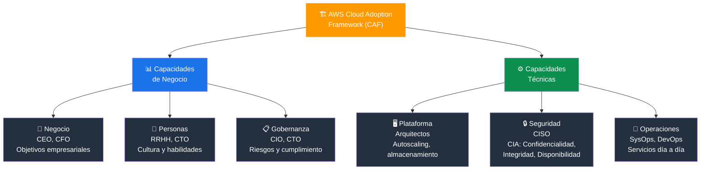
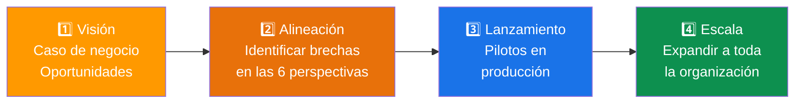
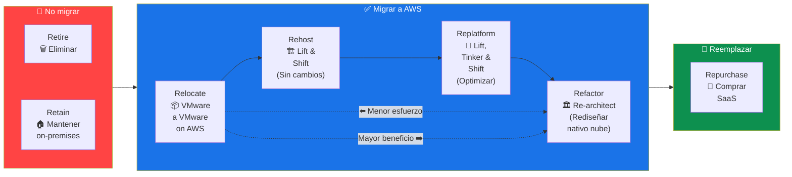
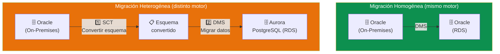
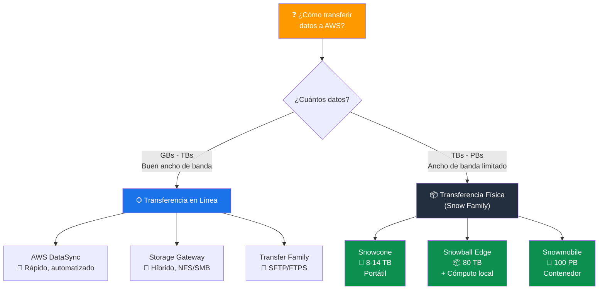
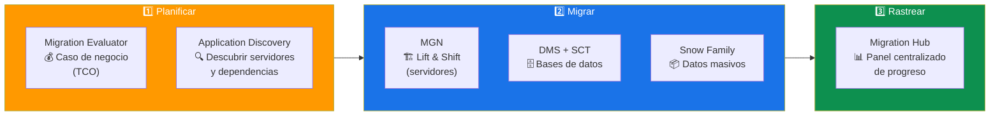
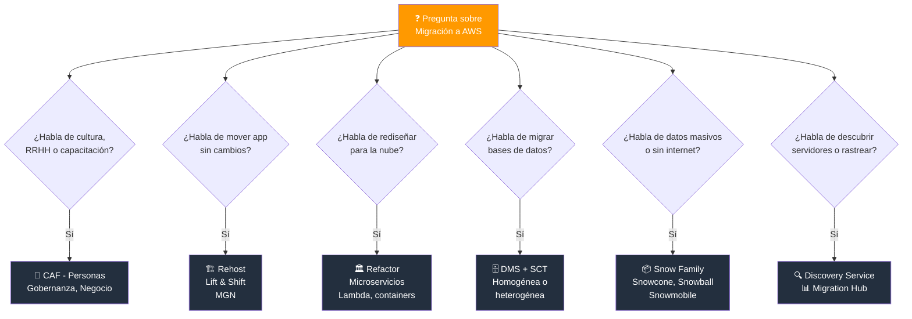

# Estrategias de Migración a AWS - Examen CLF-C02

Basado en las tres fuentes proporcionadas (Sequeira, Piper/Clinton y Kankaria), he analizado las Estrategias de Migración a AWS.

En el contexto del examen **AWS Certified Cloud Practitioner (CLF-C02)**, este tema es fundamental y se evalúa principalmente en:

- **Dominio 1: Conceptos de la Nube** — Declaración de Tarea 1.3: Comprender los beneficios y estrategias de migración a AWS Cloud.
- **Dominio 3: Tecnología y Servicios en la Nube** — Identificación de servicios de migración y transferencia de datos.

A continuación, presento un análisis detallado estructurado según los objetivos del examen.

---

## 1. Marco Estratégico: AWS Cloud Adoption Framework (CAF)

Para el examen, es crucial entender que la migración no es solo tecnológica, sino también organizacional. Las fuentes destacan el **AWS Cloud Adoption Framework (CAF)** como la guía teórica principal.

- **Objetivo del CAF:** Proporciona orientación detallada para facilitar la transición a la nube, reduciendo el riesgo empresarial y mejorando la eficiencia operativa.

### Las 6 Perspectivas del CAF

El examen a menudo pregunta qué perspectiva aborda un problema específico. Se dividen en dos grupos:

#### Capacidades de Negocio

| Perspectiva | Enfoque | Stakeholders |
|---|---|---|
| **Negocio (Business)** | Que la migración cumpla objetivos empresariales y financieros | CEO, CFO |
| **Personas (People)** | Cultura, estructura organizacional y habilidades del personal | RRHH, CTO |
| **Gobernanza (Governance)** | Minimizar riesgos y asegurar cumplimiento de normativas | CIO, CTO |

#### Capacidades Técnicas

| Perspectiva | Enfoque | Stakeholders |
|---|---|---|
| **Plataforma (Platform)** | Arquitectura y tecnología (autoscaling, almacenamiento) | CTO, Arquitectos |
| **Seguridad (Security)** | Confidencialidad, integridad y disponibilidad | CISO |
| **Operaciones (Operations)** | Que los servicios satisfagan las necesidades del negocio día a día | SysOps, DevOps |

> **Tip de examen:** Si la pregunta menciona "RRHH", "capacitación" o "cultura organizacional", la respuesta es la perspectiva de **Personas**. Si menciona "cumplimiento" o "riesgo", es **Gobernanza**.

### Las 6 perspectivas del CAF

### El Viaje de Transformación

Sequeira describe cuatro fases del viaje de transformación en la nube:

1. **Visión** — Identificar oportunidades y crear un caso de negocio.
2. **Alineación** — Identificar brechas en las 6 perspectivas del CAF.
3. **Lanzamiento** — Implementar iniciativas piloto en producción.
4. **Escala** — Expandir las iniciativas a toda la organización.

---

## 2. Las 7 Estrategias de Migración (7 R's)

Las estrategias de migración, conocidas como las **7 R's**, definen cómo se mueve cada aplicación a la nube. El examen espera que identifiques la estrategia adecuada según el escenario:

| Estrategia | Descripción | Ejemplo |
|---|---|---|
| **Rehost (Lift & Shift)** | Mover la aplicación tal cual a la nube sin cambios | Migrar una VM on-premises a EC2 |
| **Replatform (Lift, Tinker & Shift)** | Hacer optimizaciones mínimas sin cambiar la arquitectura central | Migrar una BD a RDS sin cambiar el código |
| **Refactor / Re-architect** | Rediseñar la aplicación para aprovechar capacidades nativas de la nube | Convertir un monolito a microservicios con Lambda y API Gateway |
| **Repurchase** | Reemplazar con un producto diferente, típicamente SaaS | Migrar CRM on-premises a Salesforce |
| **Retire** | Descomisionar aplicaciones que ya no son necesarias | Eliminar aplicaciones redundantes |
| **Retain** | Mantener la aplicación on-premises (no migrar aún) | Aplicaciones con dependencias complejas que requieren más análisis |
| **Relocate** | Mover infraestructura a la nube sin comprar nuevo hardware | Migrar VMware on-premises a VMware Cloud on AWS |

> **Tip de examen:** "Lift and Shift" = **Rehost** (la más rápida, sin cambios). "Rediseñar para la nube" = **Refactor** (la más compleja, mayor beneficio a largo plazo).

### Espectro de las 7 R's: Esfuerzo vs Beneficio

---

## 3. Herramientas de Migración de Bases de Datos

El examen pone un fuerte énfasis en cómo mover bases de datos, ya sea manteniendo el mismo motor o cambiándolo.

### AWS Database Migration Service (DMS)

Servicio totalmente gestionado que permite migrar bases de datos de forma segura y con un tiempo de inactividad mínimo.

- Soporta migraciones **homogéneas** (ej. Oracle a Oracle) y **heterogéneas** (ej. Oracle a Aurora).
- Mantiene la base de datos de origen **operativa durante la migración**.
- Soporta migración continua (replicación de datos en curso).

### AWS Schema Conversion Tool (SCT)

Herramienta complementaria a DMS para migraciones **heterogéneas**.

- Analiza la base de datos de origen y convierte el esquema para que sea compatible con el motor de destino.
- Ejemplo: convertir PL/SQL de Oracle a Amazon Aurora (PostgreSQL/MySQL).
- Identifica qué partes del esquema no pueden convertirse automáticamente y requieren intervención manual.

> **Tip de examen:** DMS = migrar los **datos**. SCT = convertir el **esquema/estructura**. Para migraciones heterogéneas, se usan ambos juntos.

### Flujo de migración de bases de datos

---

## 4. Migración y Transferencia de Datos (Almacenamiento)

El examen evalúa la capacidad de elegir la herramienta adecuada según el volumen de datos y la conectividad disponible.

### Familia AWS Snow (Transferencia Física)

Ideal para mover grandes volúmenes de datos (terabytes a petabytes) cuando la transferencia por red es demasiado lenta o costosa.

| Dispositivo | Capacidad | Caso de uso |
|---|---|---|
| **Snowcone** | Hasta 8 TB (HDD) / 14 TB (SSD) | Dispositivo portátil y robusto para entornos con espacio limitado |
| **Snowball Edge** | Hasta 80 TB | Migración de datos masivos + cómputo local (EC2, Lambda) |
| **Snowmobile** | Hasta 100 PB (exabytes) | Contenedor de 45 pies para migraciones a escala masiva |

> **Tip de examen:** Si la pregunta menciona "sin conexión a internet", "ancho de banda limitado" o "petabytes de datos", piensa en la **familia Snow**.

### Decisión: Transferencia en línea vs física

### Transferencia en Línea

| Servicio | Descripción |
|---|---|
| **AWS Storage Gateway** | Puente híbrido que conecta aplicaciones locales con almacenamiento en la nube (S3, Glacier, EBS) usando protocolos estándar (NFS, SMB, iSCSI) |
| **AWS Transfer Family** | Transferencia de archivos hacia/desde S3 usando SFTP, FTPS y FTP |
| **AWS DataSync** | Acelera la transferencia de datos en línea entre almacenamiento local y AWS (hasta 10x más rápido que herramientas de código abierto) |

> **Tip de examen:** "Almacenamiento híbrido" o "acceso local a datos en la nube" = **Storage Gateway**. "Transferir archivos con SFTP" = **Transfer Family**.

---

## 5. Planificación y Seguimiento de la Migración

Para gestionar migraciones complejas, las fuentes identifican herramientas de gestión específicas:

| Servicio | Función |
|---|---|
| **AWS Application Discovery Service** | Descubre y recopila información sobre aplicaciones e infraestructura locales (servidores, dependencias, rendimiento) |
| **AWS Migration Hub** | Panel centralizado para rastrear el progreso de migraciones a través de múltiples herramientas de AWS y socios |
| **AWS Application Migration Service (MGN)** | Automatiza la migración lift-and-shift de servidores a AWS (sucesor de CloudEndure) |
| **Migration Evaluator** | Crea un caso de negocio para la migración estimando el TCO en AWS |

> **Tip de examen:** "Descubrir servidores on-premises" = **Application Discovery Service**. "Rastrear progreso de migración" = **Migration Hub**.

### Flujo completo de migración

---

## Resumen para el Candidato

Para aprobar las secciones relacionadas con la migración en el examen CLF-C02, debe ser capaz de:

| Escenario | Servicio / Concepto |
|---|---|
| Objetivos no técnicos (RRHH, procesos comerciales) | Perspectivas del **CAF** (Personas, Negocio) |
| Ancho de banda limitado y datos masivos | **AWS Snow Family** (Snowball, Snowcone, Snowmobile) |
| Migración de bases de datos con mínima interrupción | **AWS DMS** (+ SCT si es heterogénea) |
| Almacenamiento híbrido y acceso local a datos en la nube | **AWS Storage Gateway** |
| Mover aplicación sin cambios a la nube | **Rehost** (Lift & Shift) |
| Rediseñar para aprovechar servicios nativos | **Refactor / Re-architect** |
| Descubrir infraestructura on-premises | **Application Discovery Service** |
| Seguimiento centralizado de migración | **Migration Hub** |

### Palabras clave que debes asociar

- **"Lift and Shift"** → Rehost, sin cambios, la más rápida
- **"Sin internet / petabytes"** → Snow Family
- **"Base de datos con distinto motor"** → DMS + SCT
- **"Híbrido / NFS / SMB"** → Storage Gateway
- **"Cultura / capacitación / RRHH"** → CAF - Perspectiva de Personas
- **"Riesgo / cumplimiento"** → CAF - Perspectiva de Gobernanza
- **"Descubrir servidores"** → Application Discovery Service

### Árbol de decisión para preguntas del examen

