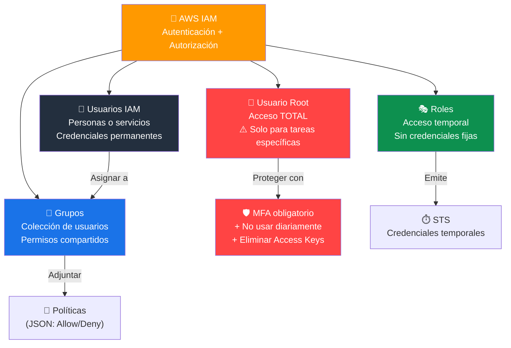
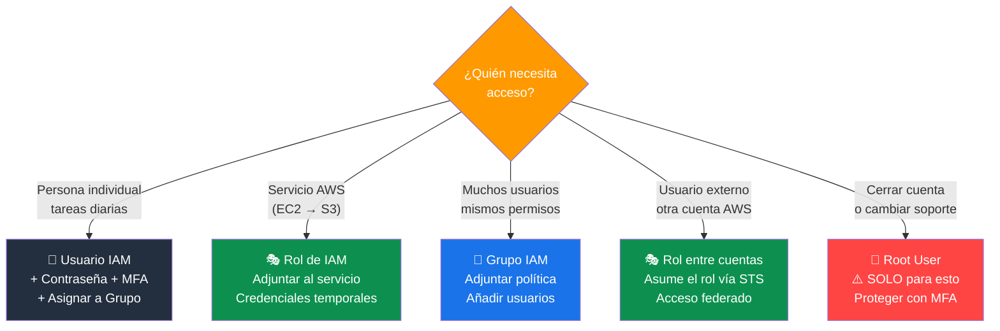
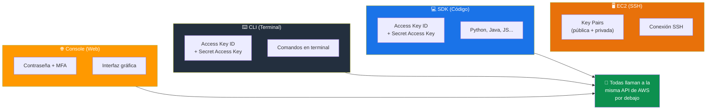
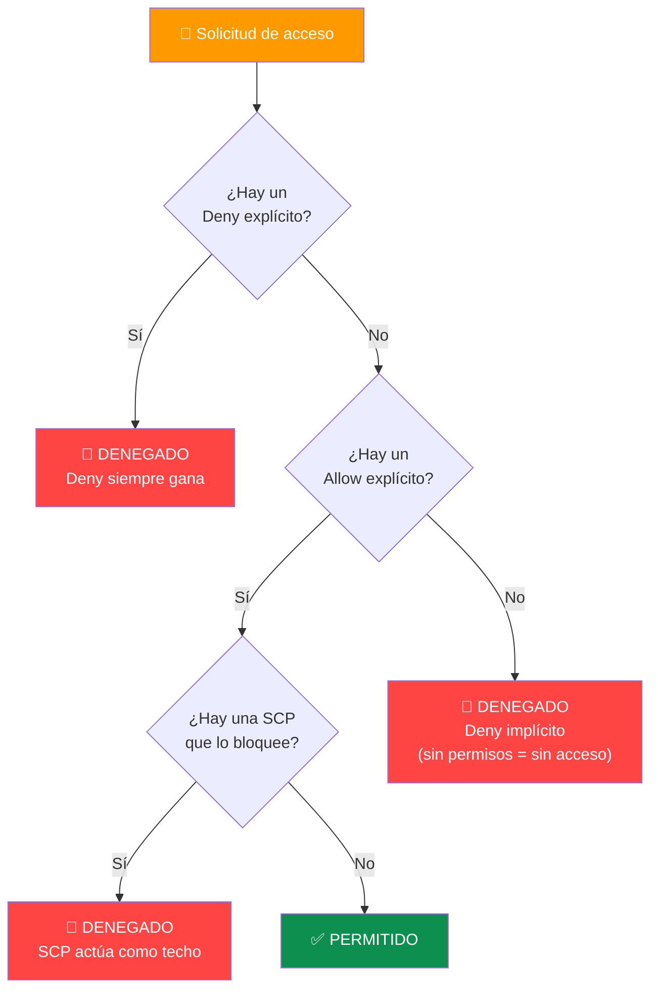
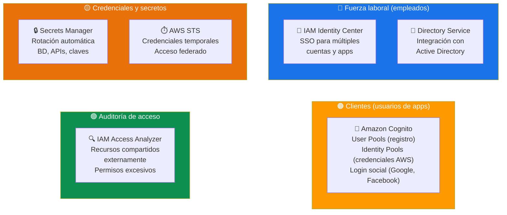
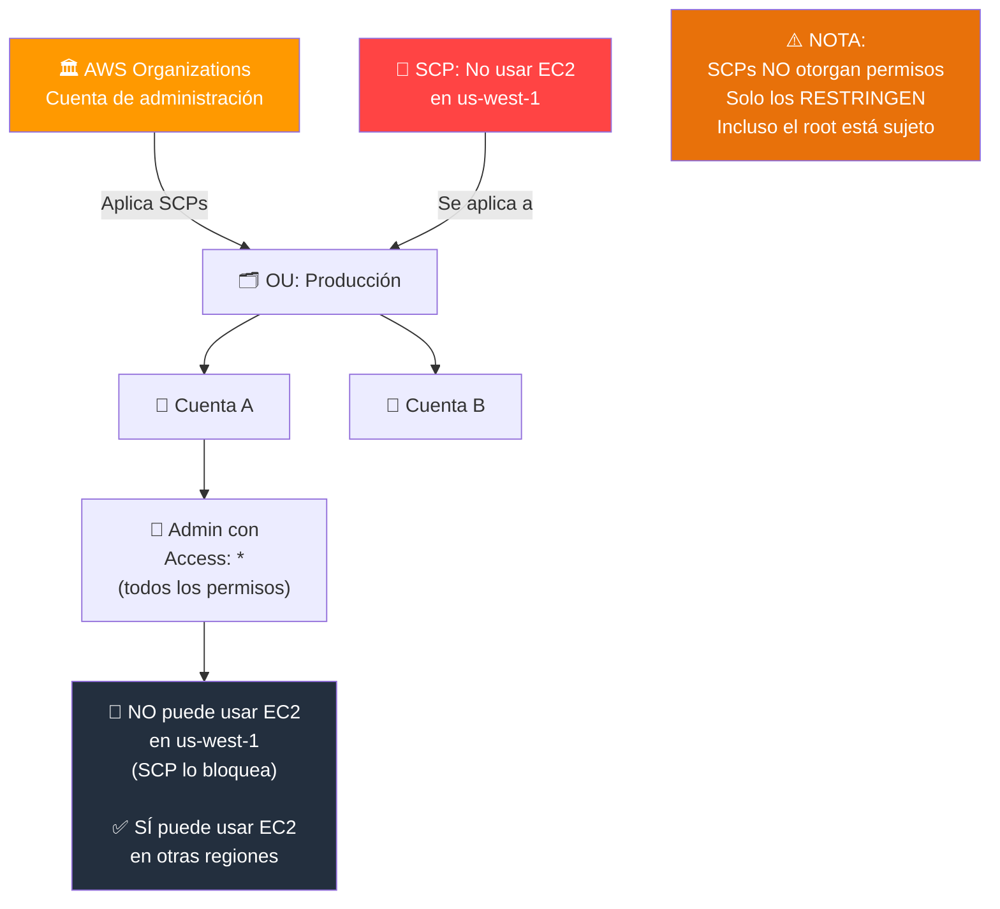

# Capacidades de Gestión de Acceso - Examen CLF-C02

Basado en las tres fuentes proporcionadas (Sequeira, Piper/Clinton y Kankaria), he analizado las Capacidades de Gestión de Acceso.

En el contexto del examen **AWS Certified Cloud Practitioner (CLF-C02)**, este tema es el pilar central del **Dominio 2: Seguridad y Cumplimiento**. Específicamente, aborda:

- **Declaración de Tarea 2.3:** Identificar capacidades de gestión de acceso de AWS.
- **Tarea 2.1 (Modelo de Responsabilidad Compartida):** La gestión de acceso es una responsabilidad del **cliente**.

A continuación, presento un análisis detallado estructurado para el examen.

---

## 1. Servicio Central: AWS Identity and Access Management (IAM)

El examen evalúa si comprende que IAM es el servicio que controla **"quién"** (autenticación) puede hacer **"qué"** (autorización) en su cuenta de AWS.

### Las 4 identidades clave de IAM

| Identidad | Descripción | Credenciales | Duración |
|---|---|---|---|
| **Usuario Raíz (Root)** | Identidad creada al registrarse en AWS. Acceso completo e irrestricto | Email + contraseña + MFA | Permanentes |
| **Usuarios IAM (Users)** | Entidades que representan a una persona o servicio. Sin permisos por defecto | Contraseña y/o claves de acceso | Permanentes |
| **Grupos (Groups)** | Colecciones de usuarios que comparten los mismos permisos | N/A (no son identidades de login) | N/A |
| **Roles (Roles)** | Identidades temporales sin credenciales a largo plazo | Credenciales temporales vía STS | Temporales |

### Las 4 identidades de IAM



### Usuario Raíz (Root User)

Mejor práctica crítica para el examen:

- **Nunca** use el usuario raíz para tareas diarias.
- Protéjalo con una **contraseña compleja** y active **MFA**.
- **Elimine** sus claves de acceso.
- Solo úselo para tareas específicas que lo requieren:
  - Cambiar el plan de soporte de la cuenta.
  - Cambiar la configuración de facturación.
  - Cerrar la cuenta de AWS.
  - Restaurar permisos de un usuario IAM.

> **Tip de examen:** Si la pregunta dice "proteger la cuenta de AWS", las respuestas correctas siempre incluyen **MFA en el root** y **no usarlo para tareas cotidianas**.

### Usuarios IAM (Users)

- Representan a una persona o servicio individual.
- Por defecto, **no tienen permisos** (deny implícito).
- Tienen credenciales **permanentes** (contraseña o claves de acceso).
- Se recomienda crear un usuario IAM con permisos de administrador para las tareas diarias en lugar de usar el root.

### Grupos (Groups)

- Colecciones de usuarios que comparten los mismos permisos.
- La forma **más eficiente** de gestionar permisos: asignar políticas a grupos y luego añadir usuarios a esos grupos.
- Ejemplo: grupos "Administradores", "Desarrolladores", "Solo-Lectura".
- **No se pueden anidar** (un grupo no puede contener otros grupos).
- Un usuario puede pertenecer a **múltiples grupos**.

### Roles (Roles)

Identidades temporales que no tienen credenciales a largo plazo (sin contraseña ni claves permanentes).

Se utilizan para delegar acceso a:

| Caso de uso | Ejemplo |
|---|---|
| **Servicios de AWS** | Una instancia EC2 que necesita acceder a S3 |
| **Usuarios federados** | Empleados que inician sesión con Active Directory corporativo |
| **Acceso entre cuentas** | Una cuenta de desarrollo que accede a recursos en producción |
| **Aplicaciones** | Una aplicación en EC2 que necesita leer de DynamoDB |

> **Tip de examen:** "Acceso temporal" o "un servicio AWS necesita acceder a otro servicio" = **Roles**. Nunca incrustar claves de acceso en instancias EC2; usar roles en su lugar.

### Cuándo usar cada identidad



---

## 2. Autenticación y Credenciales

El examen requiere que sepa qué tipo de credencial se utiliza según el método de acceso:

| Método de acceso | Credencial requerida | Recomendación |
|---|---|---|
| **AWS Management Console** (Web) | Usuario + Contraseña + MFA | Activar MFA siempre |
| **AWS CLI** (Terminal) | Access Key ID + Secret Access Key | Usar roles cuando sea posible |
| **AWS SDK / API** (Programático) | Access Key ID + Secret Access Key | Nunca incrustar claves en código |
| **Instancias EC2** (Linux/SSH) | Pares de Claves (Key Pairs) | Rotar claves periódicamente |

### MFA (Multi-Factor Authentication)

Combina dos factores de autenticación:

- **Algo que sabes:** Contraseña.
- **Algo que tienes:** Token/dispositivo (app virtual como Google Authenticator, dispositivo hardware U2F, llave de seguridad).

> **Tip de examen:** MFA siempre se recomienda para el **usuario root** y para usuarios con **privilegios elevados**. Es una de las respuestas más frecuentes en preguntas de seguridad.

### Métodos de acceso y credenciales



### Mejores prácticas con credenciales

- **Nunca compartir** claves de acceso ni incrustarlas en código plano.
- Usar **Roles** en lugar de claves de acceso para servicios AWS.
- **Rotar** las credenciales periódicamente.
- Configurar **políticas de contraseñas** (longitud mínima, complejidad, expiración).
- Usar **AWS Secrets Manager** para almacenar credenciales de bases de datos y APIs.

---

## 3. Autorización y Políticas

Una vez autenticado, ¿qué puede hacer el usuario? Esto se define mediante **Políticas (Policies)**.

### Tipos de políticas

| Tipo | Se adjunta a | Ejemplo |
|---|---|---|
| **Políticas basadas en identidad** | Usuarios, Grupos, Roles | "Este usuario puede leer S3" |
| **Políticas basadas en recursos** | El recurso mismo (S3 bucket, SQS queue) | "Este bucket permite acceso desde la cuenta X" |
| **Políticas de control de servicios (SCPs)** | Cuentas u OUs en Organizations | "Esta cuenta no puede usar EC2 en us-west-1" |
| **Políticas de límite de permisos** | Usuarios o Roles | Establece el máximo de permisos que puede tener |

### Estructura de una política JSON

```json
{
  "Version": "2012-10-17",
  "Statement": [
    {
      "Effect": "Allow",         // Allow o Deny
      "Action": "s3:GetObject",  // Qué acción
      "Resource": "arn:aws:s3:::mi-bucket/*"  // Sobre qué recurso
    }
  ]
}
```

### Principio de Privilegio Mínimo (Least Privilege)

Concepto **vital** para el examen:

- Otorgar **solo** los permisos estrictamente necesarios para realizar una tarea y nada más.
- Ejemplo: si un usuario solo necesita leer archivos de S3, no se le debe dar acceso administrativo completo.
- Comenzar con **cero permisos** e ir agregando según necesidad.
- Usar **IAM Access Analyzer** para identificar permisos excesivos o no utilizados.

### Evaluación de políticas

- **Deny explícito** siempre gana sobre cualquier Allow.
- Si no hay un Allow explícito, el acceso se **deniega por defecto** (deny implícito).
- Orden de evaluación: Deny explícito > Allow explícito > Deny implícito.

> **Tip de examen:** "El usuario no puede acceder al recurso aunque tiene un Allow" → Probablemente hay un **Deny explícito** en otra política o una SCP que lo bloquea.

### Evaluación de políticas IAM



---

## 4. Formas de Acceder a AWS

El examen puede preguntar sobre las diferentes interfaces para interactuar con AWS:

| Interfaz | Descripción | Credencial |
|---|---|---|
| **AWS Management Console** | Interfaz web gráfica (GUI) | Contraseña + MFA |
| **AWS CLI** | Línea de comandos para terminal | Claves de acceso |
| **AWS SDK** | Bibliotecas para lenguajes de programación (Python, Java, etc.) | Claves de acceso |
| **AWS CloudShell** | Terminal en el navegador, preconfigurada con las credenciales de la consola | Hereda las credenciales del usuario logueado |
| **APIs REST** | Llamadas HTTP directas a los endpoints de AWS | Claves de acceso (firma v4) |

> **Tip de examen:** Las tres formas principales de acceder a AWS son: **Console**, **CLI** y **SDK**. Todas llaman a la misma API por debajo.

---

## 5. Servicios Relacionados y Casos de Uso

El examen presenta escenarios para que elija el servicio de gestión de acceso adecuado más allá de IAM básico:

| Servicio | Caso de uso | Usuarios objetivo |
|---|---|---|
| **AWS IAM Identity Center (SSO)** | SSO para múltiples cuentas AWS y apps empresariales | Empleados / fuerza laboral |
| **Amazon Cognito** | Autenticación para apps web y móviles | Usuarios finales / clientes |
| **AWS Secrets Manager** | Gestión y rotación automática de credenciales | Aplicaciones / bases de datos |
| **AWS Directory Service** | Integración con Microsoft Active Directory | Organizaciones con AD existente |
| **AWS STS** | Credenciales temporales de seguridad | Acceso federado, entre cuentas |
| **AWS IAM Access Analyzer** | Identificar recursos compartidos externamente y permisos excesivos | Equipos de seguridad |

### AWS IAM Identity Center (anteriormente AWS SSO)

- Gestiona el acceso de la **fuerza laboral** de forma centralizada.
- Proporciona **inicio de sesión único** (Single Sign-On) para múltiples cuentas de AWS y aplicaciones comerciales.
- Permite federar identidades corporativas (Active Directory) con AWS.
- Portal único donde los empleados ven todas las cuentas y apps a las que tienen acceso.

### Amazon Cognito

- Gestiona la identidad de sus **clientes** (usuarios de sus apps web o móviles).
- Permite iniciar sesión a través de **proveedores sociales** (Google, Facebook, Apple).
- Soporta **grupos de usuarios propios** (User Pools) para registro y autenticación.
- **Identity Pools** proporcionan credenciales AWS temporales para acceder a recursos.

### AWS Secrets Manager

- Gestiona y **rota automáticamente** credenciales de bases de datos, claves API y otros secretos.
- Elimina la necesidad de codificar credenciales en las aplicaciones.
- Se integra nativamente con **RDS**, **Redshift** y **DocumentDB** para rotación automática.

### AWS IAM Access Analyzer

- Identifica recursos que están **compartidos con entidades externas** (buckets S3 públicos, roles asumibles externamente).
- Genera hallazgos cuando detecta accesos que pueden no ser intencionales.
- Ayuda a validar que las políticas cumplan con el **principio de mínimo privilegio**.

> **Tip de examen:** "Empleados accediendo a varias cuentas AWS" = **IAM Identity Center**. "Usuarios de una app móvil" = **Cognito**. "Rotar contraseñas de BD automáticamente" = **Secrets Manager**. "Encontrar recursos compartidos externamente" = **IAM Access Analyzer**.

### Ecosistema de servicios de gestión de acceso



---

## 6. AWS Organizations y SCPs

Aunque se cubre en gobernanza, es fundamental para la gestión de acceso:

- **SCPs (Service Control Policies):** Restringen qué servicios y acciones se permiten en las cuentas miembro.
- Las SCPs **no otorgan permisos**, solo los limitan (actúan como un "techo").
- Incluso el **usuario root** de una cuenta miembro está sujeto a las SCPs.
- Se aplican a nivel de **cuenta** o **Unidad Organizativa (OU)**.

> **Tip de examen:** "Evitar que una cuenta use un servicio específico" = **SCP**. Las SCPs no afectan a la cuenta de administración (management account) de la organización.

### SCPs como techo de permisos



---

## Resumen para el Candidato

Para aprobar las preguntas sobre Gestión de Acceso en el CLF-C02:

| Escenario en el examen | Respuesta |
|---|---|
| Acceso temporal o un servicio AWS accediendo a otro | **Roles de IAM** |
| Proteger la cuenta de AWS / usuario raíz | **MFA + no usar root para tareas diarias** |
| Gestionar usuarios de una app móvil | **Amazon Cognito** |
| Rotación automática de contraseñas de BD | **AWS Secrets Manager** |
| SSO para empleados en múltiples cuentas | **AWS IAM Identity Center** |
| Gestionar permisos eficientemente para muchos usuarios | **Grupos de IAM** |
| Un servicio necesita acceder a otro (EC2 → S3) | **Rol de IAM adjunto a la instancia** |
| Restringir servicios en una cuenta miembro | **SCP** (dentro de Organizations) |
| Encontrar recursos compartidos externamente | **IAM Access Analyzer** |
| Acceso programático (CLI / SDK) | **Claves de acceso (Access Keys)** |
| Terminal en el navegador sin configurar credenciales | **AWS CloudShell** |
| El usuario tiene Allow pero no puede acceder | **Deny explícito** en otra política o SCP |

### Palabras clave que debes asociar

- **"Quién puede hacer qué"** → IAM (autenticación + autorización)
- **"Acceso temporal"** → Roles, STS
- **"Mínimo privilegio"** → Solo permisos necesarios, IAM Access Analyzer
- **"Nunca usar para tareas diarias"** → Usuario root
- **"MFA"** → Segundo factor de autenticación, obligatorio para root
- **"Usuarios de app móvil / login social"** → Amazon Cognito
- **"Empleados / SSO / múltiples cuentas"** → IAM Identity Center
- **"Rotar secretos / credenciales de BD"** → Secrets Manager
- **"Deny siempre gana"** → Evaluación de políticas
- **"Claves en código = mala práctica"** → Usar Roles o Secrets Manager

### Árbol de decisión para preguntas del examen

```mermaid
flowchart TD
    Q["❓ Pregunta sobre\nGestión de Acceso"] --> Q1{"¿Sobre identidades\nIAM?"}
    Q --> Q2{"¿Sobre autenticación\no credenciales?"}
    Q --> Q3{"¿Sobre autorización\no políticas?"}
    Q --> Q4{"¿Sobre servicios\nde identidad?"}
    Q --> Q5{"¿Sobre restricciones\na nivel de cuenta?"}

    Q1 -->|"Acceso temporal\no servicio→servicio"| A1["🎭 Roles de IAM\n+ STS"]
    Q1 -->|"Gestionar permisos\nde muchos usuarios"| A1B["👥 Grupos IAM"]
    Q1 -->|"Proteger la cuenta\nde AWS"| A1C["👑 Root: MFA\n+ No usar diariamente"]

    Q2 -->|"Segundo factor\nde autenticación"| A2["🛡️ MFA\nObligatorio para root"]
    Q2 -->|"Rotar credenciales\nde BD automáticamente"| A2B["🔒 Secrets Manager"]
    Q2 -->|"Terminal en navegador\nsin configurar"| A2C["☁️ CloudShell"]

    Q3 -->|"Deny explícito\nvs Allow"| A3["🚫 Deny siempre gana\nDeny > Allow > Deny implícito"]
    Q3 -->|"Solo permisos\nnecesarios"| A3B["🔒 Mínimo Privilegio\n+ Access Analyzer"]
    Q3 -->|"Tipos de\npolíticas"| A3C["📜 Identidad vs Recurso\nvs SCP vs Límite"]

    Q4 -->|"Empleados SSO\nmúltiples cuentas"| A4["🔑 IAM Identity\nCenter"]
    Q4 -->|"Usuarios de\napp móvil/web"| A4B["📱 Cognito"]
    Q4 -->|"Integración con\nActive Directory"| A4C["🏢 Directory Service"]

    Q5 -->|"Restringir servicios\nen cuenta miembro"| A5["🚫 SCPs\n(no otorgan, solo restringen)"]
    Q5 -->|"Recursos compartidos\nexternamente"| A5B["🔍 IAM Access\nAnalyzer"]

    style Q fill:#FF9900,color:#fff
    style A1 fill:#0d904f,color:#fff
    style A1B fill:#1a73e8,color:#fff
    style A1C fill:#FF4444,color:#fff
    style A2 fill:#232F3E,color:#fff
    style A2B fill:#232F3E,color:#fff
    style A2C fill:#232F3E,color:#fff
    style A3 fill:#e8710a,color:#fff
    style A3B fill:#e8710a,color:#fff
    style A3C fill:#e8710a,color:#fff
    style A4 fill:#1a73e8,color:#fff
    style A4B fill:#1a73e8,color:#fff
    style A4C fill:#1a73e8,color:#fff
    style A5 fill:#FF4444,color:#fff
    style A5B fill:#0d904f,color:#fff
```


