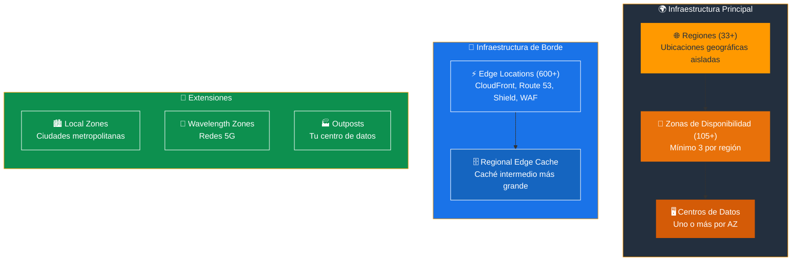
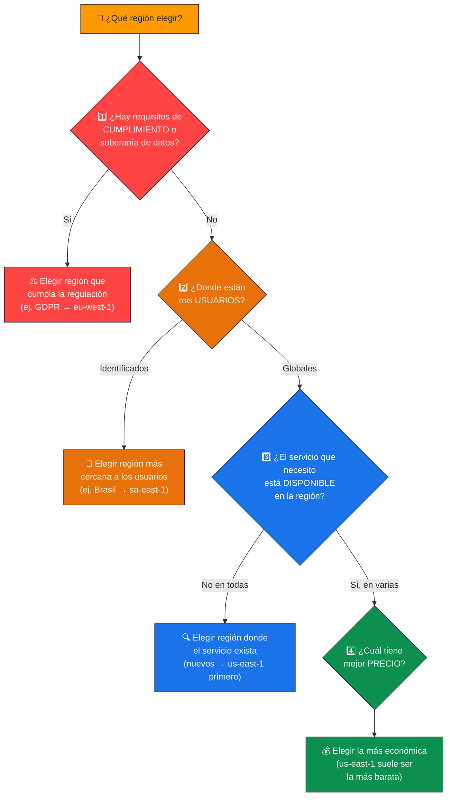
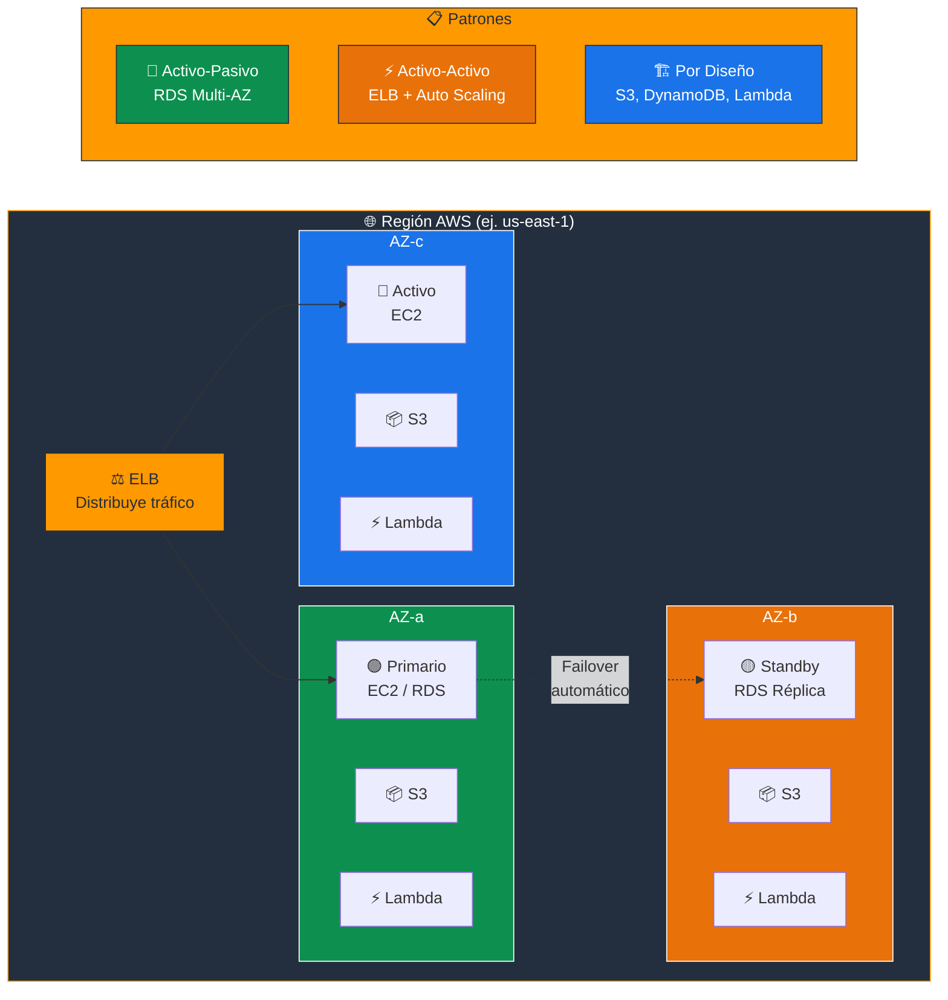
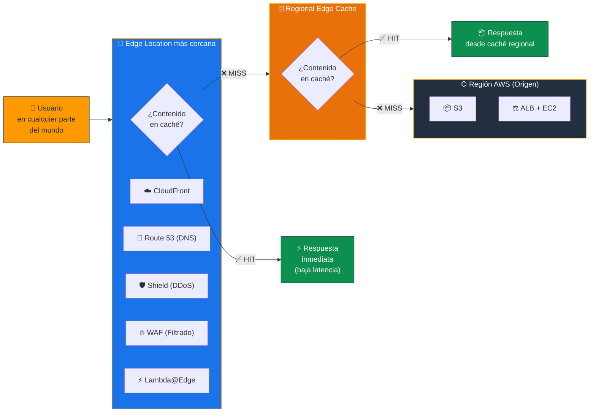
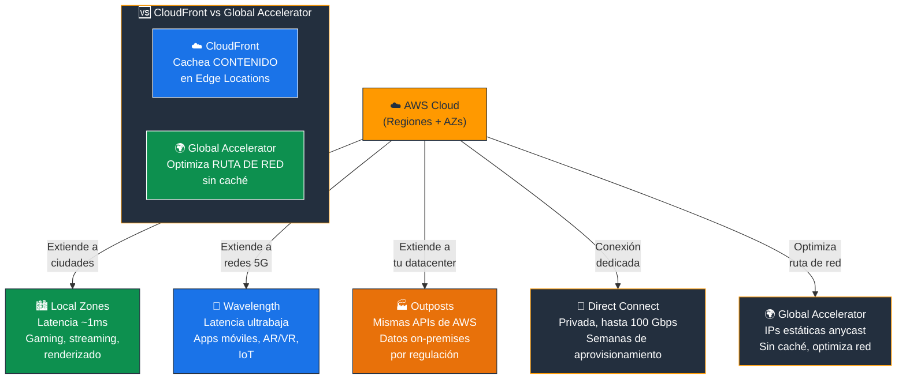
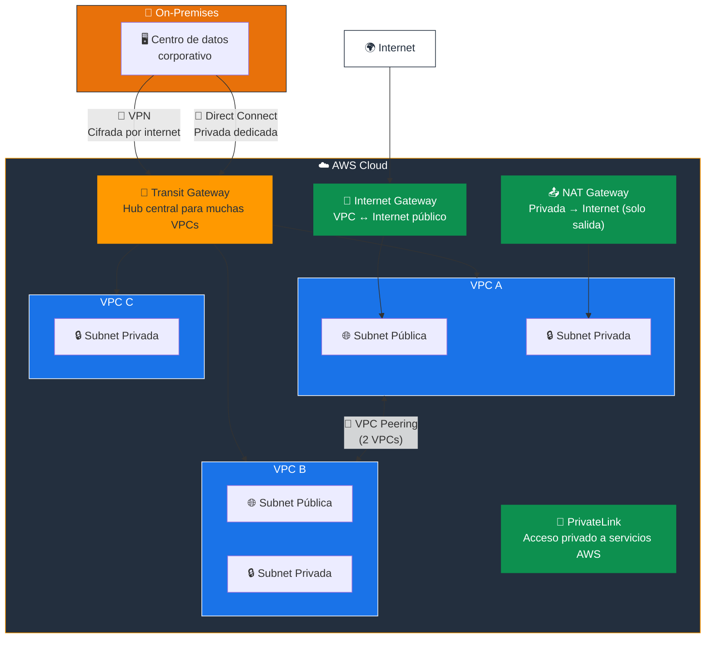
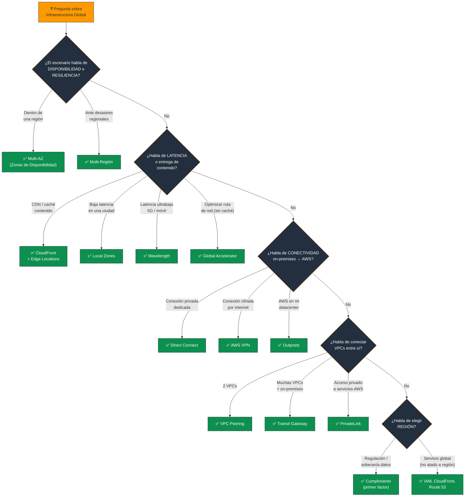

# Infraestructura Global de AWS - Examen CLF-C02

Basado en las tres fuentes proporcionadas (Sequeira, Piper/Clinton y Kankaria), he analizado la Infraestructura Global de AWS.

En el contexto del examen **AWS Certified Cloud Practitioner (CLF-C02)**, este tema es el núcleo del **Dominio 3: Tecnología y Servicios en la Nube**, que representa el **34% de la puntuación total del examen**. Específicamente, aborda la **Declaración de Tarea 3.2: Definir la infraestructura global de AWS**.

A continuación, presento un análisis detallado de los componentes que debe dominar para el examen.

---

## 1. Jerarquía de la Infraestructura Global

Antes de profundizar, es fundamental entender la jerarquía:

```
Regiones (33+)
  └── Zonas de Disponibilidad (105+) (mínimo 3 por región)
        └── Centros de datos (uno o más por AZ)

Edge Locations (600+) → CloudFront, Route 53, Shield, WAF
Local Zones → Extensión de regiones en ciudades metropolitanas
Wavelength Zones → AWS en redes 5G
Outposts → AWS en su centro de datos
```

| Componente | Cantidad aprox. | Función principal |
|---|---|---|
| **Regiones** | 33+ | Ubicaciones geográficas aisladas |
| **Zonas de Disponibilidad (AZ)** | 105+ | Centros de datos redundantes dentro de una región |
| **Edge Locations** | 600+ | Caché de contenido cercano a los usuarios |
| **Local Zones** | 30+ | Baja latencia en ciudades metropolitanas |
| **Wavelength Zones** | 30+ | Latencia ultrabaja en redes 5G |

> **Tip de examen:** Recuerda la jerarquía de mayor a menor: **Regiones > AZ > Centros de datos**. Las Edge Locations están separadas de esta jerarquía.

### 📊 Diagrama: Jerarquía de la Infraestructura Global de AWS



---

## 2. Regiones (Regions)

Una Región es una **ubicación física geográfica** que contiene múltiples Zonas de Disponibilidad.

### Características clave

- **Aislamiento completo:** Cada región es completamente independiente y está aislada de las demás para garantizar la máxima tolerancia a fallos y estabilidad.
- **Autonomía:** Los datos **no se replican automáticamente** entre regiones (a menos que el cliente lo configure explícitamente).
- **Mínimo 3 AZ:** Cada región tiene como mínimo 3 Zonas de Disponibilidad.

### Los 4 factores de selección de una región

El examen espera que sepa elegir una región basándose en estos criterios:

| Factor | Descripción | Ejemplo |
|---|---|---|
| **1. Cumplimiento (Compliance)** | Mantener datos dentro de fronteras nacionales por requisitos legales | GDPR exige datos en la UE → elegir eu-west-1 (Irlanda) |
| **2. Latencia (Proximity)** | Acercar los recursos a los usuarios finales | Usuarios en Brasil → elegir sa-east-1 (São Paulo) |
| **3. Disponibilidad de servicios** | No todos los servicios están disponibles en todas las regiones | Servicios nuevos se lanzan primero en us-east-1 (N. Virginia) |
| **4. Precios** | Los costos varían entre regiones por impuestos y costos locales | us-east-1 suele ser la más económica |

> **Tip de examen:** El **cumplimiento/soberanía de datos** es siempre el **primer factor** a considerar. Si una regulación exige que los datos estén en un país específico, eso anula cualquier otra consideración.

### 📊 Diagrama: Los 4 Factores para Elegir una Región



### Servicios Globales (no atados a una región)

El examen a menudo pregunta qué servicios son globales:

| Servicio | Por qué es global |
|---|---|
| **IAM** | Usuarios, roles y políticas aplican a toda la cuenta |
| **Amazon CloudFront** | CDN distribuida globalmente en Edge Locations |
| **Amazon Route 53** | DNS global distribuido |
| **AWS WAF** | Se asocia a CloudFront (global) o ALB (regional) |
| **AWS Shield** | Protección DDoS global |
| **S3** | Namespace global (nombres de bucket únicos), pero datos en una región específica |

> **Tip de examen:** Aunque la **consola de S3** parece global, los **datos se almacenan en una región específica** que usted elige al crear el bucket.

---

## 3. Zonas de Disponibilidad (Availability Zones - AZs)

Este es un concepto **crítico** para la Alta Disponibilidad (HA).

### Características clave

- **Definición:** Una AZ consta de **uno o más centros de datos** discretos con energía, redes y conectividad redundantes.
- **Separación física:** Las AZ dentro de una región están físicamente separadas (diferentes llanuras de inundación, diferentes sistemas eléctricos) para que un desastre local no afecte a más de una a la vez.
- **Interconexión de baja latencia:** Conectadas entre sí mediante enlaces de red de **alta velocidad y baja latencia**, permitiendo la replicación síncrona de datos.
- **Nomenclatura:** Se identifican con letras (ej. us-east-1**a**, us-east-1**b**, us-east-1**c**).
- **Mapeo aleatorio:** AWS mapea las letras de AZ de forma diferente para cada cuenta, para distribuir la carga.

### Alta Disponibilidad con Multi-AZ

| Patrón | Descripción | Servicios que lo implementan |
|---|---|---|
| **Multi-AZ activo-pasivo** | Réplica en standby en otra AZ, failover automático | RDS Multi-AZ |
| **Multi-AZ activo-activo** | Recursos activos en múltiples AZ simultáneamente | ELB + Auto Scaling, DynamoDB |
| **Multi-AZ por diseño** | El servicio distribuye automáticamente en múltiples AZ | S3, DynamoDB, Lambda, ELB |

> **Tip de examen:** **Alta Disponibilidad = Multi-AZ** (dentro de una región). **Recuperación ante desastres (DR) = Multi-Región**. No confundir estos dos conceptos.

### 📊 Diagrama: Patrones de Alta Disponibilidad Multi-AZ



---

## 4. Ubicaciones de Borde (Edge Locations)

El examen distingue claramente entre **dónde se ejecutan los servidores** (Regiones/AZ) y **dónde se entrega el contenido** (Edge Locations).

### Características clave

- **Función principal:** Endpoints utilizados por **Amazon CloudFront (CDN)** para almacenar en caché contenido cerca de los usuarios finales y reducir la latencia.
- **Cantidad:** Más de **600** Edge Locations en todo el mundo (superan ampliamente la cantidad de regiones y AZ).
- **No son Zonas de Disponibilidad:** No se ejecutan cargas de trabajo de cómputo general en ellas.

### Servicios que usan Edge Locations

| Servicio | Función en Edge Locations |
|---|---|
| **Amazon CloudFront** | CDN: almacena en caché contenido estático y dinámico |
| **Amazon Route 53** | DNS: resuelve nombres de dominio con baja latencia |
| **AWS Shield** | Protección DDoS en el borde de la red |
| **AWS WAF** | Filtra tráfico malicioso antes de llegar al origen |
| **Lambda@Edge** | Ejecuta funciones Lambda en las Edge Locations |
| **CloudFront Functions** | Funciones ligeras para transformaciones de solicitudes/respuestas |

### Caché Regional de Borde (Regional Edge Cache)

- Nivel intermedio entre las Edge Locations y el servidor de origen.
- Cachés **más grandes** que retienen contenido menos popular por más tiempo.
- Reduce la cantidad de solicitudes que llegan al origen.

> **Tip de examen:** "Reducir latencia para usuarios globales al entregar contenido" = **CloudFront + Edge Locations**. "Ejecutar código cerca de los usuarios" = **Lambda@Edge**.

### 📊 Diagrama: Flujo de Entrega de Contenido con Edge Locations



---

## 5. Extensiones de la Infraestructura

Las guías de estudio actualizadas para el CLF-C02 incluyen componentes de infraestructura híbrida y de borde:

| Servicio | Ubicación | Caso de uso | Latencia |
|---|---|---|---|
| **AWS Local Zones** | Ciudades metropolitanas | Juegos en tiempo real, streaming, renderizado | Un solo dígito de ms |
| **AWS Wavelength** | Redes 5G de telecos | Apps móviles de latencia ultrabaja, IoT | Un solo dígito de ms |
| **AWS Outposts** | Centro de datos del cliente | Experiencia híbrida consistente con AWS | Depende de la red local |
| **AWS Direct Connect** | Punto de interconexión | Conexión privada dedicada entre on-premises y AWS | Consistente y predecible |
| **AWS Global Accelerator** | Red global de AWS | Mejorar rendimiento del tráfico global | Optimizada por la red AWS |

### AWS Local Zones

- Extienden la infraestructura de AWS (cómputo, almacenamiento, bases de datos) a **grandes áreas metropolitanas**.
- Para aplicaciones que requieren latencia de **un solo dígito de milisegundo**.
- Ejemplo: videojuegos en tiempo real, producción de medios, machine learning en tiempo real.

### AWS Wavelength Zones

- Infraestructura de AWS desplegada en el **borde de las redes 5G** de proveedores de telecomunicaciones.
- Para aplicaciones móviles de **latencia ultrabaja** (gaming móvil, realidad aumentada, IoT).

### AWS Outposts

- Lleva los servicios e infraestructura nativos de AWS **al centro de datos del cliente** (on-premises).
- Experiencia híbrida **consistente**: mismas APIs, herramientas y hardware de AWS.
- Ideal cuando las regulaciones exigen que los datos permanezcan en instalaciones locales pero se quiere usar la experiencia de AWS.

### AWS Direct Connect

- Conexión de red **privada y dedicada** entre las instalaciones del cliente y AWS.
- Evita el internet público para mayor **seguridad**, menor latencia y ancho de banda consistente.
- Tiempos de aprovisionamiento largos (semanas/meses).
- Para conexiones rápidas cifradas por internet, usar **AWS VPN** en su lugar.

### AWS Global Accelerator

- Utiliza la **red global de AWS** y direcciones IP estáticas (anycast).
- Mejora la **disponibilidad y rendimiento** del tráfico de usuarios globales hacia las aplicaciones.
- Diferencia con CloudFront: CloudFront cachea **contenido**; Global Accelerator optimiza la **ruta de red** sin caché.

> **Tip de examen:** "AWS en mi datacenter" = **Outposts**. "Conexión privada dedicada" = **Direct Connect**. "Latencia ultrabaja en 5G" = **Wavelength**. "Latencia ultrabaja en una ciudad" = **Local Zones**. "Optimizar ruta de red global" = **Global Accelerator**.

### 📊 Diagrama: Extensiones de Infraestructura - ¿Dónde se ejecuta AWS?



---

## 6. Conectividad de Red

El examen puede preguntar cómo conectar diferentes entornos:

| Servicio | Tipo de conexión | Velocidad | Seguridad |
|---|---|---|---|
| **Internet Gateway** | VPC a Internet público | Variable | Pública (necesita SG/NACL) |
| **NAT Gateway** | Instancias privadas → Internet (solo salida) | Variable | Solo tráfico de salida |
| **VPC Peering** | VPC a VPC (misma o diferente cuenta/región) | Alta | Privada (red de AWS) |
| **AWS Transit Gateway** | Hub central para conectar múltiples VPCs y on-premises | Alta | Privada |
| **AWS VPN** | On-premises a AWS (cifrada por internet) | Variable | Cifrada (IPsec) |
| **AWS Direct Connect** | On-premises a AWS (dedicada privada) | Hasta 100 Gbps | Privada (no cifrada por defecto) |
| **AWS PrivateLink** | Acceso privado a servicios AWS sin salir de la red | Alta | Privada |

> **Tip de examen:** "Conectar dos VPCs" = **VPC Peering** (2 VPCs) o **Transit Gateway** (muchas VPCs). "Acceso privado a S3 sin internet" = **VPC Gateway Endpoint** o **PrivateLink**.

### 📊 Diagrama: Conectividad de Red - ¿Cómo conecto mis entornos?



---

## Resumen para el Candidato

Para aprobar las preguntas sobre Infraestructura Global en el CLF-C02:

| Escenario en el examen | Respuesta |
|---|---|
| Alta disponibilidad dentro de una región | **Multi-AZ** (Zonas de Disponibilidad) |
| Recuperación ante desastres | **Multi-Región** |
| Baja latencia al entregar contenido | **Edge Locations + CloudFront** |
| Latencia ultrabaja para computación en una ciudad | **AWS Local Zones** |
| Latencia ultrabaja en red 5G | **AWS Wavelength** |
| AWS en mi centro de datos (on-premises) | **AWS Outposts** |
| Conexión privada dedicada a AWS | **AWS Direct Connect** |
| Conexión cifrada por internet a AWS | **AWS VPN** |
| Optimizar tráfico global sin caché | **AWS Global Accelerator** |
| Soberanía de datos | Elegir la **Región** correcta |
| Servicio global (no atado a región) | **IAM, CloudFront, Route 53** |
| Conectar muchas VPCs entre sí | **AWS Transit Gateway** |

### Los 4 factores para elegir una región (en orden de prioridad)

1. **Cumplimiento** → ¿La regulación exige una ubicación específica?
2. **Latencia** → ¿Dónde están mis usuarios?
3. **Disponibilidad de servicios** → ¿El servicio que necesito existe en esta región?
4. **Precios** → ¿Cuál es la región más económica que cumple los demás criterios?

### Palabras clave que debes asociar

- **"Alta disponibilidad"** → Multi-AZ
- **"Recuperación ante desastres"** → Multi-Región
- **"Caché de contenido / CDN"** → CloudFront + Edge Locations
- **"Soberanía de datos / GDPR"** → Elegir la Región correcta
- **"Un solo dígito de ms en una ciudad"** → Local Zones
- **"5G / latencia ultrabaja móvil"** → Wavelength
- **"AWS on-premises"** → Outposts
- **"Conexión privada dedicada"** → Direct Connect
- **"Conexión cifrada por internet"** → VPN
- **"Optimizar ruta de red sin caché"** → Global Accelerator
- **"Servicio global"** → IAM, CloudFront, Route 53
- **"Centros de datos aislados dentro de una región"** → Zonas de Disponibilidad

---

### 📊 Diagrama: Árbol de Decisión para Preguntas del Examen


