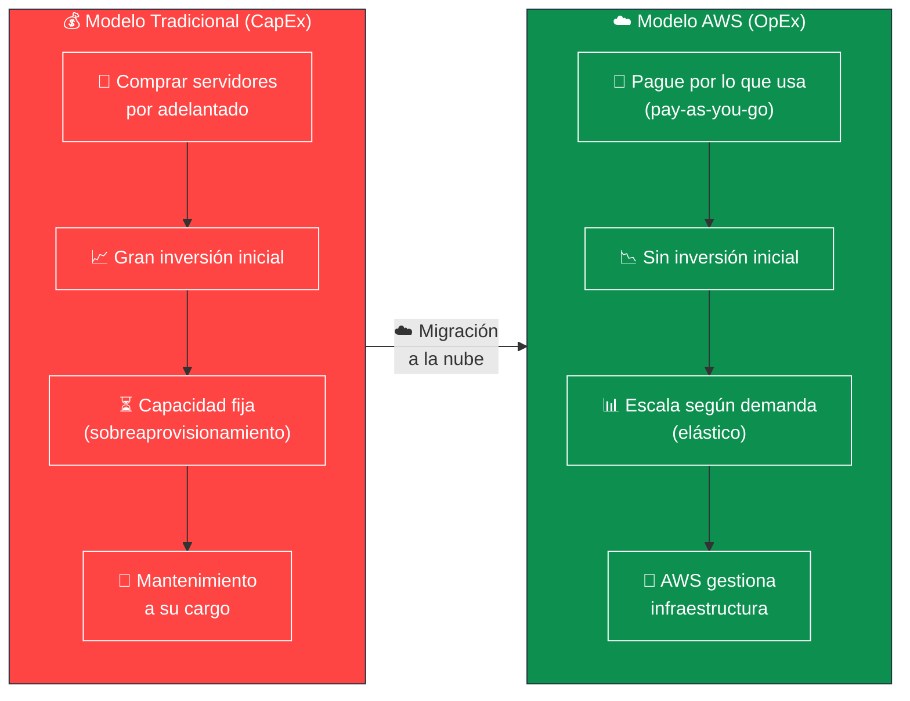
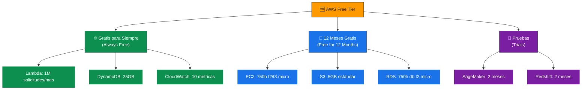
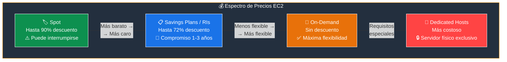
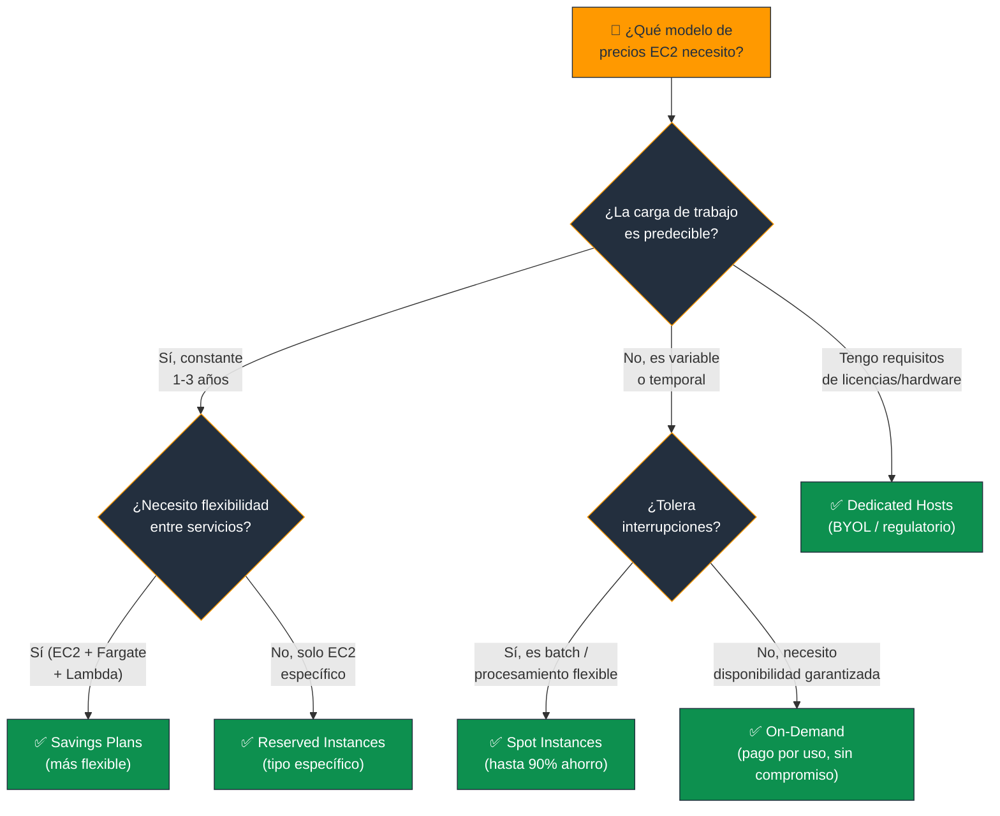
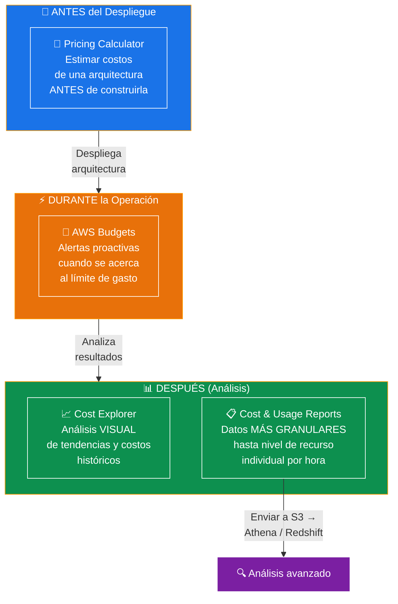
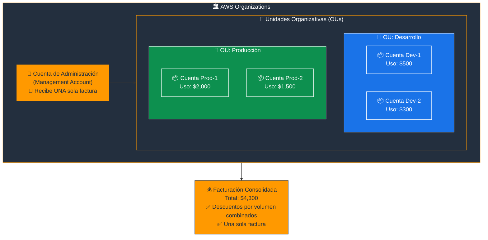
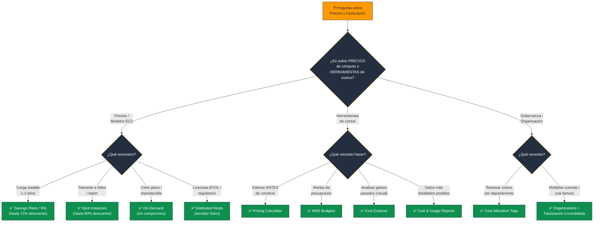

# Modelos de Precios y Facturación de AWS - Examen CLF-C02

Basado en las tres fuentes proporcionadas (Sequeira, Piper/Clinton y Kankaria), he analizado los Modelos de Precios y Facturación de AWS.

En el contexto del examen **AWS Certified Cloud Practitioner (CLF-C02)**, este tema es el núcleo del **Dominio 4: Facturación, Precios y Soporte**, que representa el **12% de la puntuación total**. Específicamente, aborda la **Declaración de Tarea 4.1: Comparar modelos de precios de AWS** y la **Declaración de Tarea 4.2: Comprender los recursos para facturación, presupuesto y gestión de costos**.

A continuación, presento un análisis detallado estructurado para el examen.

---

## 1. Filosofía General de Precios (Cloud Economics)

El examen evalúa si comprende cómo AWS cambia la estructura de costos fundamental de TI.

### CapEx vs. OpEx

Se pasa de grandes **gastos de capital iniciales (CapEx)** a **gastos operativos variables (OpEx)**. En lugar de invertir en centros de datos, paga solo cuando consume recursos.

### Pague por lo que usa (Pay-as-you-go)

Este modelo elimina la necesidad de sobreaprovisionar hardware. Si apaga una instancia, deja de pagar por ella. Este modelo medido permite cobrar desde centavos hasta miles de dólares según el uso exacto.

### Pague menos al usar más

AWS ofrece **descuentos por volumen**. A medida que aumenta el uso (por ejemplo, en almacenamiento S3 o transferencia de datos), el costo por unidad disminuye.

### Nivel Gratuito (Free Tier)

Fundamental para principiantes y para el examen. Se divide en tres categorías:

| Categoría | Descripción | Ejemplos |
|---|---|---|
| **Gratis para siempre** | Sin límite de tiempo | Lambda hasta 1M solicitudes/mes, DynamoDB hasta 25GB |
| **12 meses gratis** | Solo para cuentas nuevas | 750 horas de EC2 t2/t3.micro, 5GB en S3 estándar |
| **Pruebas (Trials)** | Ofertas a corto plazo | Servicios específicos por tiempo limitado |

### 📊 Diagrama: CapEx vs OpEx - El Cambio Fundamental

### 📊 Diagrama: Las 3 Categorías del Free Tier

---

## 2. Modelos de Precios de Cómputo (EC2)

Esta es el **área más evaluada** dentro de los precios. Debe ser capaz de elegir el modelo correcto basado en un escenario de uso.

### On-Demand (Bajo Demanda)

- **Características:** Sin compromiso a largo plazo ni pago inicial. Paga por hora o segundo. Es el modelo **más flexible pero el más costoso** por unidad de tiempo.
- **Caso de uso:** Cargas de trabajo a corto plazo, picos impredecibles o desarrollo/pruebas nuevas.

### Savings Plans e Instancias Reservadas (RIs)

- **Características:** Compromiso de uso por **1 o 3 años** a cambio de un gran descuento (hasta **72%** respecto a On-Demand).
- **Diferencia clave:** Las **Savings Plans** son el modelo recomendado por AWS sobre las RIs debido a su mayor flexibilidad (aplican a EC2, Fargate y Lambda), mientras que las RIs son específicas para instancias EC2.
- **Caso de uso:** Cargas de trabajo de **estado estable (steady-state)** y uso predecible a largo plazo.

### Spot Instances (Instancias de Subasta)

- **Características:** Compra capacidad no utilizada de AWS con descuentos de hasta el **90%**. Sin embargo, AWS puede **interrumpir/terminar** la instancia con solo **2 minutos** de aviso.
- **Caso de uso:** Cargas de trabajo **tolerantes a fallos**, flexibles en horario, procesamiento por lotes (batch processing) o análisis de big data.

### Dedicated Hosts (Hosts Dedicados)

- **Características:** Un servidor físico reservado exclusivamente para su uso. Es el modelo **más costoso**.
- **Caso de uso:** Cumplimiento de **licencias de software** existentes vinculadas al hardware (BYOL - Bring Your Own License) o requisitos regulatorios estrictos de aislamiento.

> **Tip de examen:** "Carga constante 3 años" = **Savings Plans / RIs**. "Tolerante a interrupciones, máximo ahorro" = **Spot**. "Sin compromiso, flexible" = **On-Demand**. "Licencias BYOL" = **Dedicated Hosts**.

### 📊 Diagrama: Modelos de Precios EC2 - Costo vs Flexibilidad

### 📊 Diagrama: ¿Qué modelo de precio elegir?

---

## 3. Herramientas de Gestión de Costos

El examen presenta escenarios donde un gerente financiero o un administrador necesita visualizar, alertar o estimar costos. Debe distinguir entre estas herramientas.

### AWS Pricing Calculator

- **Función:** Permite **estimar los costos mensuales** de una arquitectura **antes de construirla**.
- **Clave:** No rastrea costos reales, solo proyecciones basadas en lo que usted ingresa.

### AWS Budgets

- **Función:** Permite establecer un **presupuesto personalizado** (de costos, uso o reservas) y recibir **alertas** (email, SNS) cuando se supera (o se prevé superar) el umbral definido.
- **Clave:** Es la herramienta para la **"acción proactiva"** ante sobrecostes.

### AWS Cost Explorer

- **Función:** Herramienta **visual** para analizar datos de costos **históricos y actuales**.
- **Clave:** Permite ver tendencias, filtrar por servicio/región/etiqueta, y ofrece **recomendaciones de optimización** (como comprar Reserved Instances). Responde: "¿Cuánto gasté en EC2 el mes pasado?"

### AWS Cost and Usage Reports (CUR)

- **Función:** Proporciona los datos de facturación **más granulares y detallados** disponibles (hasta nivel de hora o recurso individual).
- **Clave:** Generalmente se envía a un bucket S3 para ser analizado con herramientas como **Amazon Athena** o **Redshift**.

> **Tip de examen:** "Estimar costos antes de construir" = **Pricing Calculator**. "Alertas de presupuesto" = **Budgets**. "Analizar gastos pasados visualmente" = **Cost Explorer**. "Datos más granulares / detallados" = **CUR**.

### 📊 Diagrama: Herramientas de Gestión de Costos - ¿Cuándo usar cuál?

---

## 4. Estrategias de Optimización y Gobernanza

### Etiquetas de Asignación de Costos (Cost Allocation Tags)

- Etiquetas que, una vez activadas, permiten **rastrear costos detallados** por proyecto, departamento o centro de costos.
- Sin ellas, la factura es un total agregado difícil de desglosar.

### AWS Organizations y Facturación Consolidada

- Permite agrupar **múltiples cuentas de AWS** bajo una cuenta de administración (Management Account).
- **Beneficio clave:** La **Facturación Consolidada (Consolidated Billing)** combina el uso de todas las cuentas, lo que permite:
  - Alcanzar **niveles de descuento por volumen** más rápido.
  - Recibir **una sola factura** para toda la organización.

> **Tip de examen:** "Rastrear costos por departamento/proyecto" = **Cost Allocation Tags**. "Múltiples cuentas, una factura, descuentos por volumen" = **Organizations + Facturación Consolidada**.

### 📊 Diagrama: AWS Organizations - Facturación Consolidada

---

## Resumen para el Candidato

Para las preguntas de facturación en el CLF-C02:

| Escenario en el examen | Respuesta |
|---|---|
| Estimación antes del despliegue | **Pricing Calculator** |
| Alertas cuando el gasto sube | **AWS Budgets** |
| Análisis visual y tendencias de costos | **Cost Explorer** |
| Datos más granulares / detallados | **Cost and Usage Reports (CUR)** |
| Descuento por compromiso (1-3 años) | **Savings Plans / Reserved Instances** |
| Máximo ahorro pero riesgo de interrupción | **Spot Instances** |
| Sin compromiso, pago por uso | **On-Demand** |
| Licencias de software (BYOL) | **Dedicated Hosts** |
| Rastrear costos por departamento | **Cost Allocation Tags** |
| Múltiples cuentas, una factura | **Organizations + Facturación Consolidada** |

### Palabras clave que debes asociar

- **"Estimar / proyectar costos antes"** → Pricing Calculator
- **"Alertas / presupuesto / umbral"** → AWS Budgets
- **"Analizar gastos / tendencias / visual"** → Cost Explorer
- **"Datos granulares / nivel de recurso"** → CUR
- **"Compromiso 1-3 años / steady-state"** → Savings Plans / RIs
- **"Interrumpible / batch / 90% ahorro"** → Spot
- **"Flexible / sin compromiso / corto plazo"** → On-Demand
- **"Licencias BYOL / servidor físico"** → Dedicated Hosts
- **"Etiquetas / rastrear por proyecto"** → Cost Allocation Tags
- **"Múltiples cuentas / volumen / una factura"** → Organizations

---

### 📊 Diagrama: Árbol de Decisión para Preguntas del Examen

