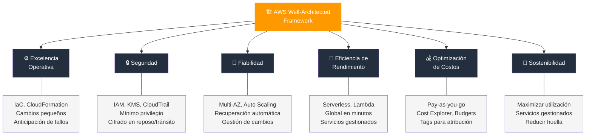
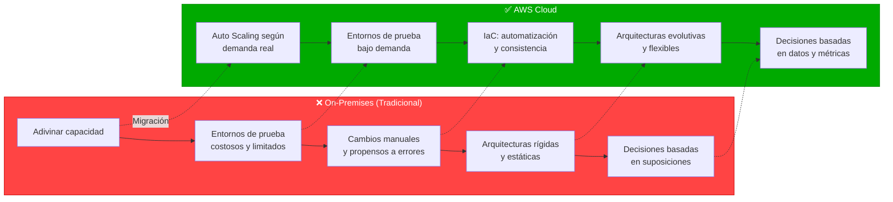
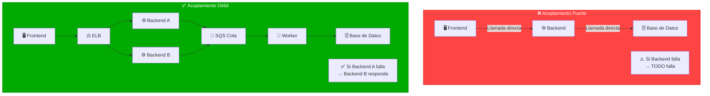
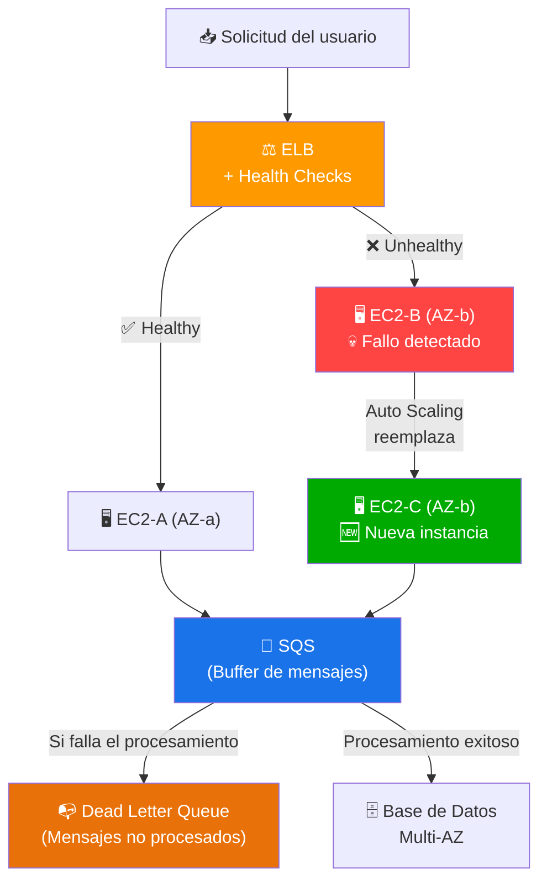
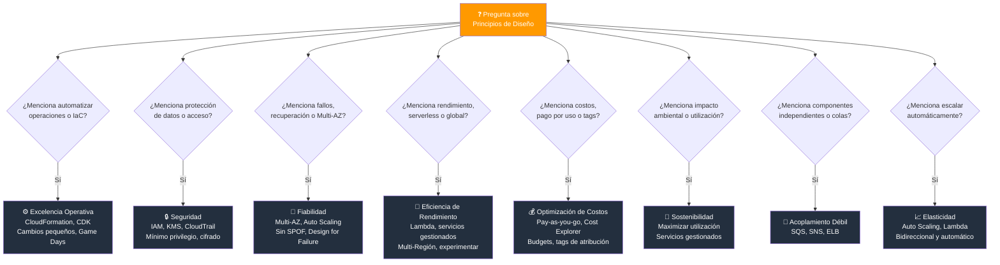

# Principios de Diseño de AWS Cloud - Examen CLF-C02

Basado en las tres fuentes proporcionadas (Sequeira, Piper/Clinton y Kankaria), he analizado los Principios de Diseño de AWS Cloud.

En el contexto de los Objetivos del Examen **AWS Certified Cloud Practitioner (CLF-C02)**, este tema se encuadra principalmente en el **Dominio 1: Conceptos de la Nube**, específicamente en la **Declaración de Tarea 1.2: Identificar los principios de diseño de AWS Cloud**.

A continuación, presento un análisis detallado de cómo se estructuran estos principios para el examen.

---

## 1. El Marco de Buena Arquitectura (AWS Well-Architected Framework)

El examen utiliza este marco como la "estrella del norte" para evaluar si una arquitectura sigue las mejores prácticas. Las fuentes coinciden en que el marco se divide en **seis pilares fundamentales**:

| # | Pilar | Enfoque principal |
|---|---|---|
| 1 | Excelencia Operativa | Ejecutar y monitorear sistemas, mejora continua |
| 2 | Seguridad | Proteger información y sistemas |
| 3 | Fiabilidad | Recuperación de fallos, disponibilidad |
| 4 | Eficiencia de Rendimiento | Uso eficiente de recursos |
| 5 | Optimización de Costos | Evitar gastos innecesarios |
| 6 | Sostenibilidad | Minimizar impacto ambiental |

### Visión general de los 6 pilares

### 1.1 Excelencia Operativa (Operational Excellence)

Se centra en ejecutar y monitorear sistemas para entregar valor empresarial y mejorar continuamente los procesos.

- **Operaciones como código (IaC):** Definir toda la infraestructura de forma programática.
- **Cambios pequeños y reversibles:** Realizar actualizaciones incrementales que puedan deshacerse fácilmente.
- **Refinar procedimientos operativos frecuentemente:** Mejorar los procesos de forma continua.
- **Anticipar fallos:** Realizar simulaciones y pruebas de fallo periódicas.

> **Tip de examen:** Si ves "automatizar operaciones" o "infraestructura como código", piensa en Excelencia Operativa y AWS CloudFormation.

### 1.2 Seguridad (Security)

Protege la información y los sistemas.

- **Gestión de identidad sólida:** Principio de mínimo privilegio con **IAM**.
- **Trazabilidad:** Habilitar logs y auditoría con **AWS CloudTrail** y **Amazon CloudWatch**.
- **Seguridad en todas las capas:** Aplicar controles en red, instancias, sistema operativo y aplicación.
- **Protección de datos:** Cifrado en reposo (**AWS KMS**) y en tránsito (**TLS/SSL**).
- **Automatizar las mejores prácticas de seguridad:** Usar plantillas y configuraciones auditables.

### 1.3 Fiabilidad (Reliability)

Asegura que la carga de trabajo realice su función correctamente y se recupere de fallos.

- **Recuperación automática de fallos:** Monitorear y activar mecanismos de recuperación automáticos.
- **Escalado horizontal:** Agregar más instancias en lugar de depender de una sola instancia más grande.
- **Dejar de adivinar la capacidad:** Usar Auto Scaling para ajustarse a la demanda real.
- **Gestión del cambio mediante automatización:** Usar IaC para aplicar cambios de manera controlada.

### 1.4 Eficiencia de Rendimiento (Performance Efficiency)

Se enfoca en usar los recursos informáticos de manera eficiente.

- **Democratizar tecnologías avanzadas:** Usar servicios gestionados (ML, bases de datos, analytics) sin necesidad de ser experto.
- **Volverse global en minutos:** Desplegar en múltiples regiones con pocos clics.
- **Usar arquitecturas serverless:** Eliminar la gestión de servidores con servicios como **AWS Lambda**.
- **Experimentar con mayor frecuencia:** Probar diferentes tipos de instancias y configuraciones fácilmente.

### 1.5 Optimización de Costos (Cost Optimization)

Evita gastos innecesarios.

- **Modelo de consumo:** Pagar solo por lo que usas (pay-as-you-go).
- **Medir la eficiencia general:** Usar herramientas como **AWS Cost Explorer** y **AWS Budgets**.
- **Eliminar la "carga pesada indiferenciada":** Dejar de gestionar servidores físicos, racks, refrigeración, etc.
- **Analizar y atribuir gastos:** Usar etiquetas (tags) para rastrear costos por proyecto, equipo o entorno.

### 1.6 Sostenibilidad (Sustainability)

Es el pilar más nuevo, enfocado en minimizar el impacto ambiental.

- **Maximizar la utilización de recursos:** Evitar instancias infrautilizadas.
- **Usar servicios gestionados:** AWS optimiza la eficiencia energética a escala.
- **Reducir el impacto posterior:** Minimizar los recursos necesarios para operar las cargas de trabajo.

---

## 2. Principios de Diseño Generales

Más allá de los pilares específicos, el examen evalúa una serie de principios generales que diferencian la nube de la infraestructura local tradicional (on-premises):

- **Dejar de adivinar la capacidad:** En lugar de aprovisionar en exceso (costoso) o en defecto (caída del servicio) basándose en estimaciones, la nube permite escalar automáticamente según la demanda real.
- **Probar sistemas a escala de producción:** En la nube, puedes crear un entorno de prueba idéntico al de producción bajo demanda, ejecutar pruebas y luego eliminarlo, lo cual es prohibitivo en entornos físicos.
- **Automatizar para facilitar la experimentación:** El uso de automatización (como CloudFormation) permite crear y replicar cargas de trabajo rápidamente sin esfuerzo manual, reduciendo errores.
- **Arquitecturas evolutivas:** A diferencia de los sistemas estáticos locales, en la nube las arquitecturas pueden evolucionar con el tiempo gracias a la facilidad para cambiar y probar nuevas configuraciones.
- **Mejorar mediante "Game Days":** Simular eventos de fallo o tráfico alto en producción para probar la resiliencia de los sistemas.
- **Construir con datos:** Tomar decisiones arquitectónicas basadas en datos y métricas reales, no en suposiciones.

### Nube vs On-Premises: Principios habilitados

> **Tip de examen:** Estos principios generales aparecen frecuentemente como opciones de respuesta. Recuerda que todos giran en torno a la idea de que la nube elimina restricciones del mundo físico.

---

## 3. Conceptos Clave de Arquitectura para el Examen

Las guías de estudio enfatizan distinciones técnicas específicas que a menudo aparecen como preguntas de escenario en el examen:

### 3.1 Escalabilidad vs. Elasticidad

| Concepto | Definición | Ejemplo |
|---|---|---|
| **Escalabilidad** | Capacidad de aumentar recursos para satisfacer demanda creciente | Aplicación que crece de usuarios locales a globales |
| **Elasticidad** | Capacidad de ajustar recursos (aumentar o disminuir) automáticamente según la demanda actual | Como una banda elástica que se estira y contrae |

> **Tip de examen:** Elasticidad = automático y bidireccional. Es clave para la optimización de costos.

### 3.2 Alta Disponibilidad y Tolerancia a Fallos

- **Diseñar sin puntos únicos de fallo (SPOF):** Ningún componente individual debe poder tumbar todo el sistema.
- **Multi-AZ:** Desplegar recursos en al menos dos Zonas de Disponibilidad dentro de una región garantiza que si un centro de datos falla, la aplicación sigue funcionando.
- **Multi-Región:** Para cargas de trabajo críticas, desplegar en múltiples regiones proporciona protección contra desastres regionales.

#### Niveles de resiliencia

```mermaid
flowchart LR
    subgraph N1["Nivel 1: Single AZ"]
        direction TB
        S1["🖥️ EC2 en AZ-a"]
        S1X["⚠️ Sin redundancia\nSPOF"]
    end

    subgraph N2["Nivel 2: Multi-AZ"]
        direction TB
        M1["🖥️ EC2 en AZ-a"]
        M2["🖥️ EC2 en AZ-b"]
        M3["⚖️ ELB distribuye"]
        M4["✅ Alta Disponibilidad"]
    end

    subgraph N3["Nivel 3: Multi-Región"]
        direction TB
        R1["🌎 us-east-1\n(Primaria)"]
        R2["🌍 eu-west-1\n(DR)"]
        R3["🔄 Route 53\nFailover"]
        R4["🛡️ Recuperación\nante desastres"]
    end

    N1 -->|"Mejorar"| N2 -->|"Mejorar"| N3

    style N1 fill:#FF4444,color:#fff
    style N2 fill:#e8710a,color:#fff
    style N3 fill:#00AA00,color:#fff
```

### 3.3 Acoplamiento Débil (Loose Coupling)

El principio de "desacoplar" componentes es vital para la fiabilidad. Si un componente falla, no debe tumbar todo el sistema.

- **Amazon SQS:** Colas de mensajes para desacoplar componentes.
- **Amazon SNS:** Servicio de notificaciones pub/sub para comunicación asíncrona.
- **Elastic Load Balancing:** Distribuye tráfico y desacopla la capa de presentación del backend.

#### Acoplamiento fuerte vs débil

### 3.4 Diseño para Fallos (Design for Failure)

- Asumir que todo puede fallar y diseñar mecanismos de recuperación.
- Usar reintentos automáticos, circuit breakers y colas de mensajes muertos (dead-letter queues).
- Implementar health checks y recuperación automática de instancias.

#### Patrón de Diseño para Fallos

---

## Resumen para el Candidato

Para aprobar la sección de "Principios de Diseño" (**Dominio 1.2**), no solo debe memorizar los seis pilares del Well-Architected Framework, sino también entender cómo se aplican en la práctica.

### Asociaciones clave para el examen

| Pregunta / Escenario | Respuesta / Concepto |
|---|---|
| "Reducir costos de infraestructura" | Optimización de Costos, pay-as-you-go, eliminar carga indiferenciada |
| "Escalar automáticamente" | Elasticidad, Auto Scaling |
| "Alta disponibilidad" | Multi-AZ, sin puntos únicos de fallo |
| "Automatizar operaciones" | Excelencia Operativa, IaC, CloudFormation |
| "Proteger datos" | Seguridad, cifrado en reposo y tránsito, IAM |
| "Recuperarse de fallos" | Fiabilidad, recuperación automática |
| "Reducir impacto ambiental" | Sostenibilidad, servicios gestionados |
| "Componentes independientes" | Acoplamiento débil, SQS, SNS |

> **Tip de examen:** Debe ser capaz de identificar que "dejar de adivinar la capacidad" es un beneficio directo de la elasticidad y el Auto Scaling, y que la alta disponibilidad se logra mediante el despliegue en múltiples Zonas de Disponibilidad. La responsabilidad de la seguridad se rige por el **Modelo de Responsabilidad Compartida**, donde el diseño seguro de la aplicación es responsabilidad del cliente.

### Árbol de decisión para preguntas del examen

