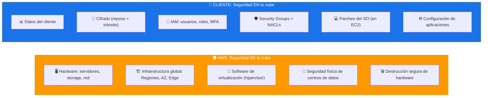
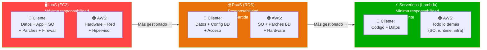
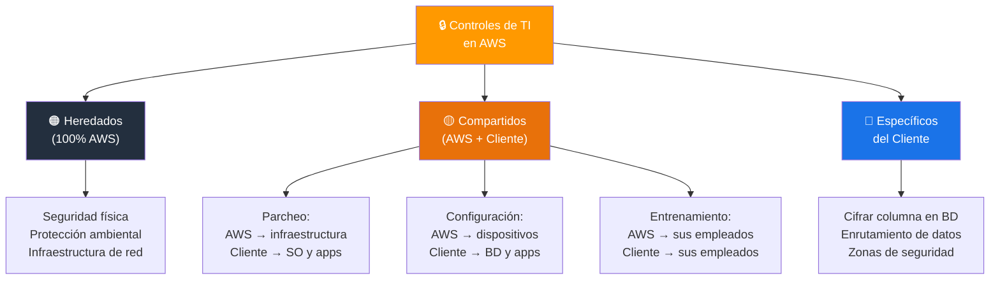
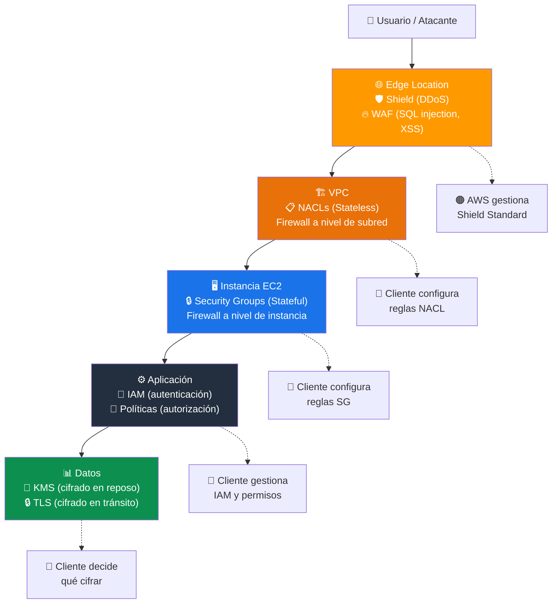
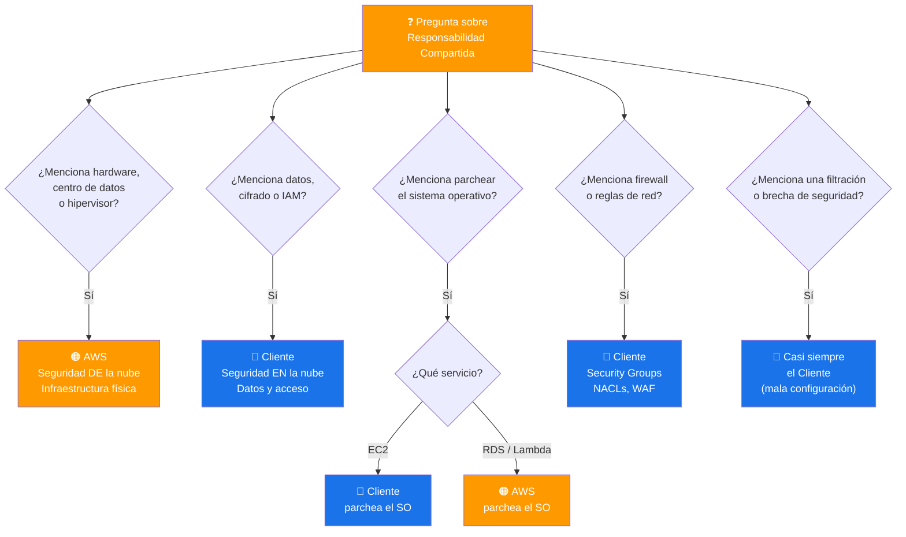

# Modelo de Responsabilidad Compartida de AWS - Examen CLF-C02

Basado en las tres fuentes proporcionadas (Sequeira, Piper/Clinton y Kankaria), he analizado el Modelo de Responsabilidad Compartida de AWS.

En el contexto del examen **AWS Certified Cloud Practitioner (CLF-C02)**, este es posiblemente el concepto más importante del **Dominio 2: Seguridad y Cumplimiento**, que representa el **30% de la puntuación total del examen**. Específicamente, aborda la **Declaración de Tarea 2.1: Comprender el modelo de responsabilidad compartida de AWS**.

A continuación, presento un análisis detallado estructurado para maximizar su preparación para el examen.

---

## 1. La Definición Fundamental: "DE" vs. "EN" la Nube

El examen evalúa constantemente si puede distinguir entre estas dos preposiciones. Las tres fuentes coinciden en la definición central que debe memorizar:

| Responsable | Alcance | Qué incluye |
|---|---|---|
| **AWS** | Seguridad **"DE"** la Nube (Security OF the Cloud) | Hardware, software, redes e instalaciones físicas |
| **Cliente** | Seguridad **"EN"** la Nube (Security IN the Cloud) | Datos, configuración de aplicaciones, controles de acceso |

> **Tip de examen:** Esta distinción "DE" vs. "EN" es la regla de oro. Si la puedes aplicar correctamente, responderás la mayoría de las preguntas de responsabilidad compartida.

### Modelo visual: "DE" vs "EN" la nube

---

## 2. Responsabilidades de AWS (Lo que hereda el cliente)

Para el examen, debe identificar qué tareas **nunca** son responsabilidad del cliente:

- **Seguridad física:** Protección de los centros de datos, control de acceso físico, vigilancia, suministro eléctrico y refrigeración.
- **Infraestructura global:** Mantenimiento de Regiones, Zonas de Disponibilidad y Ubicaciones de Borde (Edge Locations).
- **Hardware de base:** Servidores físicos, dispositivos de red, almacenamiento físico.
- **Software de virtualización:** Mantenimiento y parcheo del hipervisor (la capa que permite ejecutar máquinas virtuales).
- **Infraestructura de red:** Cables, switches, balanceadores de carga internos y conectividad entre AZ.
- **Disposición de hardware:** Descomisión y destrucción segura de discos y equipos al final de su vida útil.

> **Tip de examen:** Si la pregunta menciona "acceso físico", "hardware", "hipervisor", "destrucción de discos" o "centro de datos", la respuesta es **siempre AWS**.

---

## 3. Responsabilidades del Cliente (Lo que usted configura)

El examen presentará escenarios donde algo sale mal (ej. una filtración de datos) y preguntará quién tuvo la culpa. El cliente **siempre** es responsable de:

- **Datos del cliente:** La encriptación (en reposo y en tránsito) y la integridad de los datos.
- **Gestión de Identidad y Acceso (IAM):** Configurar usuarios, roles, grupos, políticas de contraseñas y MFA.
- **Configuración de red:** Grupos de Seguridad (Security Groups), NACLs (Network ACLs) y configuraciones de VPC.
- **Sistemas operativos (en IaaS):** Si usa EC2, usted es responsable de parchear y actualizar el sistema operativo invitado (Guest OS).
- **Configuración del firewall:** Reglas de entrada y salida en Security Groups y NACLs.
- **Cifrado del lado del cliente:** Decidir qué datos cifrar y cómo hacerlo.
- **Protección del tráfico de red:** Configurar SSL/TLS, VPN y cifrado en tránsito.

> **Tip de examen:** Regla general de Piper y Clinton: **"Si puedes editarlo, eres dueño de él."** Si tienes acceso para configurar algo, es tu responsabilidad hacerlo correctamente.

---

## 4. El "Deslizamiento" de la Responsabilidad según el Servicio

Este es un punto crítico para el examen y donde muchos candidatos fallan. La línea de responsabilidad **se mueve** dependiendo de si el servicio es IaaS, PaaS o SaaS.

### Comparación por tipo de servicio

| Capa | IaaS (EC2) | PaaS (RDS, Elastic Beanstalk) | Serverless (Lambda) | SaaS (Amazon Connect) |
|---|---|---|---|---|
| **Datos** | Cliente | Cliente | Cliente | Cliente |
| **Aplicación** | Cliente | Cliente | Cliente (código) | AWS |
| **Sistema operativo** | Cliente | AWS | AWS | AWS |
| **Parches del OS** | Cliente | AWS | AWS | AWS |
| **Red / Firewall** | Cliente | Cliente (parcial) | AWS (parcial) | AWS |
| **Infraestructura** | AWS | AWS | AWS | AWS |

### Ejemplos detallados

- **EC2 (IaaS):** El cliente tiene la **mayor carga**. Debe gestionar el sistema operativo, parches de seguridad del OS, actualizaciones de aplicaciones y el firewall.
- **RDS (PaaS):** AWS gestiona el sistema operativo y los parches del motor de base de datos. El cliente solo es responsable de gestionar los datos, el acceso y la configuración de la base de datos.
- **Lambda (Serverless):** AWS gestiona toda la infraestructura de cómputo subyacente. El cliente solo asegura su **código** y los **datos**.
- **S3:** AWS gestiona la infraestructura. El cliente es responsable de las **políticas de bucket**, el **cifrado** y los **permisos de acceso**.

> **Tip de examen:** Cuanto más **gestionado** sea el servicio, **menos** responsabilidad tiene el cliente. Lambda = mínima responsabilidad del cliente. EC2 = máxima responsabilidad del cliente.

### Deslizamiento de responsabilidad por tipo de servicio

---

## 5. Clasificación de Controles de TI

Sequeira introduce una clasificación específica de controles que puede aparecer en el examen:

### Los 3 tipos de controles

| Tipo de control | Definición | Ejemplo |
|---|---|---|
| **Controles Heredados** | El cliente los recibe totalmente de AWS | Seguridad física, protección ambiental, controles de infraestructura |
| **Controles Compartidos** | Aplican a ambas partes en contextos separados | Parcheo (AWS parchea infraestructura, cliente parchea su OS), gestión de configuración, conciencia y entrenamiento |
| **Controles Específicos del Cliente** | Totalmente responsabilidad del cliente según la aplicación | Cifrar una columna en una BD, enrutamiento de datos dentro de zonas de seguridad |

### Ejemplos de controles compartidos

- **Parcheo:** AWS parchea la infraestructura subyacente; el cliente parchea su sistema operativo y aplicaciones.
- **Gestión de configuración:** AWS configura sus dispositivos de infraestructura; el cliente configura sus bases de datos, aplicaciones y Security Groups.
- **Conciencia y entrenamiento:** AWS entrena a sus empleados; el cliente entrena a los suyos.

> **Tip de examen:** Los controles **compartidos** son los más confusos en el examen. Recuerda que "compartido" significa que ambos hacen la misma actividad pero en su propio contexto.

### Los 3 tipos de controles

---

## 6. Servicios de Seguridad Clave para el Examen

Aunque pertenecen al Dominio 2 en general, estos servicios están directamente relacionados con la responsabilidad del cliente:

| Servicio | Función | Responsable de usarlo |
|---|---|---|
| **IAM** | Gestión de usuarios, roles, políticas y MFA | Cliente |
| **AWS KMS** | Gestión de claves de cifrado | Cliente (AWS gestiona la infraestructura de KMS) |
| **AWS Shield** | Protección contra DDoS | AWS (Standard es automático), Cliente (Advanced es opcional) |
| **AWS WAF** | Firewall de aplicaciones web | Cliente (configura las reglas) |
| **Security Groups** | Firewall a nivel de instancia (stateful) | Cliente |
| **NACLs** | Firewall a nivel de subred (stateless) | Cliente |
| **AWS CloudTrail** | Registro de llamadas a la API (auditoría) | Cliente (debe habilitarlo y revisarlo) |
| **Amazon GuardDuty** | Detección inteligente de amenazas | Cliente (debe activarlo) |
| **AWS Config** | Auditoría de configuración de recursos | Cliente |

> **Tip de examen:** Security Groups = **stateful** (recuerdan el estado de la conexión). NACLs = **stateless** (evalúan cada paquete independientemente). Esta distinción aparece frecuentemente en el examen.

### Capas de seguridad: Defensa en profundidad

---

## Resumen para el Candidato

Para aprobar las preguntas sobre el Modelo de Responsabilidad Compartida:

| Escenario | Responsable |
|---|---|
| Acceso físico al centro de datos | **AWS** |
| Destrucción de discos al descomisionar | **AWS** |
| Parcheo del hipervisor | **AWS** |
| Mantenimiento de la infraestructura global | **AWS** |
| Encriptación de datos del cliente | **Cliente** |
| Permisos de usuarios (IAM) | **Cliente** |
| Parches del sistema operativo en EC2 | **Cliente** |
| Configuración de Security Groups | **Cliente** |
| Parches del OS en RDS | **AWS** |
| Parches del OS en Lambda | **AWS** |
| Parcheo de infraestructura de red | **AWS** |
| Habilitar MFA para usuarios | **Cliente** |

### Regla rápida por servicio

- **EC2** → "Parchear OS" = **Cliente**
- **RDS** → "Parchear OS" = **AWS**
- **Lambda** → "Parchear OS" = **AWS**
- **S3** → "Políticas de acceso y cifrado" = **Cliente**

### Palabras clave que debes asociar

- **"Seguridad física / hardware / hipervisor"** → Responsabilidad de AWS
- **"Datos / cifrado / IAM / permisos"** → Responsabilidad del cliente
- **"Parchear sistema operativo"** → Depende del servicio (EC2 = cliente, RDS/Lambda = AWS)
- **"Configuración de firewall"** → Responsabilidad del cliente (Security Groups, NACLs)
- **"¿Quién tiene la culpa de la filtración?"** → Casi siempre el cliente (mala configuración)

### Árbol de decisión para preguntas del examen

