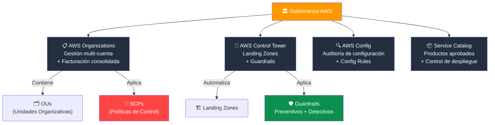
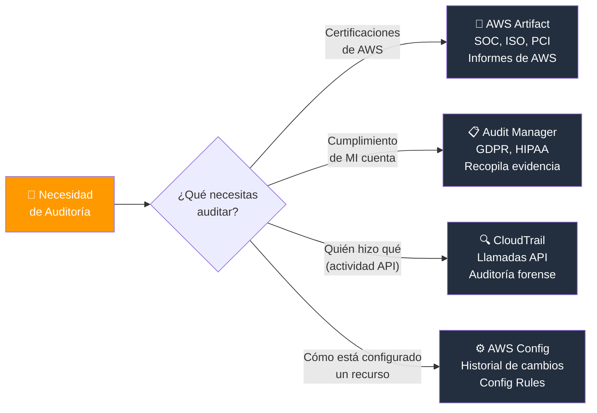
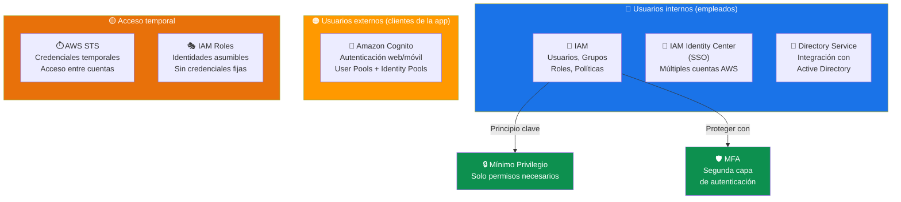
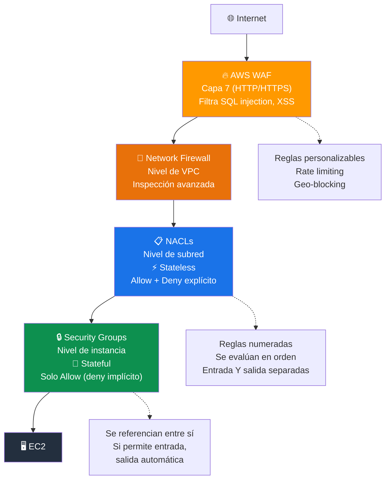
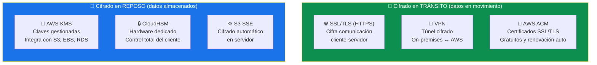
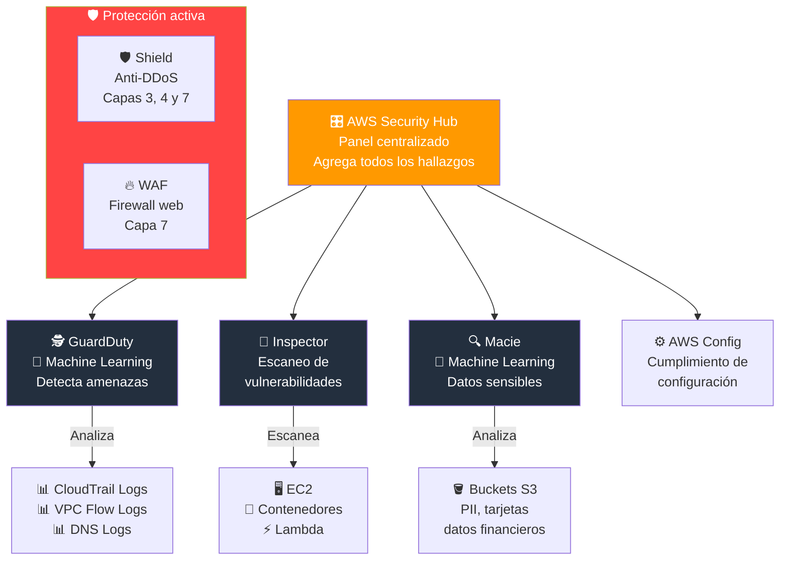
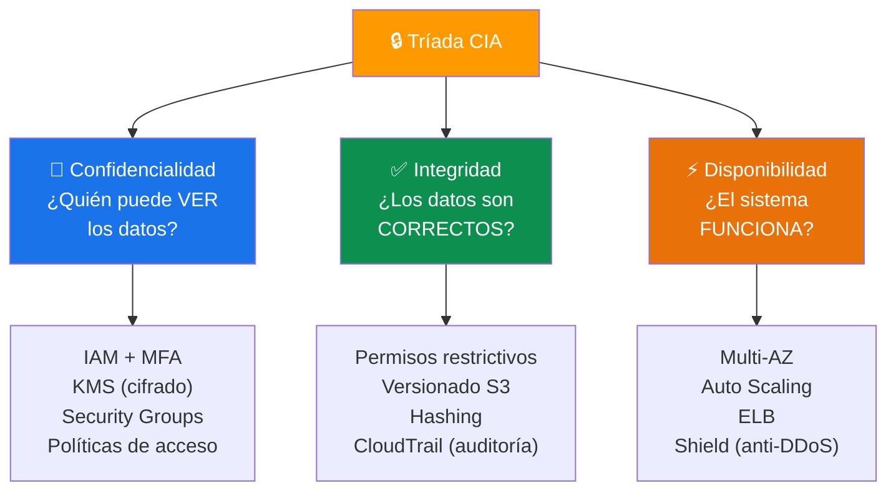

# Seguridad, Gobernanza y Cumplimiento - Examen CLF-C02

Basado en las fuentes proporcionadas (Sequeira, Piper/Clinton y Kankaria), he analizado los Conceptos de Seguridad, Gobernanza y Cumplimiento.

En el contexto del examen **AWS Certified Cloud Practitioner (CLF-C02)**, este tema es el núcleo del **Dominio 2: Seguridad y Cumplimiento**, que constituye el **30% del examen**. Específicamente, aborda:

- **Declaración de Tarea 2.2:** Conceptos de seguridad, gobernanza y cumplimiento.
- **Declaración de Tarea 2.4:** Identificar componentes y recursos de seguridad.

A continuación, presento un análisis detallado estructurado según los objetivos del examen.

---

## 1. Gobernanza y Gestión Centralizada

El examen evalúa cómo las organizaciones mantienen el control y la coherencia a medida que escalan.

### Servicios clave de gobernanza

| Servicio | Función principal | Caso de uso típico |
|---|---|---|
| **AWS Organizations** | Gestión centralizada de múltiples cuentas | Facturación consolidada, SCPs, estructura jerárquica |
| **AWS Config** | Auditoría y rastreo de configuraciones | "¿Están todos los volúmenes EBS cifrados?" |
| **AWS Control Tower** | Configurar entorno multi-cuenta seguro | Automatizar Landing Zones con mejores prácticas |
| **AWS Service Catalog** | Catálogo de productos aprobados | Controlar qué recursos pueden desplegar los equipos |

### Jerarquía de servicios de gobernanza

### AWS Organizations

Herramienta principal para la gobernanza de múltiples cuentas:

- **Facturación consolidada:** Pagar todas las cuentas con un solo método de pago y beneficiarse de descuentos por volumen.
- **Unidades Organizativas (OU):** Gestión jerárquica para agrupar cuentas por departamento, entorno o proyecto.
- **Políticas de Control de Servicios (SCPs):** Restringen qué servicios y acciones se permiten en las cuentas miembro, asegurando el cumplimiento de las políticas corporativas.

> **Tip de examen:** Las SCPs no otorgan permisos, solo los **restringen**. Funcionan como un "techo" de permisos para toda la cuenta u OU. Incluso el usuario root de una cuenta miembro está sujeto a las SCPs.

### AWS Config

Fundamental para la auditoría y el cumplimiento:

- Funciona como una **"máquina del tiempo"** que rastrea el historial de configuración de los recursos.
- Permite ver cómo estaba configurado un recurso en el pasado.
- Evalúa si los recursos cumplen con **reglas internas** (Config Rules).
- Ejemplo: verificar que todos los buckets S3 tengan cifrado habilitado.

### AWS Control Tower

- Ayuda a configurar y gobernar un entorno de múltiples cuentas seguro.
- Automatiza la creación de **Landing Zones** basadas en mejores prácticas de AWS.
- Incluye **Guardrails** (barandillas) preventivos y detectivos para mantener el cumplimiento.

> **Tip de examen:** "Configurar un entorno multi-cuenta con mejores prácticas" = **Control Tower**. "Gestionar cuentas existentes y consolidar facturación" = **Organizations**.

---

## 2. Herramientas de Cumplimiento y Auditoría

El examen a menudo presenta escenarios donde un auditor solicita informes. Debe saber distinguir entre generar informes de **sus recursos** y obtener informes sobre la **infraestructura de AWS**.

| Servicio | Qué audita | Quién lo usa |
|---|---|---|
| **AWS Artifact** | Cumplimiento de **AWS** (informes SOC, ISO, PCI) | Auditores que necesitan certificaciones de AWS |
| **AWS Audit Manager** | Cumplimiento de **su cuenta** (GDPR, HIPAA) | Equipos de cumplimiento interno |
| **Amazon CloudTrail** | **Actividad de la API** (quién hizo qué, cuándo) | Seguridad, auditoría forense |
| **AWS Config** | **Configuración de recursos** (historial de cambios) | Cumplimiento, gobernanza |

### AWS Artifact

- Portal de **autoservicio** para descargar informes de cumplimiento de AWS.
- Incluye: informes **SOC 1/2/3**, certificaciones **ISO 27001**, **PCI DSS**, **HIPAA**, entre otros.
- También permite revisar y aceptar acuerdos como el **BAA** (Business Associate Addendum) para HIPAA.

### AWS Audit Manager

- Automatiza la **recopilación de evidencia** para demostrar cumplimiento.
- Genera informes listos para auditoría basados en frameworks como GDPR, HIPAA, PCI DSS.
- Evalúa continuamente si sus configuraciones cumplen con las normativas seleccionadas.

### Amazon CloudTrail

- Registra **todas las llamadas a la API** realizadas en su cuenta.
- Captura: quién hizo la acción, qué acción, cuándo y desde dónde (IP de origen).
- Herramienta principal para **auditoría forense** y rastreo de cambios no autorizados.
- Los logs se pueden enviar a **S3** para almacenamiento a largo plazo y a **CloudWatch Logs** para alertas en tiempo real.

> **Tip de examen:** "¿Quién eliminó el recurso?" = **CloudTrail**. "¿El recurso cumplía la norma?" = **AWS Config**. "Necesito el certificado ISO de AWS" = **Artifact**.

### Flujo de auditoría: ¿Qué herramienta usar?

---

## 3. Gestión de Identidad y Acceso (IAM)

Aunque IAM se menciona en otros temas, es fundamental para la seguridad y gobernanza:

### Componentes de IAM

| Componente | Descripción |
|---|---|
| **Usuarios** | Identidades individuales con credenciales propias |
| **Grupos** | Colecciones de usuarios que comparten los mismos permisos |
| **Roles** | Identidades temporales que pueden asumir usuarios, servicios u otras cuentas |
| **Políticas (Policies)** | Documentos JSON que definen permisos (Allow/Deny) |

### Principios clave de IAM

- **Principio de mínimo privilegio:** Otorgar solo los permisos estrictamente necesarios para realizar una tarea.
- **MFA (Multi-Factor Authentication):** Agregar una segunda capa de autenticación. Se recomienda **siempre** para el usuario root y usuarios con privilegios elevados.
- **Usuario root:** Tiene acceso completo a la cuenta. Solo debe usarse para tareas específicas (como cambiar el plan de soporte o cerrar la cuenta). **Nunca** usar para tareas cotidianas.
- **Políticas basadas en identidad vs. basadas en recursos:** Las primeras se adjuntan a usuarios/grupos/roles; las segundas se adjuntan al recurso (ej. política de bucket S3).

### Otros servicios de identidad

| Servicio | Función |
|---|---|
| **AWS IAM Identity Center (SSO)** | Inicio de sesión único para múltiples cuentas AWS y aplicaciones |
| **Amazon Cognito** | Autenticación para aplicaciones web y móviles (usuarios finales) |
| **AWS Directory Service** | Integración con Microsoft Active Directory |
| **AWS STS** | Credenciales temporales de seguridad para acceso entre cuentas o federado |

> **Tip de examen:** "Acceso para empleados a múltiples cuentas AWS" = **IAM Identity Center**. "Autenticación para usuarios de una app móvil" = **Amazon Cognito**. "Credenciales temporales" = **STS o Roles de IAM**.

### Ecosistema de identidad en AWS

---

## 4. Seguridad de la Infraestructura y Datos

El examen evalúa la **"Defensa en Profundidad"**, utilizando múltiples capas de seguridad.

### Protección de Red (Firewalls)

| Control | Nivel | Estado | Comportamiento |
|---|---|---|---|
| **Security Groups** | Instancia (EC2) | **Stateful** | Si permite entrada, la salida se permite automáticamente |
| **NACLs** | Subred | **Stateless** | Debe configurar reglas explícitas de entrada Y salida |
| **AWS WAF** | Aplicación web (HTTP/HTTPS) | N/A | Filtra tráfico por reglas (SQL injection, XSS) |
| **AWS Network Firewall** | VPC | Stateful/Stateless | Inspección avanzada de tráfico a nivel de VPC |

- **Security Groups:** Permiten **solo lo que se autoriza** (deny por defecto). Se pueden referenciar entre sí.
- **NACLs:** Tienen reglas de **Allow y Deny** explícitas. Se evalúan en orden numérico. Se usan como capa adicional de defensa.

> **Tip de examen:** "Firewall a nivel de instancia" = **Security Group**. "Firewall a nivel de subred" = **NACL**. "Proteger contra SQL injection en una app web" = **AWS WAF**.

### Capas de firewall: Defensa en profundidad

### Cifrado de Datos

| Tipo | Cómo se logra | Servicios involucrados |
|---|---|---|
| **En reposo** | Cifrado de datos almacenados | AWS KMS, S3 SSE, EBS encryption, RDS encryption |
| **En tránsito** | Cifrado de datos en movimiento | SSL/TLS (HTTPS), VPN, AWS Certificate Manager |

- **AWS KMS (Key Management Service):** Servicio central para crear y gestionar claves de cifrado. Se integra con EBS, S3, RDS y muchos más. Gestiona las **CMKs** (Customer Managed Keys).
- **AWS CloudHSM:** Módulo de seguridad de hardware dedicado para gestionar claves criptográficas. Para requisitos regulatorios que exigen control total del hardware de cifrado.
- **AWS Certificate Manager (ACM):** Provisiona y gestiona certificados SSL/TLS gratuitos para cifrado en tránsito.

> **Tip de examen:** "Cifrar datos almacenados" = **KMS** (en reposo). "Cifrar datos en movimiento" = **SSL/TLS** (en tránsito). "Control total del hardware de cifrado" = **CloudHSM**.

### Cifrado: En reposo vs En tránsito

---

## 5. Detección de Amenazas y Protección

Debe identificar qué servicio utilizar para detectar comportamientos maliciosos o protegerse contra ataques específicos.

| Servicio | Función | Qué analiza |
|---|---|---|
| **Amazon GuardDuty** | Detección inteligente de amenazas | CloudTrail logs, VPC Flow Logs, DNS logs |
| **Amazon Inspector** | Evaluación de vulnerabilidades | Instancias EC2, imágenes de contenedores, funciones Lambda |
| **AWS Shield Standard** | Protección DDoS básica (gratis) | Capas 3 y 4 (red y transporte) |
| **AWS Shield Advanced** | Protección DDoS avanzada (pagada) | Capas 3, 4 y 7 + equipo DRT + protección de costos |
| **AWS WAF** | Firewall de aplicaciones web | Capa 7 (HTTP/HTTPS) |
| **Amazon Macie** | Descubrimiento de datos sensibles | Buckets S3 (PII, datos financieros) |
| **AWS Security Hub** | Panel centralizado de seguridad | Hallazgos de GuardDuty, Inspector, Macie, Config |

### Detalle de servicios clave

- **Amazon GuardDuty:** Usa **machine learning** para identificar actividades sospechosas (minería de criptomonedas no autorizada, acceso desde IPs maliciosas, comportamiento anómalo de credenciales).
- **Amazon Inspector:** Busca vulnerabilidades de software (**CVEs**) y exposiciones de red en instancias EC2 y contenedores.
- **Amazon Macie:** Descubre y protege **datos sensibles** (PII, números de tarjeta de crédito) almacenados en S3 usando machine learning.
- **AWS Security Hub:** Agrega y prioriza hallazgos de seguridad de múltiples servicios en un **panel único**. Permite verificar cumplimiento con estándares como CIS AWS Foundations.

> **Tip de examen:** "Detectar actividad sospechosa en la cuenta" = **GuardDuty**. "Buscar vulnerabilidades en EC2" = **Inspector**. "Encontrar datos sensibles en S3" = **Macie**. "Vista centralizada de seguridad" = **Security Hub**.

### Mapa de servicios de detección y protección

---

## 6. Protección DDoS

| Servicio | Costo | Capas | Características |
|---|---|---|---|
| **AWS Shield Standard** | Gratis (activado por defecto) | 3 y 4 | Protección automática contra ataques DDoS comunes |
| **AWS Shield Advanced** | Pagado ($3,000/mes) | 3, 4 y 7 | Equipo DRT, protección de costos, métricas avanzadas, integración con WAF |

> **Tip de examen:** Shield Standard es **gratuito y automático**. Si la pregunta menciona "protección DDoS avanzada", "equipo de respuesta" o "protección de costos ante DDoS", la respuesta es **Shield Advanced**.

### Shield Standard vs Shield Advanced

```mermaid
flowchart LR
    subgraph STD["🛡️ Shield Standard (GRATIS)"]
        direction TB
        S1["✅ Activado por defecto"]
        S2["✅ Capas 3 y 4"]
        S3["✅ Protección automática\ncontra ataques comunes"]
        S4["❌ Sin equipo DRT"]
        S5["❌ Sin protección de costos"]
    end

    subgraph ADV["🛡️ Shield Advanced ($3,000/mes)"]
        direction TB
        A1["✅ Capas 3, 4 y 7"]
        A2["✅ Equipo DRT\n(DDoS Response Team)"]
        A3["✅ Protección de costos\n(reembolso por escalamiento)"]
        A4["✅ Métricas avanzadas\nen tiempo real"]
        A5["✅ Integración con WAF"]
    end

    STD -->|"¿Necesitas más\nprotección?"| ADV

    style STD fill:#0d904f,color:#fff
    style ADV fill:#FF9900,color:#fff
```

---

## 7. La Tríada de Seguridad (CIA)

Concepto teórico que puede aparecer en el examen:

| Pilar | Significado | Cómo se logra en AWS |
|---|---|---|
| **Confidencialidad** | Solo personas autorizadas acceden a los datos | IAM, KMS, cifrado, Security Groups |
| **Integridad** | Los datos no son alterados sin autorización | Permisos restrictivos, versionado en S3, hashing |
| **Disponibilidad** | Los sistemas funcionan cuando se necesitan | Multi-AZ, Auto Scaling, Shield (protección DDoS) |

### Tríada CIA en AWS

---

## Resumen para el Candidato

Para aprobar las preguntas sobre seguridad, gobernanza y cumplimiento en el CLF-C02:

| Escenario en el examen | Respuesta |
|---|---|
| Descargar informes de cumplimiento de AWS (ISO, SOC, PCI) | **AWS Artifact** |
| Gobernar múltiples cuentas y consolidar facturación | **AWS Organizations** |
| Restringir qué servicios pueden usar las cuentas miembro | **SCPs** (dentro de Organizations) |
| Detectar amenazas analizando logs automáticamente | **Amazon GuardDuty** |
| Ver el historial de configuración de un recurso | **AWS Config** |
| Rastrear quién hizo qué en la cuenta (llamadas API) | **Amazon CloudTrail** |
| Firewall a nivel de instancia | **Security Group** |
| Firewall a nivel de subred | **NACL** |
| Proteger app web contra SQL injection | **AWS WAF** |
| Cifrar datos almacenados | **AWS KMS** |
| Buscar vulnerabilidades en EC2 | **Amazon Inspector** |
| Encontrar datos sensibles en S3 | **Amazon Macie** |
| Vista centralizada de hallazgos de seguridad | **AWS Security Hub** |
| Configurar entorno multi-cuenta con mejores prácticas | **AWS Control Tower** |
| Autenticar usuarios de una app móvil | **Amazon Cognito** |
| SSO para empleados en múltiples cuentas | **IAM Identity Center** |

### Palabras clave que debes asociar

- **"Informe SOC / ISO / PCI para auditor"** → AWS Artifact
- **"Múltiples cuentas / factura única"** → AWS Organizations
- **"Quién eliminó el recurso"** → CloudTrail
- **"El recurso cumple la norma"** → AWS Config
- **"Actividad sospechosa / machine learning"** → GuardDuty
- **"Vulnerabilidades / CVEs"** → Inspector
- **"Datos sensibles en S3 / PII"** → Macie
- **"Stateful / a nivel de instancia"** → Security Groups
- **"Stateless / a nivel de subred"** → NACLs
- **"Mínimo privilegio"** → IAM, principio fundamental
- **"DDoS gratis"** → Shield Standard
- **"DDoS avanzado + equipo DRT"** → Shield Advanced

### Árbol de decisión para preguntas del examen

```mermaid
flowchart TD
    Q["❓ Pregunta sobre\nSeguridad, Gobernanza\no Cumplimiento"] --> Q1{"¿Sobre gobernanza\no multi-cuenta?"}
    Q --> Q2{"¿Sobre auditoría\no cumplimiento?"}
    Q --> Q3{"¿Sobre identidad\no acceso?"}
    Q --> Q4{"¿Sobre firewalls\no red?"}
    Q --> Q5{"¿Sobre cifrado?"}
    Q --> Q6{"¿Sobre detección\nde amenazas?"}
    Q --> Q7{"¿Sobre DDoS?"}

    Q1 -->|"Múltiples cuentas\nfacturación"| A1["📋 Organizations\n+ SCPs"]
    Q1 -->|"Landing Zones\nmejores prácticas"| A1B["🗼 Control Tower"]

    Q2 -->|"Certificaciones\nde AWS (SOC, ISO)"| A2["📜 Artifact"]
    Q2 -->|"Quién hizo qué\n(llamadas API)"| A2B["🔍 CloudTrail"]
    Q2 -->|"Configuración\nde recursos"| A2C["⚙️ Config"]
    Q2 -->|"Evidencia para\nauditoría (GDPR)"| A2D["📋 Audit Manager"]

    Q3 -->|"Empleados\nmúltiples cuentas"| A3["🔑 IAM Identity\nCenter (SSO)"]
    Q3 -->|"Usuarios de\napp móvil/web"| A3B["📱 Cognito"]
    Q3 -->|"Credenciales\ntemporales"| A3C["⏱️ STS / Roles"]

    Q4 -->|"Nivel de\ninstancia"| A4["🔒 Security Group\n(Stateful)"]
    Q4 -->|"Nivel de\nsubred"| A4B["📋 NACL\n(Stateless)"]
    Q4 -->|"SQL injection\nXSS"| A4C["🔥 WAF"]

    Q5 -->|"Datos en\nreposo"| A5["🔑 KMS"]
    Q5 -->|"Datos en\ntránsito"| A5B["🌐 SSL/TLS + ACM"]
    Q5 -->|"Hardware\ndedicado"| A5C["🔒 CloudHSM"]

    Q6 -->|"Actividad\nsospechosa"| A6["🕵️ GuardDuty"]
    Q6 -->|"Vulnerabilidades\nCVEs"| A6B["🔬 Inspector"]
    Q6 -->|"Datos sensibles\nen S3"| A6C["🔍 Macie"]
    Q6 -->|"Vista\ncentralizada"| A6D["🎛️ Security Hub"]

    Q7 -->|"Protección\ngratis"| A7["🛡️ Shield Standard"]
    Q7 -->|"Equipo DRT\nprotección costos"| A7B["🛡️ Shield Advanced"]

    style Q fill:#FF9900,color:#fff
    style A1 fill:#232F3E,color:#fff
    style A1B fill:#232F3E,color:#fff
    style A2 fill:#1a73e8,color:#fff
    style A2B fill:#1a73e8,color:#fff
    style A2C fill:#1a73e8,color:#fff
    style A2D fill:#1a73e8,color:#fff
    style A3 fill:#0d904f,color:#fff
    style A3B fill:#0d904f,color:#fff
    style A3C fill:#0d904f,color:#fff
    style A4 fill:#e8710a,color:#fff
    style A4B fill:#e8710a,color:#fff
    style A4C fill:#e8710a,color:#fff
    style A5 fill:#232F3E,color:#fff
    style A5B fill:#232F3E,color:#fff
    style A5C fill:#232F3E,color:#fff
    style A6 fill:#1a73e8,color:#fff
    style A6B fill:#1a73e8,color:#fff
    style A6C fill:#1a73e8,color:#fff
    style A6D fill:#1a73e8,color:#fff
    style A7 fill:#FF4444,color:#fff
    style A7B fill:#FF4444,color:#fff
```

