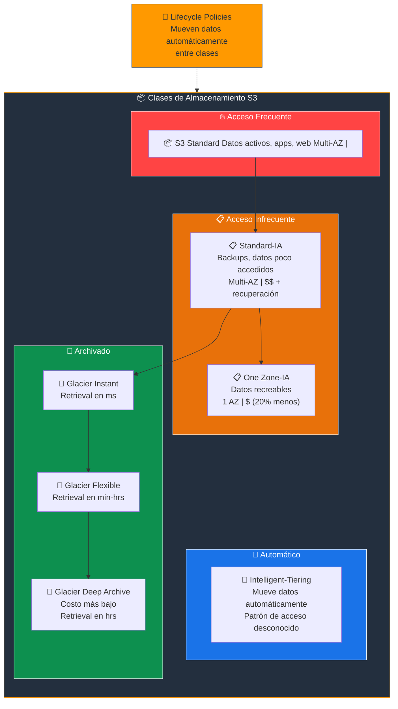
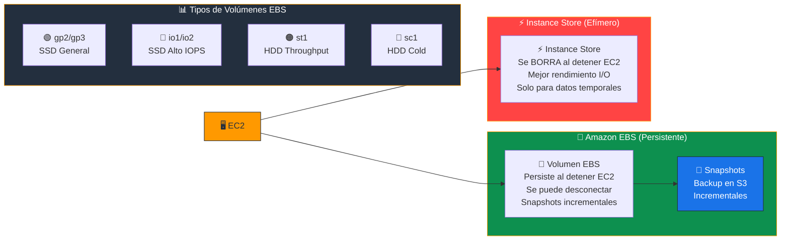
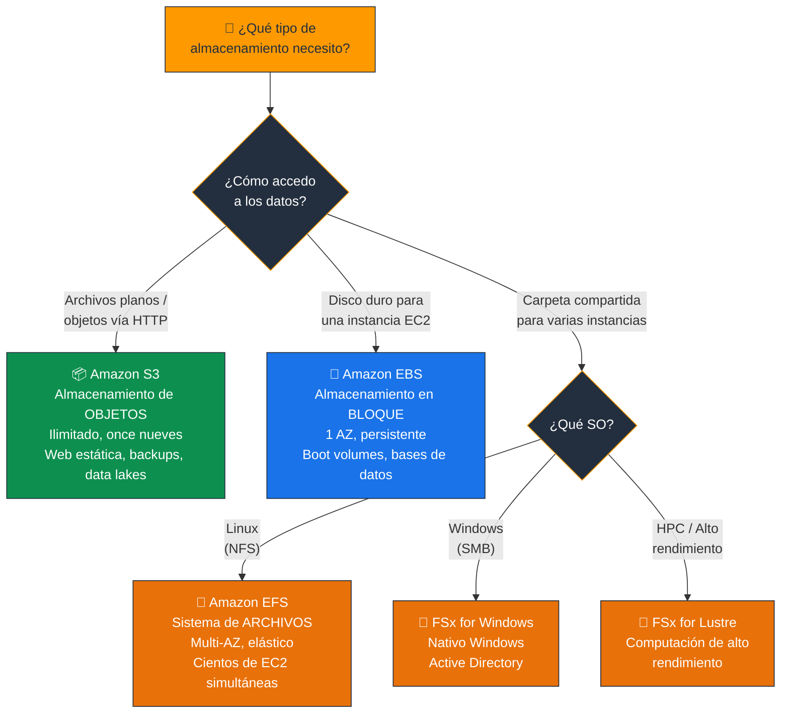
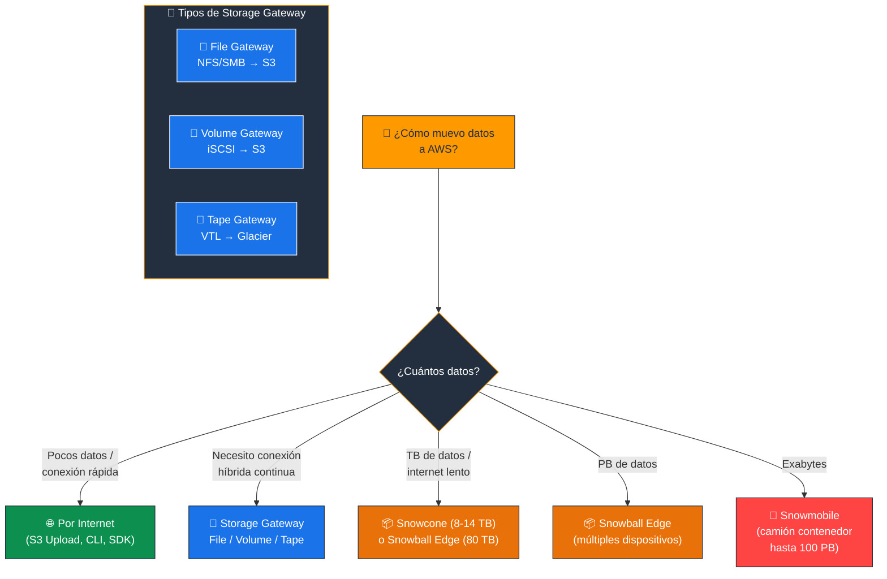
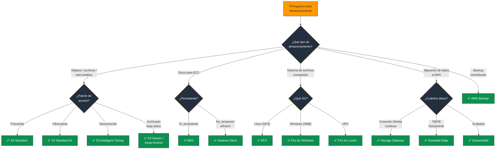

# Servicios de Almacenamiento de AWS - Examen CLF-C02

Basado en las tres fuentes proporcionadas (Sequeira, Piper/Clinton y Kankaria), he analizado los Servicios de Almacenamiento de AWS.

En el contexto del examen **AWS Certified Cloud Practitioner (CLF-C02)**, este tema es el núcleo de la **Declaración de Tarea 3.6: Identificar los servicios de almacenamiento de AWS** dentro del **Dominio 3: Tecnología y Servicios en la Nube** (34% del examen). Además, es vital para entender la **Optimización de Costos (Dominio 4)** debido a las diversas clases de almacenamiento y sus precios.

A continuación, presento un análisis detallado estructurado por tipo de almacenamiento, tal como se evalúa en el examen:

---

## 1. Almacenamiento de Objetos: Amazon S3

El examen evalúa profusamente **Amazon Simple Storage Service (S3)**. Debe entender que es un almacenamiento de **objetos** (archivos planos + metadatos) diseñado para una durabilidad del **99.999999999% ("once nueves")**.

### Clases de Almacenamiento (Storage Classes)

Tabla esencial para las preguntas de escenarios de costos:

| Clase | Acceso | AZs | Costo | Caso de uso |
|---|---|---|---|---|
| **S3 Standard** | Frecuente | Multi-AZ | $$$ | Datos activos, sitios web, apps |
| **S3 Standard-IA** | Infrecuente | Multi-AZ | $$ + costo por recuperación | Backups, datos poco accedidos |
| **S3 One Zone-IA** | Infrecuente | 1 AZ | $ (20% menos que IA) | Datos recreables, réplicas |
| **S3 Intelligent-Tiering** | Automático | Multi-AZ | $$ + tarifa monitoreo | Patrones de acceso desconocidos |
| **S3 Glacier Instant Retrieval** | Archivado | Multi-AZ | $ | Archivos accesibles en ms |
| **S3 Glacier Flexible Retrieval** | Archivado | Multi-AZ | ¢ | Archivado, recuperación min-hrs |
| **S3 Glacier Deep Archive** | Archivado largo plazo | Multi-AZ | ¢¢ (más barato) | Retención regulatoria, 7-10 años |

> **Tip de examen:** "Acceso frecuente" = **Standard**. "No sé el patrón de acceso" = **Intelligent-Tiering**. "Archivado a largo plazo, costo más bajo" = **Glacier Deep Archive**. "Infrecuente pero necesito rapidez" = **Standard-IA**.

### Características Clave de S3

- **Versionado:** Protege contra borrados accidentales manteniendo múltiples variantes de un objeto.
- **Ciclos de Vida (Lifecycles):** Reglas automatizadas para mover objetos a clases más baratas o eliminarlos (ej. mover logs a Glacier después de 30 días).
- **Acceso Público:** Por defecto, los buckets S3 son **privados**. Se puede hacer público con Bucket Policies o ACLs, o prevenirlo con **Block Public Access**.
- **Namespace global:** Los nombres de bucket son únicos globalmente, pero los **datos se almacenan en una región específica**.

> **Tip de examen:** "Hosting de sitio web estático" = **S3**. "Durabilidad once nueves" = **S3**. "Mover datos automáticamente a clases más baratas" = **S3 Lifecycle Policies**.

### 📊 Diagrama: Clases de Almacenamiento S3 - Costo vs Acceso

---

## 2. Almacenamiento en Bloque: Amazon EBS

El examen distingue claramente entre almacenamiento de **objetos (S3)** y almacenamiento en **bloque (EBS)**. **Elastic Block Store (EBS)** actúa como un **disco duro virtual** para las instancias EC2.

- **Persistencia:** A diferencia del **Instance Store** (que es efímero y se borra al detener la instancia), los volúmenes EBS son **persistentes** y se pueden desconectar de una instancia y conectar a otra.
- **Alcance:** Un volumen EBS reside en **una sola AZ** (igual que la instancia a la que se conecta).
- **Snapshots (Instantáneas):** Copias de seguridad puntuales que se almacenan en S3. Son **incrementales** (solo guardan los cambios desde la última copia).

### Tipos de Volúmenes EBS

| Tipo | Identificador | Uso | Caso de uso |
|---|---|---|---|
| **General Purpose SSD** | gp2/gp3 | Equilibrio precio-rendimiento | Boot volumes, apps generales |
| **Provisioned IOPS SSD** | io1/io2 | Alto rendimiento, baja latencia | Bases de datos críticas |
| **Throughput Optimized HDD** | st1 | Alto throughput secuencial | Big data, data warehouses |
| **Cold HDD** | sc1 | Menor costo HDD | Datos accedidos raramente |

> **Tip de examen:** "Disco duro para EC2" = **EBS**. "Almacenamiento efímero/temporal" = **Instance Store**. "Backup de volumen EBS" = **Snapshot**. "Base de datos de alta IOPS" = **io1/io2**.

### 📊 Diagrama: EBS vs Instance Store

---

## 3. Almacenamiento de Archivos: Amazon EFS y FSx

Debe saber cuándo elegir un **sistema de archivos compartido** en lugar de un volumen de bloque.

- **Amazon Elastic File System (EFS):** Sistema de archivos totalmente gestionado, escalable y elástico para cargas de trabajo **Linux**. Permite que **cientos de instancias EC2 accedan al mismo sistema de archivos simultáneamente**.
- **Amazon FSx:** La respuesta correcta si el examen menciona **"Windows"** o **"High Performance Computing (HPC)"**.
  - **FSx for Windows File Server:** Sistema de archivos nativo de Windows (**SMB**).
  - **FSx for Lustre:** Para computación de **alto rendimiento (HPC)**.

> **Tip de examen:** "Sistema de archivos compartido Linux" = **EFS**. "Sistema de archivos compartido Windows (SMB)" = **FSx for Windows**. "HPC / alto rendimiento" = **FSx for Lustre**.

### 📊 Diagrama: S3 vs EBS vs EFS - Los 3 Tipos de Almacenamiento

---

## 4. Almacenamiento Híbrido y Migración de Datos

El examen presenta escenarios sobre cómo **mover datos desde un centro de datos local (on-premises) hacia AWS**.

### AWS Storage Gateway

Conecta aplicaciones locales con el almacenamiento en la nube **sin cambiar el código**. Tres tipos:

| Tipo | Protocolo | Respaldo | Caso de uso |
|---|---|---|---|
| **File Gateway** | NFS/SMB | S3 | Carpeta compartida local respaldada en S3 |
| **Volume Gateway** | iSCSI | S3 | Almacenamiento en bloque respaldado en S3 |
| **Tape Gateway** | VTL | S3 Glacier | Reemplazo de bibliotecas de cintas físicas |

### Familia AWS Snow

Para **transferencia de datos física** cuando la red es lenta o insuficiente:

| Dispositivo | Capacidad | Cómputo local | Caso de uso |
|---|---|---|---|
| **Snowcone** | 8-14 TB | Limitado | Entornos remotos, portátil |
| **Snowball Edge** | 80 TB - PB | Sí (EC2, Lambda) | Migraciones masivas, edge computing |
| **Snowmobile** | Hasta 100 PB | No | Exabytes de datos (camión contenedor) |

> **Tip de examen:** "Conectar on-premises con S3 sin cambiar código" = **Storage Gateway**. "Reemplazo de cintas" = **Tape Gateway**. "Mover TB/PB físicamente" = **Snowball**. "Exabytes" = **Snowmobile**.

### 📊 Diagrama: Migración de Datos - ¿Cómo muevo mis datos a AWS?

---

## 5. Servicios de Backup

- **AWS Backup:** Servicio **centralizado** para automatizar y gestionar copias de seguridad en múltiples servicios de AWS (EBS, RDS, DynamoDB, EFS, etc.). Permite crear políticas de backup consistentes desde un solo lugar.

> **Tip de examen:** "Backup centralizado de múltiples servicios AWS" = **AWS Backup**.

---

## Resumen para el Candidato

Para aprobar las preguntas de almacenamiento en el CLF-C02:

| Escenario en el examen | Respuesta |
|---|---|
| Almacenamiento de objetos / Archivos planos / Web estática | **S3** |
| Archivado a largo plazo / Costo más bajo | **S3 Glacier / Deep Archive** |
| Patrón de acceso desconocido | **S3 Intelligent-Tiering** |
| Disco duro para EC2 / Base de datos en EC2 | **EBS** |
| Almacenamiento temporal de alto rendimiento | **Instance Store** |
| Sistema de archivos compartido para Linux | **EFS** |
| Sistema de archivos compartido para Windows (SMB) | **FSx for Windows** |
| HPC / Alto rendimiento | **FSx for Lustre** |
| Conectar on-premises con S3 | **Storage Gateway** |
| Reemplazo de cintas físicas | **Tape Gateway** |
| Mover TB/PB de datos físicamente | **Snowball Edge** |
| Exabytes de datos | **Snowmobile** |
| Backup centralizado multi-servicio | **AWS Backup** |

### Palabras clave que debes asociar

- **"Objetos / archivos planos / once nueves"** → S3
- **"Acceso frecuente"** → S3 Standard
- **"No sé el patrón de acceso"** → S3 Intelligent-Tiering
- **"Archivado / retención regulatoria"** → Glacier Deep Archive
- **"Disco para EC2 / persistente"** → EBS
- **"Temporal / efímero / se borra al detener"** → Instance Store
- **"Compartido Linux / NFS"** → EFS
- **"Compartido Windows / SMB"** → FSx for Windows
- **"HPC / Lustre"** → FSx for Lustre
- **"Hybrid / on-premises ↔ S3"** → Storage Gateway
- **"Mover datos físicamente"** → Snow Family
- **"Backup centralizado"** → AWS Backup
- **"Lifecycle / mover a clase más barata"** → S3 Lifecycle Policies

---

### 📊 Diagrama: Árbol de Decisión para Preguntas del Examen

