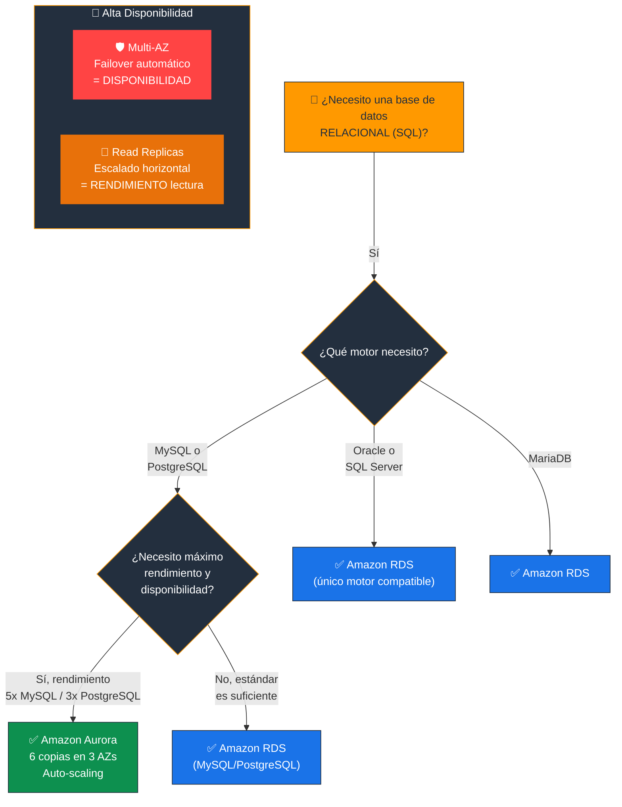
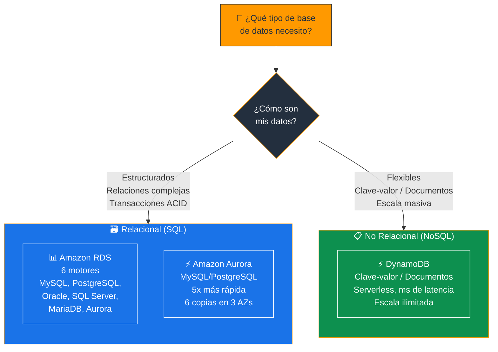
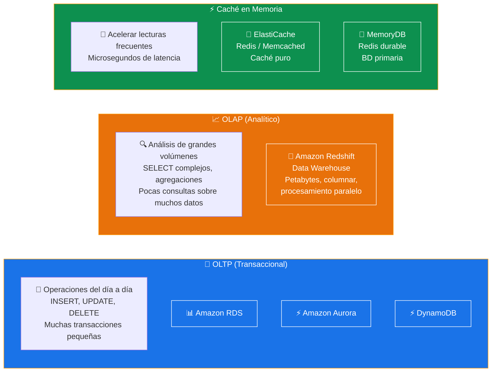
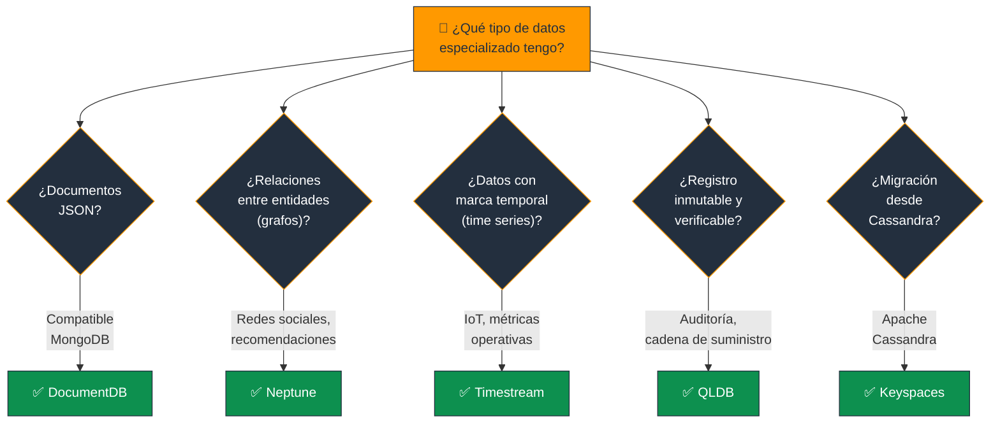
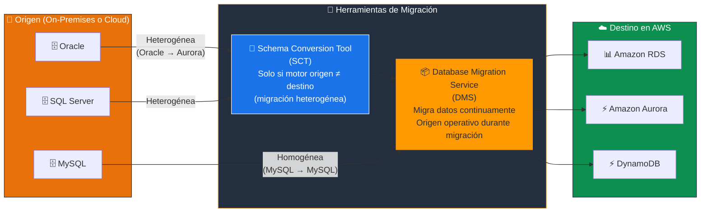
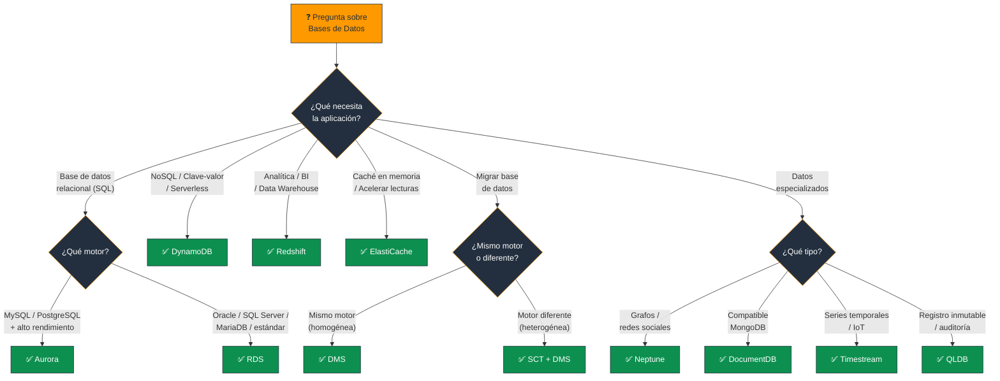

# Servicios de Base de Datos de AWS - Examen CLF-C02

Basado en las tres fuentes proporcionadas (Sequeira, Piper/Clinton y Kankaria), he analizado los Servicios de Base de Datos de AWS.

En el contexto del examen **AWS Certified Cloud Practitioner (CLF-C02)**, este tema se encuadra principalmente en el **Dominio 3: Tecnología y Servicios en la Nube**, abordando específicamente la **Declaración de Tarea 3.4: Identificar servicios de base de datos de AWS**. Además, es crucial para entender la migración (Dominio 1.3) y los costos (Dominio 4).

A continuación, presento un análisis detallado estructurado según los objetivos del examen, diferenciando entre bases de datos relacionales, no relacionales y otros servicios especializados.

---

## 1. Servicios de Bases de Datos Relacionales (SQL)

El examen evalúa si comprende cuándo usar una base de datos relacional (estructurada, con filas y columnas) y qué opciones ofrece AWS.

### Amazon Relational Database Service (RDS)

- **Propósito:** Es un servicio **gestionado** que facilita la configuración, operación y escalado de bases de datos relacionales en la nube. Automatiza tareas administrativas como el aprovisionamiento de hardware, la configuración de bases de datos, los parches y las copias de seguridad.
- **Motores Soportados:** Debe memorizar que RDS soporta **seis motores**: MySQL, MariaDB, PostgreSQL, Oracle, Microsoft SQL Server y Amazon Aurora.
- **Características Clave:**
  - **Multi-AZ:** Implementación para **Alta Disponibilidad** y recuperación ante desastres (failover automático en caso de fallo).
  - **Read Replicas (Réplicas de Lectura):** Se utilizan para mejorar el **rendimiento de lectura** (escalado horizontal), **no** para alta disponibilidad ante desastres.

> **Tip de examen:** **Multi-AZ** = Alta Disponibilidad (failover). **Read Replicas** = Rendimiento de lectura (escalado). No confundir estos conceptos.

### Amazon Aurora

- **Definición:** Es una base de datos relacional compatible con **MySQL y PostgreSQL** creada por AWS para la nube.
- **Ventaja Competitiva:** Ofrece el rendimiento y la disponibilidad de bases de datos comerciales de alta gama a una **décima parte del costo**. Es hasta **5 veces más rápida que MySQL** estándar y **3 veces más rápida que PostgreSQL** estándar.
- **Arquitectura:** Utiliza almacenamiento distribuido y tolerante a fallos, replicando datos **6 veces a través de 3 Zonas de Disponibilidad (AZ)**.

> **Tip de examen:** Si la pregunta menciona "relacional + alto rendimiento + compatibilidad MySQL/PostgreSQL + costo-eficiente" = **Aurora**.

### 📊 Diagrama: RDS vs Aurora - ¿Cuándo usar cada uno?

---

## 2. Servicios de Bases de Datos No Relacionales (NoSQL)

El examen distingue claramente entre casos de uso SQL (estructurados) y NoSQL (flexibles, alto rendimiento).

### Amazon DynamoDB

- **Definición:** Base de datos de **clave-valor y documentos**, totalmente gestionada y **sin servidor (serverless)**.
- **Casos de Uso:** Aplicaciones que requieren latencia de **milisegundos de un solo dígito** a cualquier escala, como juegos, tecnología publicitaria, IoT y aplicaciones móviles.
- **Características:**
  - No requiere administración de servidores (serverless)
  - Escala automáticamente
  - Soporta **tablas globales** para replicación en múltiples regiones

> **Tip de examen:** "NoSQL + serverless + latencia de milisegundos + escala ilimitada" = **DynamoDB**. Es el servicio NoSQL estrella de AWS.

### 📊 Diagrama: SQL vs NoSQL - ¿Cuándo usar cada tipo?

---

## 3. Servicios de Almacenamiento en Memoria (Caching)

Para el examen, debe identificar qué servicio mejora el rendimiento de lectura de bases de datos mediante caché.

### Amazon ElastiCache

- **Propósito:** Servicio de almacén de datos **en memoria** totalmente gestionado. Mejora el rendimiento de las aplicaciones web al permitir recuperar información de cachés en memoria rápidos y gestionados, en lugar de depender totalmente de bases de datos basadas en disco más lentas.
- **Motores:** Soporta **Redis** y **Memcached**.

### Amazon MemoryDB

- Servicio compatible con **Redis** que ofrece **durabilidad** y puede actuar como **base de datos primaria** (a diferencia de ElastiCache que es puramente caché), aunque ElastiCache es el foco principal del examen CLF-C02.

> **Tip de examen:** "Mejorar rendimiento de lectura con caché en memoria" = **ElastiCache**. "Base de datos durable compatible con Redis" = **MemoryDB**.

---

## 4. Servicios de Almacenamiento de Datos (Data Warehousing)

Debe diferenciar entre una base de datos **operativa (transaccional = OLTP)** y un **almacén de datos (analítico = OLAP)**.

### Amazon Redshift

- **Propósito:** Servicio de **almacén de datos (data warehouse)** a escala de petabytes, rápido y totalmente gestionado. Permite analizar todos los datos utilizando herramientas de inteligencia empresarial estándar y SQL.
- **Tecnología:** Utiliza **almacenamiento en columnas** y **procesamiento paralelo masivo** para consultas analíticas complejas (OLAP), a diferencia de RDS que es para transacciones (OLTP).

> **Tip de examen:** "Analítica / Data Warehouse / BI / SQL complejo sobre petabytes" = **Redshift**. "Transacciones operativas" = **RDS/Aurora**.

### 📊 Diagrama: OLTP vs OLAP - ¿Transaccional o Analítico?

---

## 5. Servicios de Bases de Datos Especializadas

Las guías de estudio más recientes (Kankaria) destacan servicios adicionales que pueden aparecer como distractores o respuestas específicas:

| Servicio | Tipo | Caso de uso |
|---|---|---|
| **Amazon DocumentDB** | Documentos (compatible MongoDB) | Apps que usan MongoDB |
| **Amazon Neptune** | Grafos | Redes sociales, motores de recomendación |
| **Amazon Timestream** | Series temporales (serverless) | IoT, datos operativos |
| **Amazon QLDB** | Libro mayor inmutable | Auditoría, cadena de suministro verificable |
| **Amazon Keyspaces** | Compatible Apache Cassandra | Migración de cargas Cassandra |

> **Tip de examen:** "Grafos / redes sociales" = **Neptune**. "Compatible MongoDB" = **DocumentDB**. "Inmutable / libro mayor" = **QLDB**. "Series temporales / IoT" = **Timestream**.

### 📊 Diagrama: Mapa de Bases de Datos Especializadas

---

## 6. Herramientas de Migración de Bases de Datos

Vinculado al **Dominio 1.3 (Migración)**:

- **AWS Database Migration Service (DMS):** Ayuda a migrar bases de datos a AWS de forma rápida y segura. La base de datos de origen **permanece totalmente operativa** durante la migración, minimizando el tiempo de inactividad.
- **AWS Schema Conversion Tool (SCT):** Se utiliza en **migraciones heterogéneas** (ej. Oracle a Aurora) para convertir el esquema de la base de datos de origen al formato de destino.

> **Tip de examen:** "Migrar base de datos a AWS con mínimo downtime" = **DMS**. "Convertir esquema de un motor a otro (heterogénea)" = **SCT + DMS**.

### 📊 Diagrama: Migración de Bases de Datos con DMS

---

## Resumen para el Candidato

Para aprobar las preguntas sobre bases de datos:

| Escenario en el examen | Respuesta |
|---|---|
| Transaccional / SQL / Relacional | **RDS** o **Aurora** |
| NoSQL / Clave-Valor / Serverless / ms de latencia | **DynamoDB** |
| Analítica / Data Warehouse / SQL complejo | **Redshift** |
| Caché / Rendimiento de lectura en memoria | **ElastiCache** |
| Migración de BBDD con mínimo downtime | **DMS** |
| Conversión de esquema (motor diferente) | **SCT** |
| Grafos / Redes sociales | **Neptune** |
| Compatible con MongoDB | **DocumentDB** |
| Series temporales / IoT | **Timestream** |
| Registro inmutable / Libro mayor | **QLDB** |

### Palabras clave que debes asociar

- **"SQL / Relacional / Transaccional"** → RDS o Aurora
- **"5x MySQL / 3x PostgreSQL"** → Aurora
- **"NoSQL / Clave-valor / Serverless"** → DynamoDB
- **"Caché en memoria / Redis / Memcached"** → ElastiCache
- **"Data Warehouse / Analítica / OLAP / Petabytes"** → Redshift
- **"Migrar base de datos"** → DMS
- **"Convertir esquema"** → SCT
- **"Grafos"** → Neptune
- **"MongoDB"** → DocumentDB
- **"Series temporales"** → Timestream
- **"Inmutable / Libro mayor"** → QLDB
- **"Multi-AZ"** → Alta Disponibilidad (failover)
- **"Read Replicas"** → Rendimiento de lectura (escalado)

---

### 📊 Diagrama: Árbol de Decisión para Preguntas del Examen

