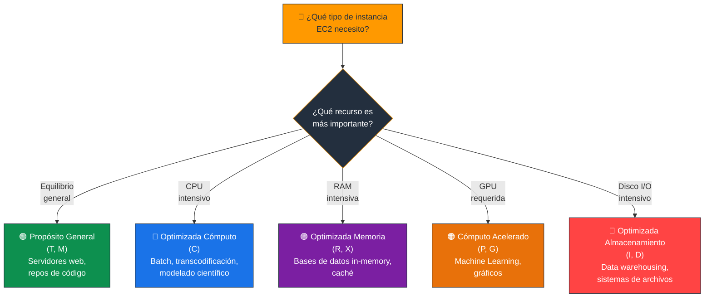
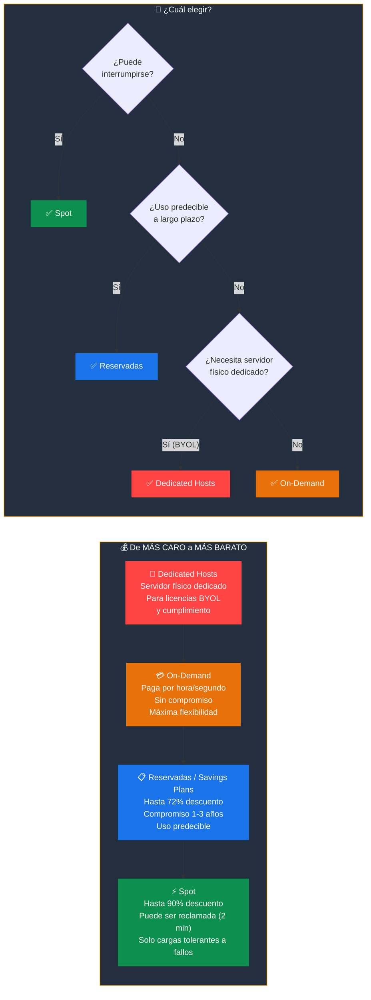
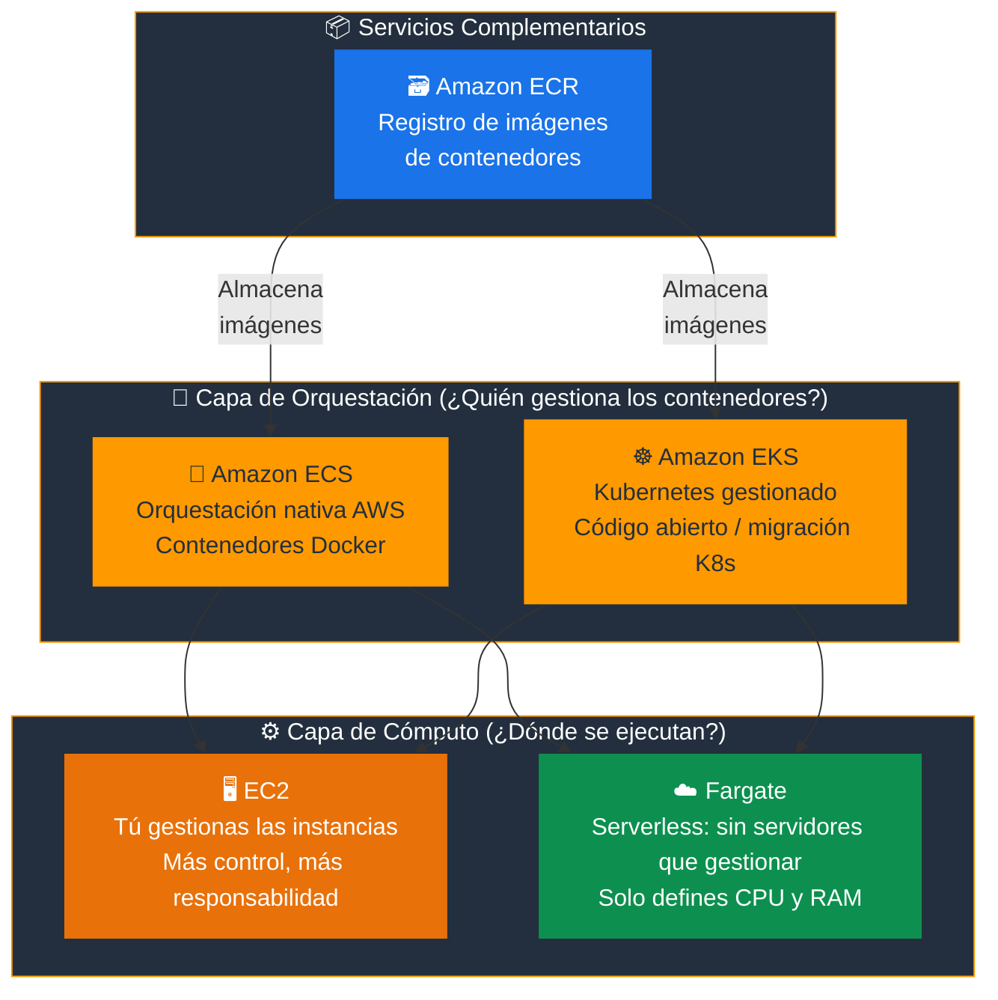
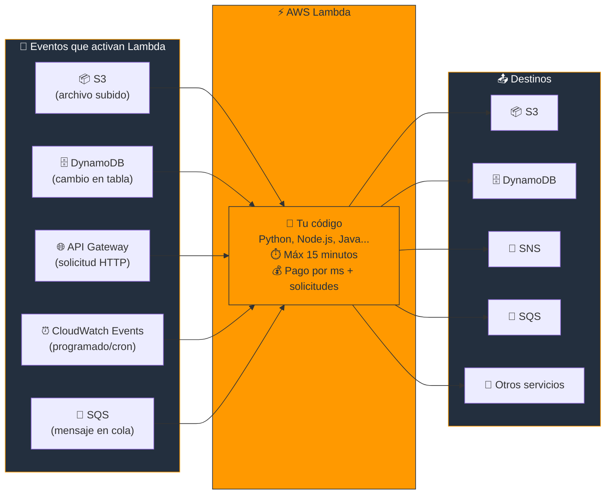
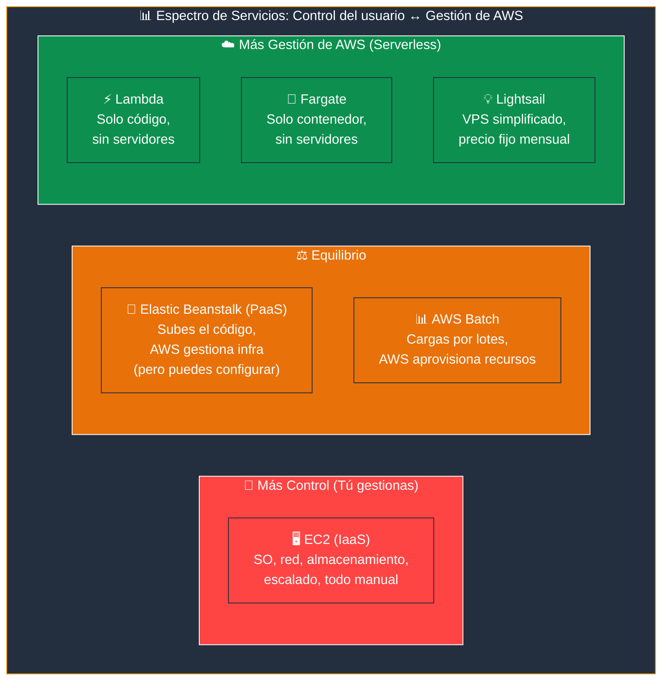
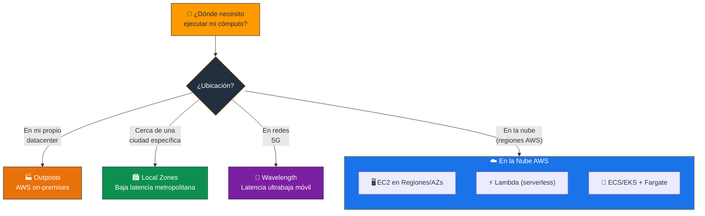
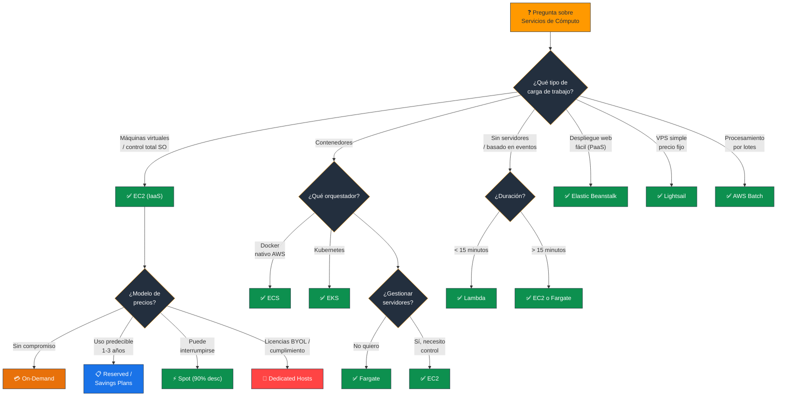

# Servicios de Cómputo de AWS - Examen CLF-C02

Basado en las tres fuentes proporcionadas (Sequeira, Piper/Clinton y Kankaria), he analizado los Servicios de Cómputo de AWS.

En el contexto del examen **AWS Certified Cloud Practitioner (CLF-C02)**, este tema es el núcleo del **Dominio 3: Tecnología y Servicios en la Nube** (34% del examen), abordando específicamente la **Declaración de Tarea 3.3: Identificar servicios de cómputo de AWS**. Además, tiene un fuerte solapamiento con el **Dominio 4 (Facturación)** debido a los modelos de precios de cómputo.

A continuación, presento un análisis detallado estructurado para el examen:

---

## 1. Amazon Elastic Compute Cloud (EC2) - IaaS

El servicio fundamental de **Infraestructura como Servicio (IaaS)**. El examen evalúa su capacidad para seleccionar la configuración correcta según el caso de uso.

- **Definición:** Proporciona capacidad de cómputo redimensionable (máquinas virtuales) en la nube. Ofrece **control total** a nivel de sistema operativo (root/admin).
- **Imágenes de Máquina de Amazon (AMIs):** Son las "plantillas" preconfiguradas que contienen el sistema operativo y el software necesario para lanzar una instancia. Las fuentes destacan cuatro categorías de AMIs:
  - **Quick Start** (inicio rápido)
  - **Mis AMIs** (personalizadas)
  - **Marketplace** (de proveedores externos)
  - **Comunitarias**
- **Tipos de Instancias (Familias):** Debe memorizar las categorías generales para elegir la instancia adecuada según el escenario:

| Familia | Letras | Caso de uso |
|---|---|---|
| **Propósito General** | T, M | Equilibrio de recursos (servidores web, repositorios de código) |
| **Optimizadas para Cómputo** | C | Alto rendimiento de procesador (procesamiento por lotes, transcodificación) |
| **Optimizadas para Memoria** | R, X | Grandes conjuntos de datos en memoria |
| **Cómputo Acelerado** | P, G | GPU para aprendizaje automático o gráficos |
| **Optimizadas para Almacenamiento** | I, D | Acceso secuencial de lectura/escritura muy alto |

> **Tip de examen:** La letra de la familia es la clave: **C** = Compute (cómputo), **R** = RAM (memoria), **T** = Turbo/general, **P/G** = GPU, **I/D** = I/O disco.

### 📊 Diagrama: Familias de Instancias EC2 - ¿Cuál elegir?

---

## 2. Modelos de Precios de Cómputo

Aunque es parte del **Dominio 4**, es inseparable de EC2. Las fuentes coinciden en cuatro modelos clave que **siempre aparecen en el examen**:

| Modelo | Descuento | Compromiso | Caso de uso |
|---|---|---|---|
| **Bajo Demanda (On-Demand)** | 0% (precio base) | Ninguno | Cargas impredecibles, corto plazo, no interrumpibles |
| **Instancias Reservadas / Savings Plans** | Hasta 72% | 1 o 3 años | Cargas estables y predecibles |
| **Instancias de Spot** | Hasta 90% | Ninguno (pueden ser reclamadas con 2 min de aviso) | Cargas flexibles, sin estado, tolerantes a fallos |
| **Hosts Dedicados** | Variable | Variable | Licencias BYOL, cumplimiento normativo estricto |

> **Tip de examen:** "Más barato posible + puede interrumpirse" = **Spot**. "Uso predecible a largo plazo" = **Reservadas/Savings Plans**. "Sin compromiso + no puede interrumpirse" = **On-Demand**. "Licencias existentes" = **Dedicated Hosts**.

### 📊 Diagrama: Modelos de Precios EC2 - Costo vs Flexibilidad

---

## 3. Servicios de Contenedores

El examen distingue entre la **orquestación** (gestión) y el **cómputo** (dónde se ejecutan) de los contenedores.

- **Amazon Elastic Container Service (ECS):** Servicio de orquestación de contenedores altamente escalable que soporta **Docker**. Es la forma **"nativa" de AWS** para ejecutar contenedores.
- **Amazon Elastic Kubernetes Service (EKS):** Servicio gestionado para ejecutar **Kubernetes** en AWS. Elija esto si la pregunta menciona migrar cargas de trabajo de Kubernetes existentes o usar herramientas de código abierto.
- **AWS Fargate:** Es un motor de cómputo **serverless para contenedores**. Funciona tanto con ECS como con EKS. Con Fargate, **no tiene que aprovisionar ni gestionar servidores** (no ve las instancias EC2 subyacentes), solo paga por los recursos que consume el contenedor.

> **Tip de examen:** "Contenedores Docker nativos de AWS" = **ECS**. "Kubernetes" = **EKS**. "Contenedores sin gestionar servidores" = **Fargate**.

### 📊 Diagrama: Ecosistema de Contenedores en AWS

---

## 4. Cómputo Serverless (Sin Servidor)

Un tema **crítico** para la arquitectura moderna en la nube.

- **AWS Lambda:** Ejecuta código **sin aprovisionar ni gestionar servidores**. Se factura por milisegundos de tiempo de cómputo y número de solicitudes. Es **basado en eventos** (se activa por cambios en S3, DynamoDB, etc.).
  - **Límite clave para el examen:** Las funciones tienen un tiempo de espera máximo de **15 minutos**.

> **Tip de examen:** "Ejecutar código sin servidores" o "basado en eventos" = **Lambda**. Si la tarea dura más de 15 minutos, Lambda **no** es la respuesta.

### 📊 Diagrama: AWS Lambda - Arquitectura Basada en Eventos

---

## 5. Servicios de Cómputo Gestionados y Especializados

El examen a menudo presenta escenarios buscando la solución con **"menor carga administrativa"**.

- **AWS Elastic Beanstalk (PaaS):** Servicio fácil de usar para desplegar y escalar aplicaciones web. Usted sube el código y Elastic Beanstalk maneja automáticamente el despliegue (aprovisionamiento de capacidad, equilibrio de carga, auto-escalado). Usted **mantiene el control** de la configuración si lo desea.
- **Amazon Lightsail:** Servidores privados virtuales (VPS) simplificados. Incluye todo lo necesario (cómputo, almacenamiento, redes) por un **precio mensual bajo y predecible**. Ideal para sitios web simples o desarrolladores principiantes que no necesitan las funciones avanzadas de EC2.
- **AWS Batch:** Permite ejecutar cargas de trabajo de **computación por lotes** a cualquier escala. Aprovisiona dinámicamente la cantidad y el tipo óptimos de recursos de cómputo (como instancias optimizadas para memoria o CPU).

> **Tip de examen:** "Subir código y que AWS se encargue del resto (PaaS)" = **Elastic Beanstalk**. "VPS simple y barato" = **Lightsail**. "Procesamiento por lotes masivo" = **Batch**.

### 📊 Diagrama: Nivel de Control vs Gestión de AWS

---

## 6. Cómputo Híbrido y en el Borde

Las fuentes más recientes (Piper/Clinton y Kankaria) destacan extensiones de la infraestructura que aparecen en la versión CLF-C02 del examen:

- **AWS Outposts:** Lleva la infraestructura y los servicios de AWS a su **centro de datos local (on-premises)** para una experiencia híbrida consistente.
- **AWS Wavelength:** Despliega servicios de cómputo y almacenamiento en el **borde de las redes 5G** de telecomunicaciones para aplicaciones de latencia ultrabaja.
- **AWS Local Zones:** Extiende la infraestructura de AWS a **áreas metropolitanas específicas** para acercar el cómputo a los usuarios finales y reducir la latencia.

> **Tip de examen:** "AWS on-premises" = **Outposts**. "Latencia ultrabaja en 5G" = **Wavelength**. "Cómputo cerca de una ciudad" = **Local Zones**.

### 📊 Diagrama: ¿Dónde ejecutar cómputo en AWS?

---

## Resumen para el Candidato

Para aprobar las preguntas de Servicios de Cómputo:

| Escenario en el examen | Respuesta |
|---|---|
| IaaS y Control Total | **EC2** |
| Código sin servidores (Eventos / < 15 min) | **Lambda** |
| Fácil despliegue web (PaaS) | **Elastic Beanstalk** |
| VPS simple / Precio fijo | **Lightsail** |
| Contenedores Docker (nativo AWS) | **ECS** |
| Contenedores Kubernetes | **EKS** |
| Contenedores sin gestionar servidores | **Fargate** |
| Procesamiento por lotes masivo | **AWS Batch** |
| AWS en tu datacenter | **Outposts** |
| Latencia ultrabaja en 5G | **Wavelength** |
| Cómputo cerca de una ciudad | **Local Zones** |

### Palabras clave que debes asociar

- **"Control total / SO / IaaS"** → EC2
- **"Sin servidores / basado en eventos"** → Lambda
- **"Subir código / PaaS / despliegue fácil"** → Elastic Beanstalk
- **"VPS simple / precio fijo mensual"** → Lightsail
- **"Docker nativo AWS"** → ECS
- **"Kubernetes"** → EKS
- **"Contenedores sin gestionar infra"** → Fargate
- **"Procesamiento por lotes"** → AWS Batch
- **"Más barato + puede interrumpirse"** → Spot Instances
- **"Uso predecible a largo plazo"** → Reserved Instances / Savings Plans
- **"Licencias existentes (BYOL)"** → Dedicated Hosts

---

### 📊 Diagrama: Árbol de Decisión para Preguntas del Examen

