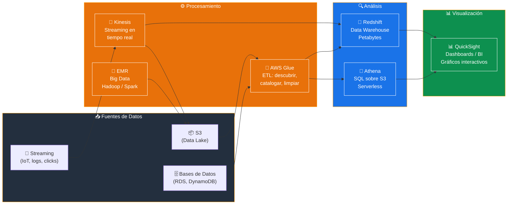
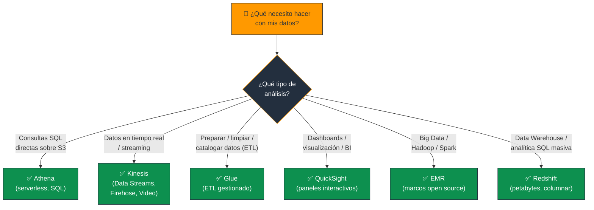
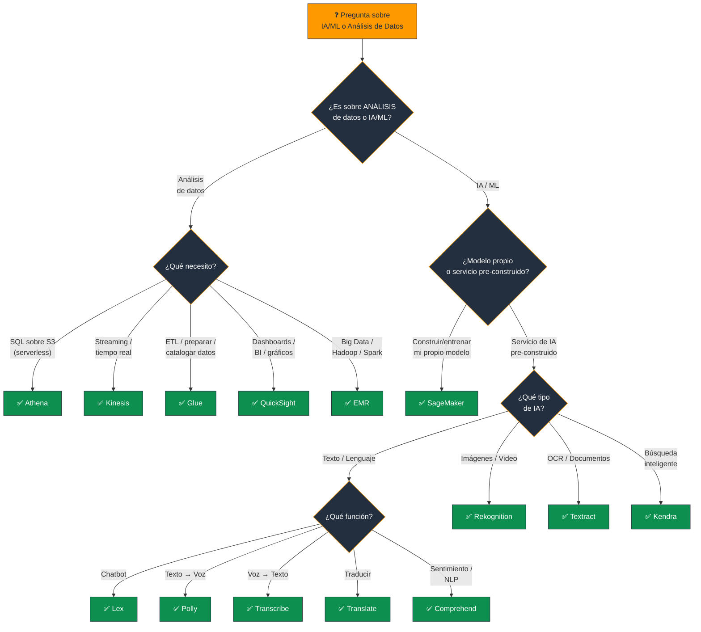

# Servicios de IA/ML y Análisis de Datos de AWS - Examen CLF-C02

Basado en las tres fuentes proporcionadas (Sequeira, Piper/Clinton y Kankaria), he analizado los Servicios de Inteligencia Artificial (IA), Aprendizaje Automático (ML) y Análisis de Datos.

En el contexto del examen **AWS Certified Cloud Practitioner (CLF-C02)**, este tema se encuadra en el **Dominio 3: Tecnología y Servicios en la Nube**, específicamente en la **Declaración de Tarea 3.7: Identificar servicios de inteligencia artificial y aprendizaje automático (IA/ML) y servicios de análisis de AWS**.

A continuación, presento un análisis detallado estructurado por categoría de servicio, destacando los casos de uso clave que suelen aparecer en el examen.

---

## 1. Servicios de Análisis de Datos

El examen evalúa si puede identificar la herramienta adecuada para procesar, analizar y visualizar datos según el escenario presentado.

### Amazon Athena

- **Función:** Servicio de consultas interactivo y **sin servidor**.
- **Caso de uso clave:** Analizar datos almacenados directamente en **Amazon S3** utilizando sintaxis **SQL estándar**. No requiere cargar datos en una base de datos ni gestionar servidores.

### Amazon Kinesis

- **Función:** Plataforma para procesar y analizar **datos de streaming en tiempo real** a gran escala (video, logs, IoT).
- **Componentes:**
  - **Data Streams:** Ingesta de flujos de datos a gran escala.
  - **Data Firehose:** Carga datos de streaming en otros servicios (S3, Redshift) automáticamente.
  - **Video Streams:** Ingesta de video de dispositivos conectados para análisis.

### Amazon QuickSight

- **Función:** Servicio de **inteligencia empresarial (BI)**.
- **Caso de uso clave:** Crear **paneles visuales (dashboards)** interactivos y gráficos para visualizar datos y obtener información empresarial.

### AWS Glue

- **Función:** Servicio de **extracción, transformación y carga (ETL)** totalmente gestionado.
- **Caso de uso clave:** Preparar y cargar datos para su análisis. Actúa como un "organizador de datos" que descubre, cataloga y limpia datos para que sean utilizables por servicios como Athena o Redshift.

### Amazon Elastic MapReduce (EMR)

- **Función:** Procesamiento de **Big Data** utilizando marcos de código abierto.
- **Caso de uso clave:** Ejecutar marcos como Apache Hadoop, Spark o Presto para procesar grandes cantidades de datos.

> **Tip de examen:** "SQL sobre S3 sin servidor" = **Athena**. "Streaming en tiempo real" = **Kinesis**. "ETL / preparar datos" = **Glue**. "Dashboards / BI" = **QuickSight**. "Big Data / Hadoop / Spark" = **EMR**.

### 📊 Diagrama: Pipeline de Análisis de Datos en AWS

### 📊 Diagrama: ¿Qué servicio de análisis usar?

---

## 2. Servicios de IA/ML (Enfoque en Servicios Gestionados)

El examen CLF-C02 no requiere que sea un científico de datos, sino que sepa **qué servicio usar para añadir capacidades de IA** a una aplicación sin necesidad de experiencia profunda en ML ("democratizar tecnologías avanzadas").

### Amazon SageMaker

- **Función:** Servicio completo para **construir, entrenar y desplegar modelos de aprendizaje automático**.
- **Caso de uso clave:** Es la herramienta principal para desarrolladores y científicos de datos que desean crear sus **propios modelos de ML personalizados** con infraestructura gestionada.

> **Tip de examen:** "Crear/entrenar mi propio modelo de ML" = **SageMaker**. Si la pregunta habla de usar IA pre-construida (sin entrenar), busque los servicios de IA específicos a continuación.

### Servicios de IA Lingüística y de Chatbots

| Servicio | Función | Caso de uso |
|---|---|---|
| **Amazon Lex** | Interfaces conversacionales (chatbots) con voz y texto | Chatbots, misma tecnología que Alexa |
| **Amazon Polly** | Texto a Voz (Text-to-Speech) realista | Leer contenido en voz alta, accesibilidad |
| **Amazon Transcribe** | Voz a Texto (Speech-to-Text) automático | Subtitular reuniones, transcripciones |
| **Amazon Translate** | Traducción de texto entre idiomas | Internacionalización, contenido multilingüe |
| **Amazon Comprehend** | Procesamiento de lenguaje natural (NLP) | Análisis de sentimiento, extracción de entidades |

### Servicios de IA de Visión y Búsqueda

| Servicio | Función | Caso de uso |
|---|---|---|
| **Amazon Rekognition** | Análisis de imágenes y videos | Reconocimiento facial, detección de objetos |
| **Amazon Textract** | Extracción de texto de documentos escaneados | OCR inteligente, formularios, tablas |
| **Amazon Kendra** | Búsqueda empresarial inteligente con ML | Buscar en documentos internos con lenguaje natural |

> **Tip de examen:** "Chatbot / Alexa" = **Lex**. "Texto → Voz" = **Polly**. "Voz → Texto" = **Transcribe**. "Traducir" = **Translate**. "Sentimiento / NLP" = **Comprehend**. "Imágenes / facial" = **Rekognition**. "OCR / documentos" = **Textract**. "Búsqueda inteligente" = **Kendra**.

### 📊 Diagrama: Mapa de Servicios de IA/ML

```mermaid
flowchart TD
    subgraph BUILD["🔬 Construir tu Propio Modelo"]
        SM["🧪 SageMaker<br/>Construir, entrenar,<br/>desplegar modelos ML<br/>personalizados"]
    end

    subgraph LANGUAGE["🗣️ IA Lingüística (pre-construida)"]
        direction TB
        LEX["🤖 Lex<br/>Chatbots<br/>(tecnología Alexa)"]
        POLLY["🔊 Polly<br/>Texto → Voz"]
        TRANS["🎤 Transcribe<br/>Voz → Texto"]
        TRANSLATE["🌐 Translate<br/>Traducción<br/>entre idiomas"]
        COMP["🧠 Comprehend<br/>NLP / Sentimiento"]
    end

    subgraph VISION["👁️ IA de Visión y Búsqueda (pre-construida)"]
        direction TB
        REKOG["📸 Rekognition<br/>Imágenes / Video<br/>Reconocimiento facial"]
        TEXT["📄 Textract<br/>OCR inteligente<br/>Documentos escaneados"]
        KENDRA["🔍 Kendra<br/>Búsqueda empresarial<br/>Lenguaje natural"]
    end

    style BUILD fill:#FF9900,stroke:#232F3E,color:#232F3E
    style LANGUAGE fill:#1a73e8,stroke:#FF9900,color:#FFFFFF
    style VISION fill:#0d904f,stroke:#FF9900,color:#FFFFFF
    style SM fill:#FF9900,stroke:#232F3E,color:#232F3E
    style LEX fill:#1a73e8,stroke:#FFFFFF,color:#FFFFFF
    style POLLY fill:#1a73e8,stroke:#FFFFFF,color:#FFFFFF
    style TRANS fill:#1a73e8,stroke:#FFFFFF,color:#FFFFFF
    style TRANSLATE fill:#1a73e8,stroke:#FFFFFF,color:#FFFFFF
    style COMP fill:#1a73e8,stroke:#FFFFFF,color:#FFFFFF
    style REKOG fill:#0d904f,stroke:#FFFFFF,color:#FFFFFF
    style TEXT fill:#0d904f,stroke:#FFFFFF,color:#FFFFFF
    style KENDRA fill:#0d904f,stroke:#FFFFFF,color:#FFFFFF
```

---

## Resumen para el Candidato

Para aprobar las preguntas de este dominio en el CLF-C02:

| Escenario en el examen | Respuesta |
|---|---|
| Consultas SQL directas en S3 | **Athena** |
| Datos en tiempo real / Streaming | **Kinesis** |
| ETL / Preparación de datos | **Glue** |
| Visualización / Dashboards / BI | **QuickSight** |
| Big Data / Hadoop / Spark | **EMR** |
| Crear/Entrenar modelos propios de ML | **SageMaker** |
| Chatbots / Alexa | **Lex** |
| Texto a Voz | **Polly** |
| Voz a Texto / Transcripciones | **Transcribe** |
| Traducción entre idiomas | **Translate** |
| Análisis de sentimiento / NLP | **Comprehend** |
| Reconocimiento de imágenes / facial | **Rekognition** |
| OCR / Extracción de texto de documentos | **Textract** |
| Búsqueda empresarial inteligente | **Kendra** |

### Palabras clave que debes asociar

- **"SQL sobre S3 / serverless"** → Athena
- **"Streaming / tiempo real / IoT"** → Kinesis
- **"ETL / catalogar / limpiar datos"** → Glue
- **"Dashboards / BI / gráficos"** → QuickSight
- **"Hadoop / Spark / Big Data"** → EMR
- **"Entrenar modelo ML propio"** → SageMaker
- **"Chatbot / conversacional / Alexa"** → Lex
- **"Texto → Voz"** → Polly
- **"Voz → Texto"** → Transcribe
- **"Traducir idiomas"** → Translate
- **"Sentimiento / NLP / relaciones en texto"** → Comprehend
- **"Imágenes / videos / facial"** → Rekognition
- **"OCR / documentos escaneados"** → Textract
- **"Búsqueda inteligente en documentos"** → Kendra

---

### 📊 Diagrama: Árbol de Decisión para Preguntas del Examen

