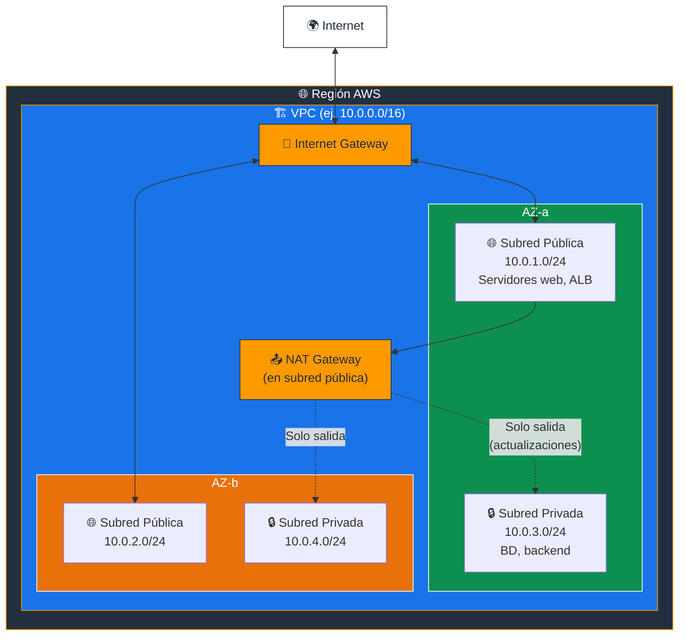
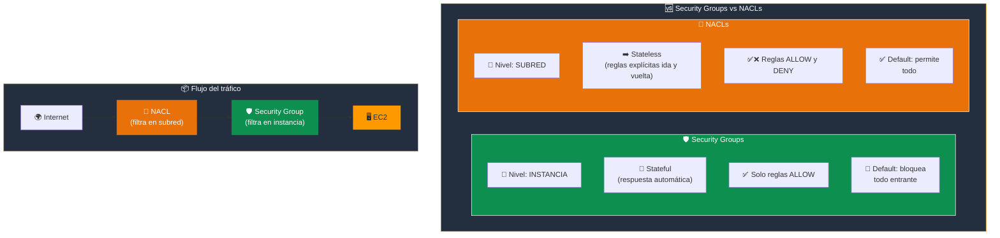
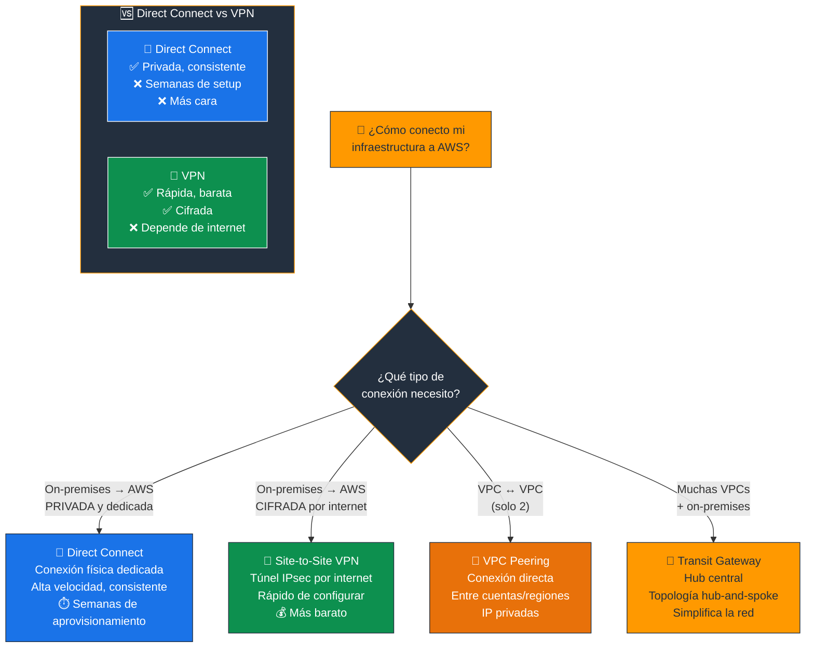
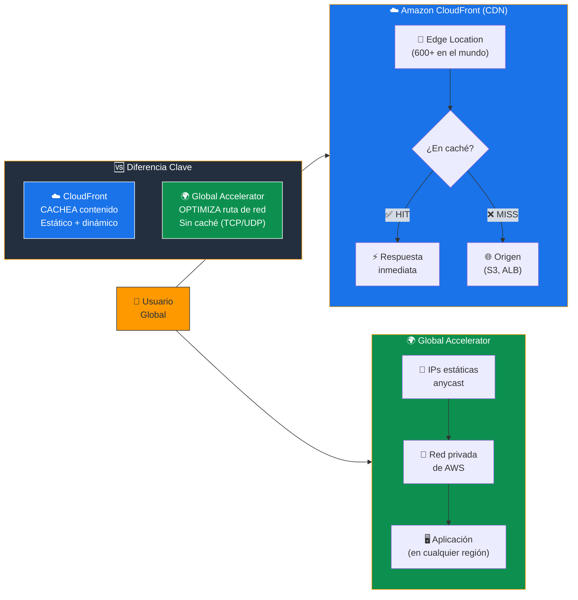
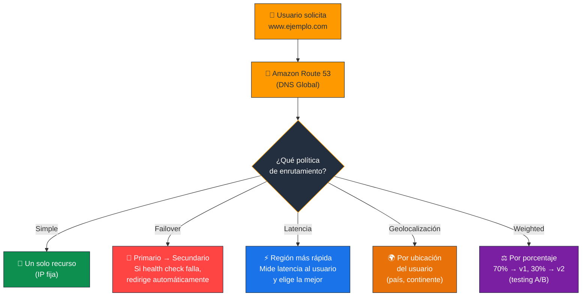
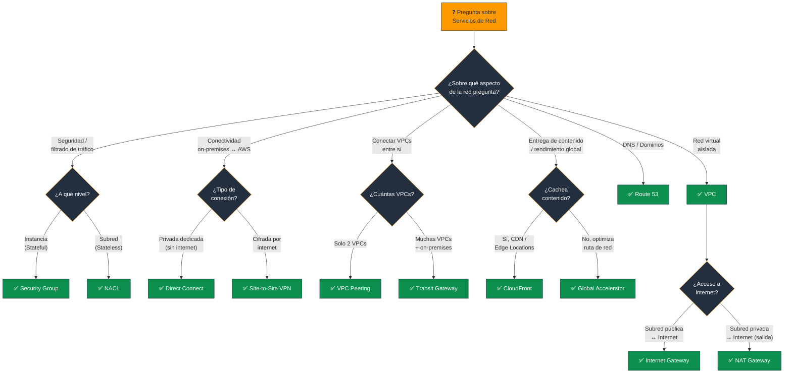

# Servicios de Red de AWS - Examen CLF-C02

Basado en las tres fuentes proporcionadas (Sequeira, Piper/Clinton y Kankaria), he analizado los Servicios de Red de AWS.

En el contexto del examen **AWS Certified Cloud Practitioner (CLF-C02)**, este tema es fundamental para el **Dominio 3: Tecnología y Servicios en la Nube**, específicamente la **Declaración de Tarea 3.5: Identificar servicios de red de AWS**.

A continuación, presento un análisis detallado estructurado para el examen:

---

## 1. Amazon Virtual Private Cloud (VPC)

El VPC es el **componente fundamental** de la red en AWS. El examen evalúa si entiende que es una red virtual lógicamente aislada donde usted define su propio espacio de direcciones IP.

- **Alcance:** Un VPC existe dentro de una **Región** de AWS, pero puede abarcar **todas las Zonas de Disponibilidad (AZ)** dentro de esa región.
- **Bloques CIDR:** Definen el rango de direcciones IP (ej. 10.0.0.0/16). Este rango es personalizado por el usuario.
- **Subredes (Subnets):** Dividen el VPC. Debe saber que una subred reside en **una sola Zona de Disponibilidad**.
  - **Subred Pública:** Tiene una ruta directa a un **Internet Gateway (IGW)**, permitiendo tráfico hacia y desde Internet.
  - **Subred Privada:** No tiene acceso directo a Internet. Para que las instancias en una subred privada accedan a Internet (por ejemplo, para actualizaciones de software) sin ser accesibles desde fuera, se utiliza un **NAT Gateway**.

> **Tip de examen:** "Red virtual aislada en AWS" = **VPC**. "Subred en una sola AZ" es una regla clave. Las subredes públicas tienen IGW; las privadas usan NAT Gateway para salida.

### 📊 Diagrama: Arquitectura de un VPC

---

## 2. Seguridad de Red: La Comparación Clave

Uno de los temas **más frecuentes** en el examen es la diferencia entre Grupos de Seguridad y NACLs. Las tres fuentes enfatizan esta distinción crítica:

### Grupos de Seguridad (Security Groups)

- Actúan a nivel de **Instancia** (EC2).
- Son **Con Estado (Stateful):** Si permite una solicitud entrante (inbound), la respuesta saliente (outbound) se permite automáticamente, independientemente de las reglas de salida.
- Por defecto, **bloquean todo el tráfico entrante** y permiten todo el saliente.
- Solo soportan reglas de **Permitir (Allow)**.

### Listas de Control de Acceso de Red (Network ACLs - NACLs)

- Actúan a nivel de **Subred**.
- Son **Sin Estado (Stateless):** Debe crear reglas explícitas tanto para el tráfico entrante como para el saliente; la respuesta **no** se permite automáticamente.
- Procesan reglas en **orden numérico** y soportan reglas de **"Denegar" (Deny)**, a diferencia de los Security Groups que solo permiten.
- Por defecto, **permiten todo** el tráfico entrante y saliente.

> **Tip de examen:** **Security Group** = nivel de instancia + stateful + solo Allow. **NACL** = nivel de subred + stateless + Allow y Deny.

### 📊 Diagrama: Security Groups vs NACLs

---

## 3. Conectividad Híbrida y entre VPCs

El examen presenta escenarios sobre cómo conectar su infraestructura local con AWS o cómo conectar VPCs entre sí.

- **AWS Direct Connect:** Proporciona una conexión de red **dedicada y física** desde sus instalaciones a AWS. No utiliza el internet público, ofreciendo mayor seguridad, velocidad y consistencia que una VPN.
- **AWS Site-to-Site VPN:** Conecta su red local a su VPC a través del **internet público** mediante un túnel encriptado (IPsec). Es más rápido de configurar y más barato que Direct Connect, pero depende de la calidad de su internet.
- **VPC Peering:** Conecta **dos VPCs** entre sí, permitiendo que se comporten como una sola red utilizando direcciones IP privadas. Funciona incluso entre **diferentes cuentas y regiones**.
- **AWS Transit Gateway:** Actúa como un **"hub" central** para conectar múltiples VPCs y redes locales, simplificando la topología de red (topología hub-and-spoke) en lugar de tener muchas conexiones punto a punto complejas.

> **Tip de examen:** "Conexión privada dedicada (sin internet)" = **Direct Connect**. "Conexión cifrada por internet" = **VPN**. "Conectar 2 VPCs" = **VPC Peering**. "Conectar muchas VPCs + on-premises" = **Transit Gateway**.

### 📊 Diagrama: Conectividad Híbrida - ¿Cómo me conecto a AWS?

---

## 4. Entrega de Contenido y Optimización

Debe distinguir entre **acelerar contenido estático** y **optimizar el tráfico de red global**.

- **Amazon CloudFront:** Es una **red de entrega de contenido (CDN)**. Almacena en caché contenido (videos, imágenes, APIs) en **Ubicaciones de Borde (Edge Locations)** repartidas por todo el mundo para reducir la latencia de los usuarios finales.
- **AWS Global Accelerator:** Mejora la disponibilidad y el rendimiento de las aplicaciones para usuarios globales utilizando la **red interna de AWS** y direcciones IP estáticas (anycast). A diferencia de CloudFront (que cachea contenido), Global Accelerator **optimiza la ruta de red** hacia sus aplicaciones (TCP/UDP).

> **Tip de examen:** "CDN / caché de contenido / baja latencia al entregar archivos" = **CloudFront**. "Optimizar ruta de red sin caché / IPs estáticas anycast" = **Global Accelerator**.

### 📊 Diagrama: CloudFront vs Global Accelerator

---

## 5. Sistema de Nombres de Dominio (DNS)

### Amazon Route 53

- Es el servicio de **DNS escalable** de AWS.
- **Funciones clave:**
  - **Registro de dominios:** Comprar y gestionar nombres de dominio.
  - **Enrutamiento de tráfico (DNS routing):** Traducir nombres de dominio a direcciones IP.
  - **Comprobación de estado (Health Checks):** Monitorear la salud de los recursos y redirigir si fallan.
- **Políticas de Enrutamiento** que suelen aparecer en el examen:

| Política | Descripción | Caso de uso |
|---|---|---|
| **Simple** | Un registro, un recurso | Sitio web básico |
| **Failover** | Redirige a recurso secundario si el primario falla | Alta disponibilidad |
| **Latencia** | Envía al usuario a la región más rápida | Usuarios globales |
| **Geolocalización** | Basado en la ubicación geográfica del usuario | Contenido regional, regulaciones |
| **Weighted (Ponderado)** | Distribuye tráfico según porcentajes asignados | Testing A/B, migraciones graduales |
| **Multivalue** | Múltiples recursos, con health checks | Balanceo de carga básico |

> **Tip de examen:** "DNS de AWS" = **Route 53**. "Enrutar por latencia/geolocalización" = Route 53 con la **política de enrutamiento** correspondiente. Route 53 es un servicio **global**.

### 📊 Diagrama: Políticas de Enrutamiento de Route 53

---

## Resumen para el Candidato

Para las preguntas de Servicios de Red en el examen CLF-C02:

| Escenario en el examen | Respuesta |
|---|---|
| Red virtual aislada en AWS | **VPC** |
| Nivel de instancia + Stateful | **Security Group** |
| Nivel de subred + Stateless | **NACL** |
| Acceso a internet desde subred pública | **Internet Gateway** |
| Acceso a internet desde subred privada (solo salida) | **NAT Gateway** |
| Conexión privada física (sin internet) | **Direct Connect** |
| Conexión cifrada por internet | **Site-to-Site VPN** |
| Conectar 2 VPCs | **VPC Peering** |
| Conectar múltiples VPCs y VPNs centralizadamente | **Transit Gateway** |
| CDN / Caché en el borde | **CloudFront** |
| Optimizar ruta de red global (sin caché) | **Global Accelerator** |
| DNS / Enrutamiento por latencia o geo | **Route 53** |

### Palabras clave que debes asociar

- **"Red virtual aislada"** → VPC
- **"Stateful + nivel instancia"** → Security Group
- **"Stateless + nivel subred + Deny"** → NACL
- **"Subred pública ↔ Internet"** → Internet Gateway
- **"Subred privada → Internet (solo salida)"** → NAT Gateway
- **"Conexión dedicada física"** → Direct Connect
- **"Túnel cifrado por internet"** → VPN
- **"Conectar 2 VPCs"** → VPC Peering
- **"Hub central para muchas VPCs"** → Transit Gateway
- **"CDN / caché / Edge Locations"** → CloudFront
- **"Optimizar ruta sin caché / IPs anycast"** → Global Accelerator
- **"DNS / registro de dominios"** → Route 53

---

### 📊 Diagrama: Árbol de Decisión para Preguntas del Examen

