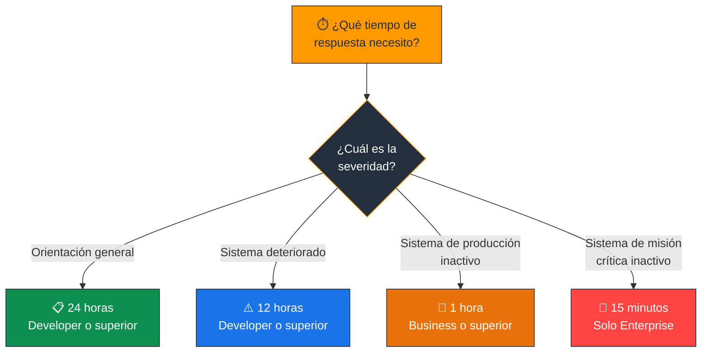
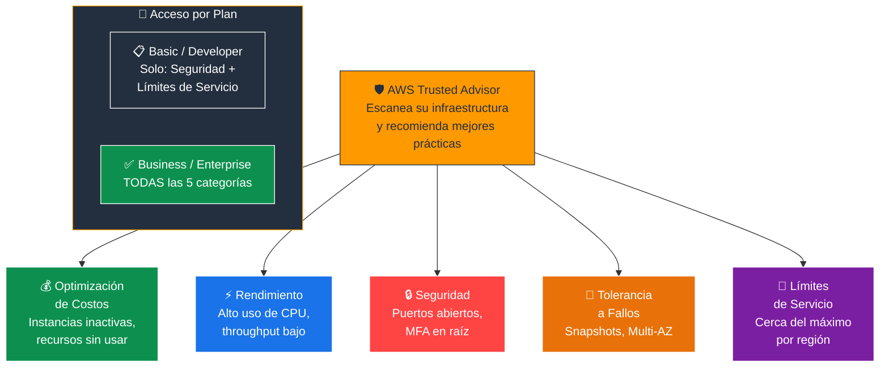
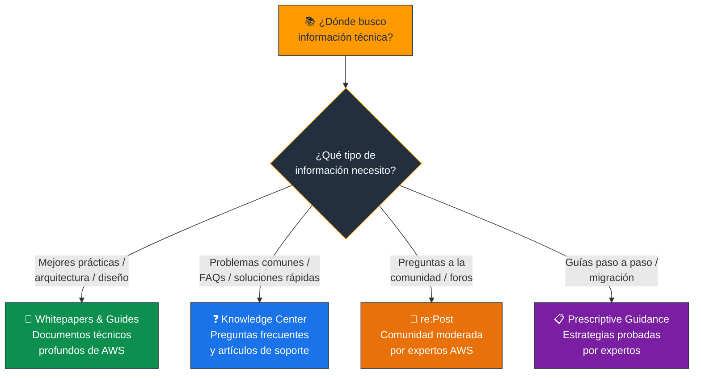
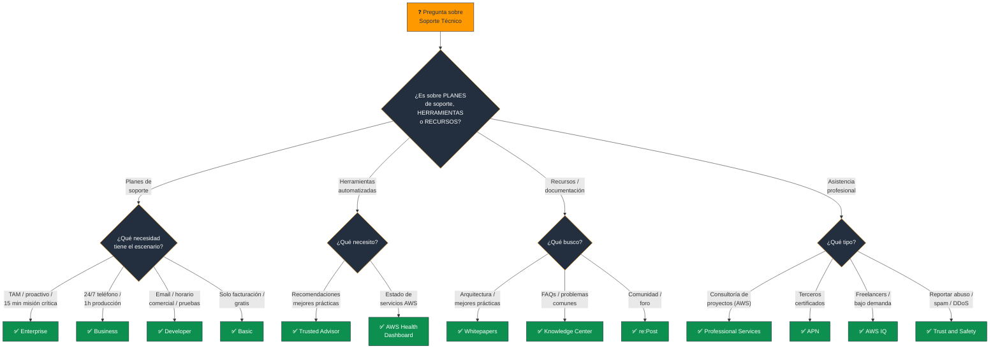

# Recursos de Soporte Técnico de AWS - Examen CLF-C02

Basado en las tres fuentes proporcionadas (Sequeira, Piper/Clinton y Kankaria), he analizado los Recursos de Soporte Técnico.

En el contexto del examen **AWS Certified Cloud Practitioner (CLF-C02)**, este tema es el componente principal del **Dominio 4: Facturación, Precios y Soporte**, que representa el **12% de la puntuación total**. Específicamente, aborda la **Declaración de Tarea 4.3: Identificar recursos técnicos de AWS y opciones de AWS Support**.

A continuación, presento un análisis detallado estructurado para el examen, diferenciando entre los planes de soporte, las herramientas automatizadas y los recursos de conocimiento.

---

## 1. Planes de Soporte de AWS (AWS Support Plans)

El examen evalúa exhaustivamente su capacidad para elegir el plan de soporte adecuado según las necesidades de un escenario (ej. "¿Qué plan ofrece un tiempo de respuesta de 1 hora para sistemas de producción caídos?"). Las fuentes detallan **cuatro niveles principales** que debe memorizar:

### Plan Basic (Básico)

- **Costo:** Gratuito para todos los clientes.
- **Acceso:** Atención al cliente 24/7 solo para **facturación y problemas de cuenta**. No incluye soporte técnico para problemas de infraestructura o software.
- **Recursos:** Acceso a documentación, whitepapers, AWS re:Post y el panel de AWS Health.

### Plan Developer (Desarrollador)

- **Caso de uso:** Recomendado para **experimentación y pruebas**.
- **Acceso Técnico:** Acceso a ingenieros de soporte (Cloud Support Associates) vía **correo electrónico solamente**, durante **horario comercial**.
- **Tiempo de respuesta:**
  - Menos de **12 horas** para sistemas deteriorados.
  - **24 horas** para orientación general.

### Plan Business (Negocios)

- **Caso de uso:** Mínimo recomendado para **cargas de trabajo de producción**.
- **Acceso Técnico:** Acceso **24/7** a ingenieros de soporte vía **teléfono, chat y correo electrónico**.
- **Tiempo de respuesta crítico:** Menos de **1 hora** si el sistema de producción está inactivo.
- **Características adicionales:**
  - Acceso completo a **todas las comprobaciones de Trusted Advisor**.
  - Soporte para **software de terceros**.

### Plan Enterprise (Empresarial) y Enterprise On-Ramp

- **Caso de uso:** Para cargas de trabajo de **misión crítica**.
- **Recurso Exclusivo:** Acceso a un **Technical Account Manager (TAM)**. El TAM es su defensor técnico designado dentro de AWS, brindando orientación proactiva, revisiones de arquitectura y coordinación en caso de eventos críticos.
- **Soporte de Conserjería (Concierge):** Equipo especializado en facturación y cuentas para grandes empresas.
- **Tiempo de respuesta crítico:** Menos de **15 minutos** para sistemas de misión crítica inactivos.

> **Tip de examen:** "TAM / asesoramiento proactivo" = **Enterprise**. "Producción caída, 1 hora" = **Business**. "Misión crítica, 15 min" = **Enterprise**. "Solo email, horario comercial" = **Developer**. "Solo facturación" = **Basic**.

### 📊 Diagrama: Comparación de Planes de Soporte

```mermaid
flowchart LR
    subgraph BASIC["🆓 Basic"]
        direction TB
        B1["💰 Gratuito"]
        B2["📧 Solo facturación<br/>y cuenta"]
        B3["❌ Sin soporte técnico"]
        B4["📋 Trusted Advisor:<br/>solo comprobaciones<br/>de núcleo"]
    end

    subgraph DEV["🔧 Developer"]
        direction TB
        D1["💵 Desde $29/mes"]
        D2["📧 Email solamente<br/>horario comercial"]
        D3["⏱️ 12h sistemas<br/>deteriorados"]
        D4["📋 Trusted Advisor:<br/>solo comprobaciones<br/>de núcleo"]
    end

    subgraph BUS["🏢 Business"]
        direction TB
        BU1["💵 Desde $100/mes"]
        BU2["📞 Teléfono + Chat<br/>+ Email 24/7"]
        BU3["⏱️ 1h producción<br/>inactiva"]
        BU4["✅ Trusted Advisor:<br/>TODAS las<br/>comprobaciones"]
    end

    subgraph ENT["🏛️ Enterprise"]
        direction TB
        E1["💵 Desde $15,000/mes"]
        E2["👤 TAM designado<br/>+ Concierge"]
        E3["⏱️ 15min misión<br/>crítica inactiva"]
        E4["✅ Trusted Advisor:<br/>TODAS las<br/>comprobaciones"]
    end

    BASIC -->|"+ Soporte<br/>técnico"| DEV
    DEV -->|"+ 24/7<br/>+ Teléfono"| BUS
    BUS -->|"+ TAM<br/>+ 15 min"| ENT

    style BASIC fill:#232F3E,stroke:#FF9900,color:#FFFFFF
    style DEV fill:#1a73e8,stroke:#FF9900,color:#FFFFFF
    style BUS fill:#e8710a,stroke:#FF9900,color:#FFFFFF
    style ENT fill:#FF9900,stroke:#232F3E,color:#232F3E
    style B1 fill:#232F3E,stroke:#FFFFFF,color:#FFFFFF
    style B2 fill:#232F3E,stroke:#FFFFFF,color:#FFFFFF
    style B3 fill:#232F3E,stroke:#FFFFFF,color:#FFFFFF
    style B4 fill:#232F3E,stroke:#FFFFFF,color:#FFFFFF
    style D1 fill:#1a73e8,stroke:#FFFFFF,color:#FFFFFF
    style D2 fill:#1a73e8,stroke:#FFFFFF,color:#FFFFFF
    style D3 fill:#1a73e8,stroke:#FFFFFF,color:#FFFFFF
    style D4 fill:#1a73e8,stroke:#FFFFFF,color:#FFFFFF
    style BU1 fill:#e8710a,stroke:#FFFFFF,color:#FFFFFF
    style BU2 fill:#e8710a,stroke:#FFFFFF,color:#FFFFFF
    style BU3 fill:#e8710a,stroke:#FFFFFF,color:#FFFFFF
    style BU4 fill:#e8710a,stroke:#FFFFFF,color:#FFFFFF
    style E1 fill:#FF9900,stroke:#232F3E,color:#232F3E
    style E2 fill:#FF9900,stroke:#232F3E,color:#232F3E
    style E3 fill:#FF9900,stroke:#232F3E,color:#232F3E
    style E4 fill:#FF9900,stroke:#232F3E,color:#232F3E
```

### 📊 Diagrama: Tiempos de Respuesta por Plan

---

## 2. Herramienta Clave: AWS Trusted Advisor

Esta herramienta aparece frecuentemente en el examen vinculada a los planes de soporte y a la optimización de la cuenta.

- **Función:** Es un "experto en la nube" automatizado que escanea su infraestructura y ofrece **recomendaciones para seguir las mejores prácticas** de AWS.

### Las 5 Categorías de Chequeo

Debe saber que Trusted Advisor evalúa:

| Categoría | Ejemplo |
|---|---|
| **Optimización de Costos** | Instancias inactivas, recursos sin usar |
| **Rendimiento** | Alto uso de CPU, throughput insuficiente |
| **Seguridad** | Puertos abiertos, falta de MFA en raíz |
| **Tolerancia a Fallos** | Snapshots de EBS, Multi-AZ habilitado |
| **Límites de Servicio** | Acercándose al límite de instancias por región |

### Diferencia por Plan

| Plan | Acceso a Trusted Advisor |
|---|---|
| **Basic / Developer** | Solo comprobaciones de **núcleo** (seguridad y límites de servicio) |
| **Business / Enterprise** | Acceso al **conjunto completo** de todas las comprobaciones |

> **Tip de examen:** "Recomendaciones automáticas / mejores prácticas" = **Trusted Advisor**. "Todas las comprobaciones de Trusted Advisor" = **Business o superior**. Recuerde las 5 categorías: **C**ostos, **R**endimiento, **S**eguridad, **T**olerancia a fallos, **L**ímites.

### 📊 Diagrama: Las 5 Categorías de Trusted Advisor

---

## 3. Recursos de Conocimiento y Documentación

El examen verifica si sabe dónde buscar información técnica oficial sin necesidad de abrir un ticket de soporte.

### AWS Whitepapers & Guides

- Documentos técnicos profundos escritos por AWS y socios que explican **arquitectura, seguridad y economía de la nube**.
- Son esenciales para entender las mejores prácticas y patrones de diseño.

### AWS Knowledge Center

- Una base de datos de **preguntas frecuentes (FAQs)** y artículos de soporte técnico que resuelven los problemas más comunes reportados por los clientes.

### AWS re:Post

- Un servicio de **preguntas y respuestas impulsado por la comunidad** y moderado por expertos de AWS, diseñado para eliminar bloqueos técnicos.

### AWS Prescriptive Guidance

- Estrategias y **guías paso a paso** probadas por expertos para migraciones y modernizaciones.

> **Tip de examen:** "Documentos de arquitectura / mejores prácticas" = **Whitepapers**. "Preguntas frecuentes / problemas comunes" = **Knowledge Center**. "Comunidad / preguntas y respuestas" = **re:Post**.

### 📊 Diagrama: Recursos de Conocimiento - ¿Dónde buscar?

---

## 4. Servicios Profesionales y Ecosistema de Socios

Para asistencia práctica en la implementación de proyectos:

### AWS Professional Services

- Un equipo global de **expertos propios de AWS** que trabaja junto con su equipo y socios para ejecutar iniciativas de computación en la nube.
- **No es soporte técnico** de ruptura/reparación, sino **consultoría de proyectos**.

### AWS Partner Network (APN)

- **Terceros certificados** que ayudan a los clientes a construir, migrar y gestionar cargas de trabajo.

### AWS IQ

- Una plataforma para contratar **freelancers y expertos certificados** de AWS para trabajos bajo demanda o consultoría rápida.

### 📊 Diagrama: Ecosistema de Soporte y Asistencia

```mermaid
flowchart TD
    subgraph SELF["🔍 Autoservicio (Sin costo)"]
        direction TB
        WP["📄 Whitepapers"]
        KC["❓ Knowledge Center"]
        RP["💬 re:Post"]
        DOC["📚 Documentación"]
    end

    subgraph PLANS["📞 Planes de Soporte AWS"]
        direction TB
        BASIC["🆓 Basic<br/>Solo facturación"]
        DEV["🔧 Developer<br/>Email, horario comercial"]
        BUS["🏢 Business<br/>24/7 teléfono/chat"]
        ENT["🏛️ Enterprise<br/>TAM + 15 min"]
    end

    subgraph PRO["🤝 Asistencia Profesional"]
        direction TB
        PS["👔 Professional Services<br/>Consultoría de proyectos<br/>(equipo propio AWS)"]
        APN["🌐 Partner Network (APN)<br/>Terceros certificados"]
        IQ["💼 AWS IQ<br/>Freelancers / expertos<br/>bajo demanda"]
    end

    subgraph ABUSE["🚨 Reportar Abuso"]
        TS["🛡️ Trust and Safety<br/>Spam, DDoS, intrusiones<br/>desde IPs de AWS"]
    end

    style SELF fill:#0d904f,stroke:#FF9900,color:#FFFFFF
    style PLANS fill:#1a73e8,stroke:#FF9900,color:#FFFFFF
    style PRO fill:#e8710a,stroke:#FF9900,color:#FFFFFF
    style ABUSE fill:#FF4444,stroke:#FF9900,color:#FFFFFF
    style WP fill:#0d904f,stroke:#FFFFFF,color:#FFFFFF
    style KC fill:#0d904f,stroke:#FFFFFF,color:#FFFFFF
    style RP fill:#0d904f,stroke:#FFFFFF,color:#FFFFFF
    style DOC fill:#0d904f,stroke:#FFFFFF,color:#FFFFFF
    style BASIC fill:#1a73e8,stroke:#FFFFFF,color:#FFFFFF
    style DEV fill:#1a73e8,stroke:#FFFFFF,color:#FFFFFF
    style BUS fill:#1a73e8,stroke:#FFFFFF,color:#FFFFFF
    style ENT fill:#1a73e8,stroke:#FFFFFF,color:#FFFFFF
    style PS fill:#e8710a,stroke:#FFFFFF,color:#FFFFFF
    style APN fill:#e8710a,stroke:#FFFFFF,color:#FFFFFF
    style IQ fill:#e8710a,stroke:#FFFFFF,color:#FFFFFF
    style TS fill:#FF4444,stroke:#FFFFFF,color:#FFFFFF
```

---

## 5. Reporte de Abuso

- **AWS Trust and Safety:** El examen puede presentar un escenario donde usted detecta una actividad ilegal o abusiva (como spam, ataques DDoS o intrusiones) proveniente de una IP de AWS.
- **Acción correcta:** Contactar al equipo de **AWS Trust and Safety** a través de sus formularios de reporte de abuso.

> **Tip de examen:** "Actividad abusiva / spam / DDoS desde IP de AWS" = contactar a **AWS Trust and Safety**.

---

## Resumen para el Candidato

Para aprobar las preguntas de este dominio en el CLF-C02:

| Escenario en el examen | Respuesta |
|---|---|
| TAM / asesoramiento proactivo / contacto designado | **Plan Enterprise** |
| Producción caída, respuesta en 1 hora | **Plan Business** |
| Misión crítica caída, respuesta en 15 min | **Plan Enterprise** |
| Solo email, horario comercial | **Plan Developer** |
| Solo facturación y cuenta (gratis) | **Plan Basic** |
| Trusted Advisor completo (todas las comprobaciones) | **Business o superior** |
| Soporte técnico 24/7 por teléfono/chat | **Business o superior** |
| Recomendaciones automáticas / mejores prácticas | **Trusted Advisor** |
| Guías de arquitectura oficiales | **Whitepapers** |
| Problemas comunes / FAQs | **Knowledge Center** |
| Comunidad / preguntas y respuestas | **re:Post** |
| Consultoría de proyectos (equipo AWS) | **Professional Services** |
| Terceros certificados | **APN** |
| Freelancers / expertos bajo demanda | **AWS IQ** |
| Actividad abusiva desde IP de AWS | **Trust and Safety** |

### Palabras clave que debes asociar

- **"TAM / defensor técnico / proactivo"** → Enterprise
- **"1 hora / producción inactiva"** → Business
- **"15 minutos / misión crítica"** → Enterprise
- **"Email / horario comercial"** → Developer
- **"Gratis / solo facturación"** → Basic
- **"Recomendaciones / mejores prácticas automáticas"** → Trusted Advisor
- **"5 categorías: costos, rendimiento, seguridad, tolerancia, límites"** → Trusted Advisor
- **"Todas las comprobaciones"** → Business o superior
- **"Whitepapers / documentos técnicos"** → Whitepapers
- **"FAQs / problemas comunes"** → Knowledge Center
- **"Comunidad / foro moderado"** → re:Post
- **"Spam / DDoS / abuso desde IP AWS"** → Trust and Safety

---

### 📊 Diagrama: Árbol de Decisión para Preguntas del Examen

